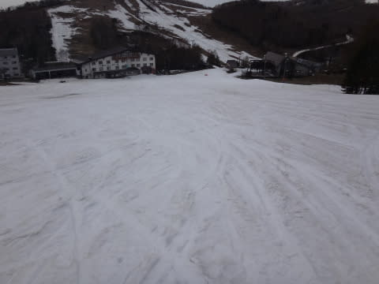

# GW5連休最終日，5月6日の志賀高原は…何とか雪はもってくれたな～

📅 投稿日時: 2015-05-08 01:47:47

🏷️ カテゴリ: [2015スキー滑走日記](c09ea645cfc085f86dfcd80f49599dd89.md)

お待たせしました．←誰も待ってないって

昨日速報した，ゴールデンウィークの5連休最終日．

志賀高原の詳細レポートをば…

えー．

まず，早朝スキーのために，朝6時ごろに宿を出てみると…

おおっと．

車，凍り付いてますね～．

明け方は放射冷却で，見事に氷点下まで

下がってくれたようで…

うむ．

早朝のバーンコンディションに期待っ！

ってことで，焼額ゴンドラの早朝営業に行ってみると…

あら．

最終日だというのに．

結構人がいるなぁ…

で，山頂に上がると…

今日も，すっきり晴れですね～！

で…

車が凍り付くほど冷え込んでいたというのに．

早朝スタート時の山頂の気温，すでにプラス9度にまで

上がってますか…（涙）．

うーーーむ．

今日もあったかくなりそう…

でも．

明け方の冷え込みのおかげで．

朝イチバーンはしっかり固いよ！

いい感じでスピードが出せるよ！

すぐに緩むだろうから，早朝のうちにガンガン滑っておかないとっ！

…と，思ったのもつかの間…

あぁ．

ダメだ．

やっぱり，早朝開始時にもう10℃近い高温だったので．

開始1時間経った7時半過ぎには，

なんだか，もう，

雪がかなり緩んじゃってるんですけど…（涙）．

そして．

8時には…

あうーーーん（泣）．

まだ早朝営業の時間なのに．

…もう，ユルユルの粘りつく雪になってきちゃったよ…（悲）．

今日もすっきり晴れ上がった，強烈な日差しのおかげで…

「夏か？？」

ってほどの気温に上がり．

そして．

9時前に，すでにゲレンデはほぼ全面，板にまとわりつく

ストップスノーに…（涙）．

い，板が滑らない…（激泣）．

だもんで．

昼には一旦一の瀬に移動してみましたが…

あぅ．

このゲレンデ．

見ただけで，かなりの終わっている感が

漂ってるんですが…

この正面バーン，まだ営業しているってのが

驚き以外の何物でもないんですが…っ！！

まぁ，怖いもの見たさで，ちょっと正面バーンに

チャレンジしてみますか…

＃Blogネタにするためにあえてチャレンジした，という説もあり

…うむ．

…これは…ダメだ．

石を踏まずに下に行くのは難しいよ…

下の緩斜面も，結構雪が薄くなり，ブッシュ攻撃を受けちゃうんですけど…

…これは，あれですね．

とりあえず，最終日まで営業しましたっ！って

言うために営業しているような感じで．

時々チャレンジャーが滑っている以外は，

ほとんど誰も滑ってません（^^;

まぁ，リフト乗り場近辺はまだいっぱい雪があるんですけどね～．

…となると．

やっぱり，一番マシなのは焼額か…

ってことで．

再び戻った焼額．

ここも，第2高速沿いの唐松コースは．

上半分はコース幅半分くらいまで，土のエリアが

浸食して狭くなっているし…

下の急斜面は廊下になっているので．

第2高速側は滑っても楽しくないし．

…まともなのは，ゴンドラコースだけか…

とりあえず．

ゴンドラコースは．

一部狭くなってはいるものの．

例年雪が薄くなる急斜面も，まだ

しっかり雪がついていたし…

＃でも，あと1日くらいで穴があきそうな気配だったけど

中間点も…

ところどころ薄くはなっているところがあるものの．

人工雪の下地のおかげで，穴は開かずに済んでいたし．

一番下のゴンドラ前も，コース幅いっぱい雪が残っていたし．

…まぁ，雪は汚れて滑らなかったものの．

最終日までゴンドラが普通に滑れて，良かったということにしておこう…

という感じで．

今日も，営業終了まで焼額を滑り．

焼額の今シーズン営業終了の4時．

自分が下りた直後，リフトが止まったのを見て．

…あぁ…自分が焼額の今シーズン最後の乗客だったのか…．

焼額の今シーズンも終わってしまったなぁ…

今年もお世話になりました！

ありがとう！

また，7か月後に戻ってくるよ～！！！！

…と，心の中で叫んだ，Skier_Sなのだった…

## 💬 コメント一覧

### 💬 コメント by (KENKEN)
**タイトル**: ご無沙汰です。
**投稿日**: 2015-05-08 23:27:40

２月にご一緒したときに次は春スキーでとコメントしながらご一緒できずに残念でした。

実はSさんとご一緒した翌週に家族で行ったスキーで足を大怪我(骨折&靭帯損傷）してしまい、今シーズンのスキーは強制終了となりました。

(家族を置いて２度も志賀高原に行った天罰か？)

先週にやっと通院は終わって今はリハビリ中です。

夏のダイビングシーズンまでの完治を目指してます。

という訳で今シーズンの無念を晴らすべく、来シーズンこそは(怪我をしないよう)ガンガン滑りたいと思います。

また７か月後に志賀高原でお会いしましょう。

その前に西表で会えるといいですね。

７月後半～８月上旬に行く予定です。

あと9月も計画中です。

### 💬 コメント by (Skier_S)
**タイトル**: KENKENさま
**投稿日**: 2015-05-08 23:57:31

お久しぶりです！

けがをされていたんですね…

骨折＆靱帯って，脛骨か腓骨骨折＆ひざ靱帯ですか…？？？

それは大変でしたね…

これからリハビリ大変かと思いますが，

ダイビングシーズンまでの回復を願ってます！

こちらの夏休みは，職場がご無体すぎるので

また全く未定です…（涙）．

いつ夏休みが取れるんだろう…

また機会がありましたら，ご一緒に！

### 💬 コメント by (KENKEN)
**タイトル**: 左足脛骨の剥離骨折と内側側副靭帯を
**投稿日**: 2015-05-09 23:18:39

やってしまいました。

最初の診断で前十字も切れているかもと言われ、

もうスキーや激しい運動はできないかもとかなり落ち込みました。

MRIの結果、前十字は伸びているけど切れてないし、手術もいらない、リハビリ後はこれまで通り運動できると言われかなりホッとしました。

人生初の大怪我でしたが、健康のありがたさを噛みしめるよい機会にもなりました。

しっかりリハビリして次のシーズンに(怪我しないよう)備えます。

ちなみに怪我はジャンプして着地に失敗したときやりました。

その瞬間嫌な音がしました。

一生忘れないと思います。

### 💬 コメント by (aqura)
**タイトル**: 志賀高原お疲れさまでした
**投稿日**: 2015-05-10 08:12:35

久しぶりにブログのぞきました

志賀高原も終わったのですね

まだまだ主様は、他で滑りまくるのですね

お楽しみに下さい

あっ、私、ようやく、ギブス外れました。まだまだ、リハビリ中

### 💬 コメント by (Skier_S)
**タイトル**: かぐらから帰ってきました…
**投稿日**: 2015-05-11 00:20:45

＞KENKENさま

あー．やっぱり，脛骨骨折ですか…

でも，剥離骨折って，ポッキリはいかなかったんですね．

手術なしで済んだのであれば，不幸中の幸いという

感じでしょうか…

しっかりリハビリして，ダイビングシーズンには復帰してくださいね～！！

＞aquraさま

お久しぶりです！

あ，例のコブコブでコケたってやつは，

ギプスするほどの怪我だったんですね…

かなり長引いたようですが，早期の完全回復祈ってます．

ちなみに私は，まだまだ滑りますよ～！

6月下旬の月山までは，シーズンですから！

