# まだ終わらんよ！1月4日の志賀高原は…ちょいとイマイチの天気

📅 投稿日時: 2014-01-04 21:29:37

…読者の皆さんは，そろそろ飽きてるころだと思いますが．

＃書いている本人も飽きてきている気が…

でも，志賀高原レポートを続けるのだ．

継続は力なりっ！←だから，何の？

ということで．

本日の志賀高原．

天気予想では，終日曇り時々雪がちらつく…

って書きましたが．

実際は，終日雪がちらつき，時折止む…

というのが正解でした．

＃微妙に惜しいはずし方．

でも，

残念ながら．

積もるほどの降雪ではない…

という，あたらなくて良いところはぴったりあたってしまい．

…今朝の積雪はこの程度．

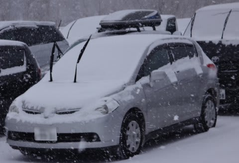

どうやら，夜の間は晴れていて，朝から

降り出した様子．

…いやがらせかな？（泣）

今日も，気温はしっかり冷え込んでます．

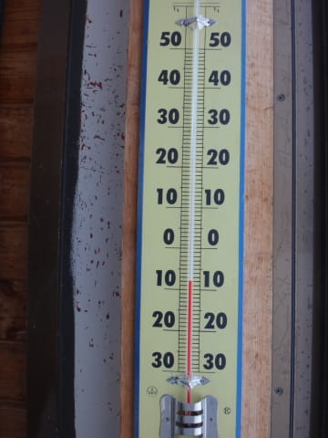

でも…

山頂は，ガスってて視界が…(涙)

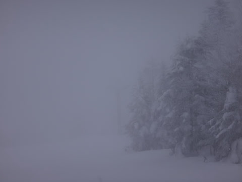

決して気持ちよく飛ばせるコンディションではありません(泣)．

雪は良いんですけどね～

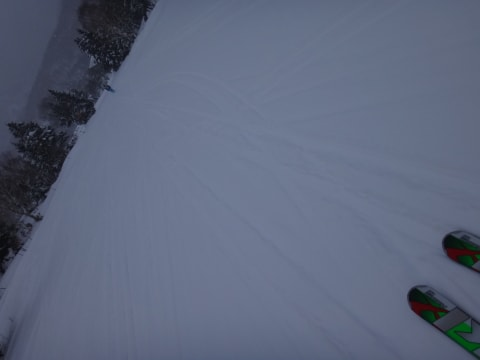

雪は，時折強く降りますが．

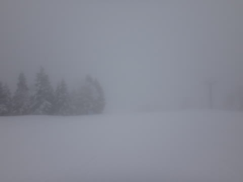

うーむ．

でも，積もる感じじゃないんだよな～．

今日も10時ごろのゲレンデ人口密度はそこそこ高くなってきましたが．

でも，これまでの年末年始休みに比べれば，天気が悪い分

いつもより少な目かな？

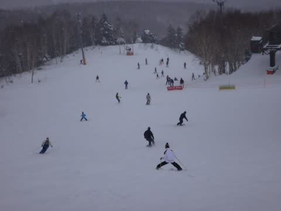

＃こーゆー混雑になることは少なかった

焼額第2ゴンドラは最大10分程度の待ちがあったみたいだけど，

第1ゴンドラは最大でせいぜいこの程度．

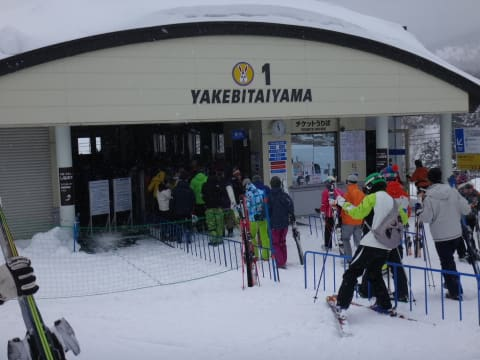

やっぱり，人が少なめですね～．

とりあえず．

空いてるのは良いけど．

今日はガスや雪で終日視界が悪く…

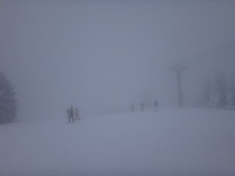

そして，昼間の最高気温もマイナス8度程度までしか上がらず…

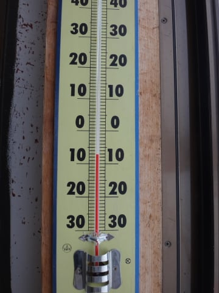

すんごい寒いんですけどっ！

と言いながら．

今日もナイターまで繰り出して．

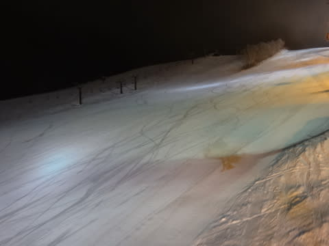

最高のシマシマバーンをいただいてきたのでした…

で．

今日は滑っている間，ずっとガスがかかって雪が降っていたのに．

ナイター終了間際になったら晴れてくるという…

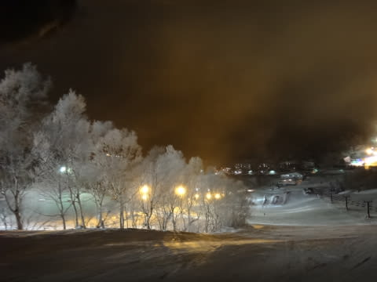

…やっぱり，いやがらせかな～(涙)．

明日は，いい天気になって欲しいなぁ…

＃明日は，昼ごろには良くなってくるはず！
