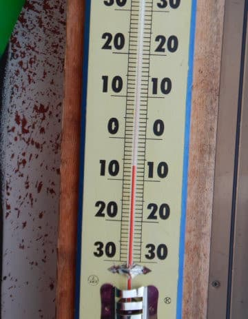
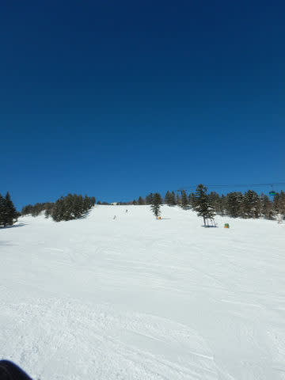
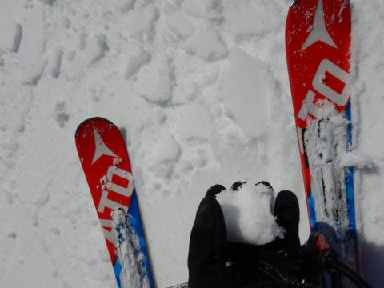

# 2020/2/24(月・祝)，3連休最終日の志賀高原スキー場，詳細レポート！…午前ちょっと混んで，午後は一部雪は緩んだけど，トップシーズンの晴天で絶好のスキー日和！

📅 投稿日時: 2020-02-26 00:03:39

えー．

どうやら本日の志賀高原．

午後から雪になり，ちょっと積もったようです！

([北信建設事務所道路気象状況ページ](http://hokushin.pref-nagano-roadcamera.jp/)より）

そして…

26日の水曜日も，パラパラと雪が降り続けそうで．

で．そのあと．

26日夜から27日をまたいで，28日朝まで…

降りそうです．

冷え冷えの雪が，そこそこ積もって

くれそうです！！！

なんてったって，27日の500hpa気温図を

見てみると．

そこそこの積雪の目安，赤い-30度線が

志賀高原にかかってるし…

そして，850hpa気温図を見ても．

水色の-9度線が志賀高原にかかってますよ！！

これは，-10℃を大きく下回る冷え冷えになり，

真冬の冷え冷え雪が降りますよっ！！

地上天気図はきれいな冬型ではないものの．

北風になる等圧線配置なので．

日本海側に降水域が予想されていて，

志賀高原でもしっかり積もるパターン！！

こういういい感じの天気図が，

26日夜から28日朝まで続くので…

ドサドサ積もるわけではないけど，

この二晩の間で，そこそこ積もってくれそう！

28日朝は，パウダーねらい目かも…！？？

そして，昼には晴れて来そうなので…

28日は冷え冷えいい雪の絶好の

スキー日和になりそう！

…でも．

29日はちょっと気温が上がりそうだけど…

プラス気温までにはいかなさそうだから，

何とかなるかな？？

また，週末の天気は明日予想します～！！

ってことで．本題．

月曜の志賀高原，詳細レポートです！

えー．まず．

昨晩からの積雪は，数mmしかなかったものの．

車がガッツリ凍り付くほどの冷え冷えで

スタートした朝．

いつも通り，焼額第1ゴンドラの営業開始に

並ぶわけですが．

うむ．

今日は人が多くて，ちょいと混みそうな予感…

で．

あさイチゴンドラで山頂に登ると…

そこにはすっきり晴天の，冷え冷え

最高ゲレンデがお出迎え！！

山頂の気温は-7℃と，

[金曜に予想した](e94c3085f1e2e581da80b8f5f18b12058.md)ぴったりの気温！

…昨日も予想通りの-8℃だったし．

最近の天気予想の精度は，かなり

上がってきている気がする…

そして．

あさイチのバーンコンディションは，

昨日の冷え冷え雪がしっかり圧雪されて，

朝の低温でいい感じで締まった，

いかにもおいしそうなバーン！！

では，極上のシマシマバーン，

いただきまーーーーす！！！

うはははーーーっ！

ぐほほほほーーーぅ！！

うひょひょひょほひょーーー！！

最高ぅっ！

ぐふぅ！！（言葉を失っている）

〇▽δε※×？ξ√！（あまりもの感動にバグっている）

あぁ…

すばらしひ…

すばらしすぎる…（昇天）

人生，この瞬間のためにあるんだよ…

このヨロコビのために

生きているんだよ…（感泣）

と，激烈快楽バーンを欲望のまま傾き，

切り裂き続けること数本．

…さすが3連休．

午前9時半には，ちょいとコースの

人口密度が高くなり…（泣）

うぎゃーーー！

なんだ！？？

まだ10時前というのに，第1ゴンドラは

すごい列に…！！（涙）

…一の瀬側から人が流れて混み始めてきた

タイミングでは．

まだ奥志賀側にはそれほど人が流れ込んで

いないので，奥志賀ならまだ空いてるはず…！

と．

おそらくこの世で，「暖冬」の次に

「混雑」が嫌いな私．

今日はあっさりホームの焼額を捨てて，

奥志賀へ向かいましたが…

奥志賀はまだ人も少なく，

雪も冷え冷え，まだところどころ

シマシマが残ってます！

そして，奥志賀のリフト側，エキスパート

コースは…

うむ！いい感じで締まった，

見事なフラットバーン！

雪もいい感じだし．

リフト待ちは多少あったけど，

焼額第1ゴンドラの混雑に比べれば

まだ許容範囲！

ってなことで．

晴天でゴキゲンなエキスパート

コースをしばらく楽しんでましたが…

うむ．

さすがの奥志賀も，10:30ごろには混み始め…

そして，大勢の人が滑ったので，

雪もちょいと荒れてきましたね（涙）

ってなことで．

焼額山11時の法則（11時を過ぎると1ゴンの混雑が解消し始める）

があるので．

そろそろ混雑が解消したはずの

わがホームゲレンデへ！！

うむ．

コース上の混雑はもう解消されてるし…

そして．11時半を過ぎると．

3連休最終日の本日．

早めに帰る人が多いのか…

ゴンドラ混雑は一気に解消！

リフト待ちも，ほぼ0になってます！

ただ，この日はちょっと気温が高めで，

最高気温は-2℃と，ぎりぎりマイナスを

キープしてくれたのですが…

雲一つなく，強い日差しが降り注いだので．

朝から日が当たる東側斜面となる

オリンピックコースや，GSコースのごく

一部．

昼頃には，ちょいと雪が緩んだところも…（ちょい涙）

でも，それ以外のほとんどの場所は，

終日冷え冷えのいい雪をキープして

くれました～！

いや．

金曜夜の，

　この日は終日晴れ．

　昼間は気温は0℃近くまで上がるけど，

　南向き斜面の一部以外はいい雪質を

　キープ．

という予想．

見事にその通りになってますね～（自分で自分をほめておく）

で．

この日，焼額朝礼メンバーの約1名が，

20000mチャレンジするということで，

一の瀬ファミリーグルグルしているのを

応援するために，午後は一の瀬へ．

（ここ3週連続で知り合いの20000mチャレンジが続いて

　いるので，ホームゲレンデ焼額脱出率が上がってるなぁ…）

一の瀬正面バーンも，午後は人が少なく．

雪はかなり硬めの下地に，

柔らかい削れた雪がところどころ

溜まった感じでちょいと凸凹は

あったものの，

晴天の日差しでも全く雪は

緩んでおらず，いい感じの

トップシーズンバーン！！

うむ．

絶好のスキー日和ですね～！！！

ラストは焼額に戻ってきましたが．

午後3時を過ぎた焼額は，誰も

滑っていない貸し切りバーン状態で．

…そして，ラストまで比較的フラットな

バーン状態をキープ！

いやー．

2月の志賀高原は，やっぱりこんな感じじゃないと…！！

さすがに，最後は急斜面はそこそこの

凸凹になり，下地の硬いのが出てきた

場所もあったものの．

今日も焼額営業終了の16:15に

リフトに乗り，ラストまでたっぷり

満喫したのでした…

…が．

焼額の駐車場に降りた時点で16:25．

一の瀬ファミリーが16:40までやっているので…

今日も右足だけブーツを脱ぎ，一瞬のワザで

一の瀬駐車場まで移動！

間に合った…

ラスト1本，間に合ったよ…

ということで．

日が暮れる中，今度は一の瀬ファミリーの

営業終了まで滑り．

晴天＆グッドコンディションの一日，

まさにラストまで堪能したのでした…

いやーーー．

良かった．

いい一日だった…

今週もそこそこ冷えていい雪が降り続けそうなので．

今週末もいいコンディションになってくれると

いいんだけど．

土日とも，晴れ間はなさそうかな～．

でも，そこそこ冷えていい雪になって

くれるかな？

今週末も，いい終末になることを期待！

## 💬 コメント一覧

### 💬 コメント by (かず)
**タイトル**: Unknown
**投稿日**: 2020-02-26 00:47:05

予定どうり今週 金土日（月）予定です 先週の3連休は志賀は雪有るで混んだ感じでしょうか？反動で空いてほしい！金曜チョット期待です  しかし全く先が読めない現状に心配も…運次第

### 💬 コメント by (しんちゃん)
**タイトル**: お礼
**投稿日**: 2020-02-26 01:26:57

2/24は一ノ瀬ファミリーをグルグルし、20000ｍチャレンジして、目標達成できました～！

応援ありがとうございました。

この日は一ノ瀬でも終日天気・雪質と皆さんの応援にも恵まれ、まさにスキー日和（いや、チャレンジ日和）でした。

当日はガチで挑戦していたので、Ｓさんを正面バーンでぶち抜いてしまいました(^-^;皆さんの応援もあって、目標達成できてよかったです。今後は某お札の布教活動にいそしみたいと思います（笑）

応援いただいたたくさんの皆様に、この場をお借りして御礼申し上げます。（Ｓさん、場を拝借させていただきすみません）

### 💬 コメント by (新米パパさん)
**タイトル**: Unknown
**投稿日**: 2020-02-26 07:21:48

昨日奥志賀、焼額は昼からずっと雪でした。

降り始めは湿った雪でしたが、営業終了時は乾いた雪が10センチ近く乗りました、軽く吹雪いて視野がとりづらかった、、

週末も期待出来そうですが、コロナの方が怖くなってきましたね。

ゴンドラ内もアルコール除菌シートかな、、

### 💬 コメント by (naoちゃんねる)
**タイトル**: Unknown
**投稿日**: 2020-02-26 08:14:05

しんちゃん様

20000m達成おめでとうございます！！

しかし…76本とは…(驚愕)

スキーサイボーグの仲間入りですね💕

S様

この日はホント～に最高でしたね！！

そしてこのところの天気予想の精度が高いっ！！

この勢いで、これから週末の天気を 毎回最高冷え冷えのスキー日和にしてくださぁい！！

### 💬 コメント by (ゆーき)
**タイトル**: Unknown
**投稿日**: 2020-02-26 12:39:50

行動パターンが似てる、、、最終日は焼額山、奥志賀、そして、焼額山に戻り、一ノ瀬、東館山、丸池、サンバレー、昼食後、サンバレー、丸池、ジャイアント、西館、高天ヶ原、タンネ、そして、一ノ瀬で最終に乗って終わり、バスで宿に戻りました。。。あんな状態の良い日だったので、ちゃんと滑らないとね、最終日だけど。

### 💬 コメント by (ジャック)
**タイトル**: Unknown
**投稿日**: 2020-02-26 18:17:09

知り合いがインストラクターをしており初めて一の瀬ファミリーのゲレンデに行ってからあの一枚バーンが忘れられず来月行く予定です。

関西の私にはとても羨ましく思いながらレポート楽しみに見ています。

### 💬 コメント by (西館)
**タイトル**: ☆.｡.:*･ﾟ☆.｡.:*･ﾟ☆祝しんちゃんさま☆ﾟ･*:.｡.☆ﾟ･*:.｡.☆
**投稿日**: 2020-02-27 01:05:39

凄い凄い、凄いですね！76本は6.4分/周で合計24,000ｍ弱ですよ スゲエエェェ(pﾟ∀ﾟq)ェェエエ工工

当日は16:40までの営業でしたから、これが16:50までの営業だったら更に2本滑っていたのでは？

14時頃にそば屋上リフトから一枚バーンを眺めていたら、２～3回のターンで滑走していく上オレンジ下グリーン系統の方がいて、あまりの速さにただただ驚いたのですが、もしかしてしんちゃんさまでしたか？

違っていたとしても恐らく20000ｍの方ですよね。

恐らくは帰宅日の挑戦でしょうに、20000ｍ到達後も手(脚)を緩めないタフさにも脱帽です！

これで気分すっきり、次回に挑めますね！

週末の疲れを平日で癒やせるのかは謎ですが、どうぞ少しでもお身体を癒やして、また素晴らしい滑りを披露してくださいね！

>Sさま

2日酔いはしない方ですか？

帰宅日にちょー睡眠不足で最終まで滑って、しかもこの日は渋滞したと思うのですが、無事にご帰宅されて良かったです。いやぁ、タフですね。

最近、水曜日が楽しいでなりません。それはSさんの天気予報が楽しみだから。

### 💬 コメント by (Skier_S)
**タイトル**: この土日は悪くなさそう
**投稿日**: 2020-02-27 06:07:49

＞かずさま

3連休は中日に降った雪で，雪のコンディションはよくなりました．

でも，混みましたよ～！

今週末は反動で混まないと思います…

金曜は最高だと思いますよ！

＞しんちゃんさま

20000m達成おめでとうございます～！！

これで終わった人の仲間入りです(笑)

＞新米パパさま

あら．25日まで滑ってらしたんですか…？

これから28日にかけて，いい感じで積もります！

今週末もいい感じになりそうですよ…！

＞naoちゃんねるさま

月曜は最高でしたね…

今週末もいい感じになりそうですよ！

…残念ながら晴れなさそうですが，晴れないおかげで

雪が緩まずに済みそうです．

＞ゆーきさま

月曜，終日遠足されてたんですね．

奥志賀からサンバレーまで全踏破ですね…

ラストまで滑走お疲れ様です．

一の瀬ラストは，20000m達成の授与式をやってました(笑)．

＞ジャックさま

一枚バーンが好きなんですね！

だとすると，一の瀬正面バーンは最高だと思います．

一の瀬もいいけど，焼額も覗いてやってください．

一枚バーンは無いですが…

＞西館さま

16:50までだったら，さらに記録は伸びてたと思います．

上オレンジ下グリーンは，しんちゃんではないですね…誰だろう？？

ちなみに，今回は車を3人で乗りあっていったので，

帰り道はほとんど残り2人に運転してもらいました…

そうじゃなかったら死んでました．

