# 2021/1/11(月・祝)の志賀高原スキー場，特派員レポート！…そして，これから一週間のスキー場の天気は？

📅 投稿日時: 2021-01-12 00:26:58

🏷️ カテゴリ: [日記](cc4b5682fb7b8b144980957a978653fb0.md)

ということで．

私はStay homeの連休だったわけですが．

有能な志賀高原特派員の皆様から，

今日もいっぱい写真が送られてきました…！

まず．

本日の朝イチの焼額山頂は-13℃と，

今日も冷え冷え！

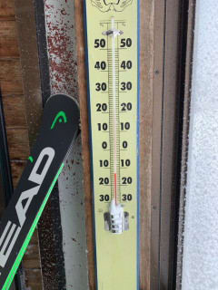

昨晩は数cmの積雪があったようですが．

朝のうちに止んだようで，

あさイチはピカピカ圧雪！

…3連休は初日，2日目と新雪だったので，

初めてのピカピカ圧雪ですね…！

うーん…おいしそう…！

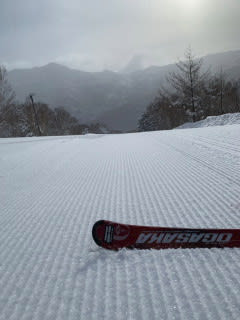

午前中から昼にかけては，曇り空ながら，

空は比較的明るく．

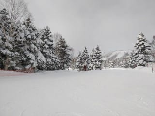

ピカピカ柔らか圧雪と相まって，今日も

最高のコンディションだったようで…

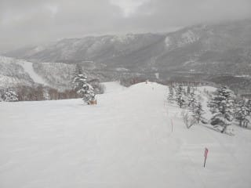

うらやましい…

うらやましすぎる…！！

昨日は雪が重めの荒れ荒れで，

結構手ごわい感じだったけど，

今日はコンディション恵まれてますね…！

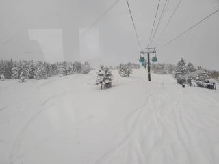

ゴンドラ待ちもそれほど長くなく．

ゲートの外まで並ぶことは無かったようで．

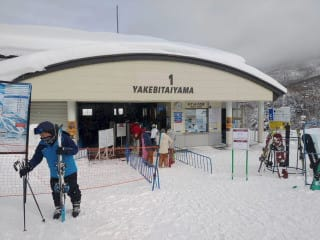

昼間の気温も最高-7℃程度と，

予想より低く．

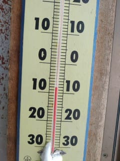

冷え冷えガラガラ，最高雪質で．

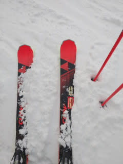

よだれじゅるじゅるモノのバーン

コンディションだったみたいです…！

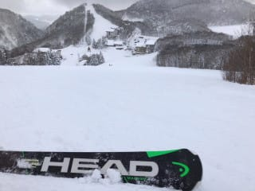

ただ…

奥志賀エキスパートコースは圧雪されて

なかったのか，ボコボコだったみたいですが…

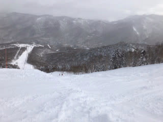

そして．

今日も午後になると日が射し始めて．

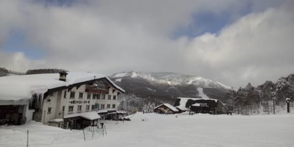

薄っすら日が射す中，3連休最終日とあって

さらにガラガラ，ゴーストタウン化し…

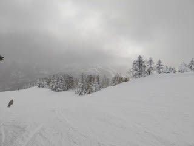

最後はいい感じに日も射し，

太陽のもと，最後までフラットなバーンを

楽しめたようです…！

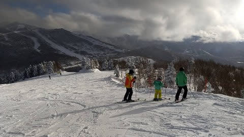

…この3連休も．

良かったみたいですね…（遠くを見る目）

ってなわけで．

果たして．

これまでの冷え冷えのGoodコンディション．

これからも続くのか？

ちょっと天気図を見てみましょうか…

850hpaの気温傾向を見ると．

うーむ．

やはり，冷え冷え祭りは本日11日まで．

12日以降は赤矢印で示したように，

平年より2～4℃程度高い気温になる

ようです…

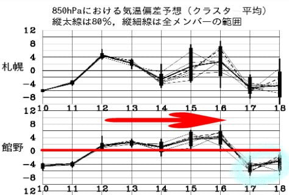

ただ．

この時期なら，+4℃までに収まれば

志賀高原は全然問題なし！

気温が上がりそうな13日～15日までの

850hpa気温図を見ると…

赤い0℃線は3日間とも志賀高原に

近いところまで北上しているけど，

志賀より南に居るので，雨が降るような

気温にはならず…

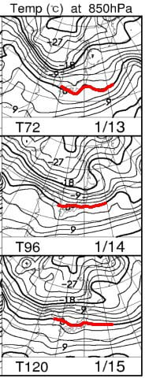

そして，地上天気図を見ても．

降水域の網掛けは日本海側にかかっておらず．

志賀高原は，13，14，15日は3日とも

ほぼ晴れそう！

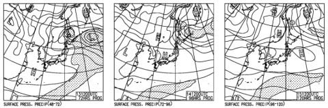

13，14，15日の志賀高原．

昼間はちょっと暖かくなり，日が射すバーンは

雪が緩むかもしれないけど…

あさイチは締まった最高シマシマが

楽しめそうな3日間です！

…そして．

16，17，18日は…

16日はちょっときわどい位置に

0℃線がありますが…

17，18日はなんだか，またものすごい

冷えになりそう！

17日，水色の-12℃線が志賀に近づいてるので…

また，1月9，10日レベルの大雪になっても

不思議じゃない冷えっぷりです！

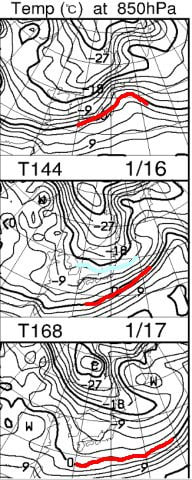

地上天気図を見ても…

16，17，18日の3日間．

見事に冬型ですね…

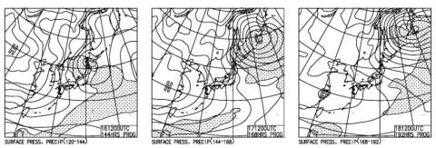

この天気図だと．

16日の土曜．

降り始めはかなり重め…というか，ウエアに

着くと濡れちゃうような湿った雪で．

夜中から冷え冷え雪になり

激烈に積もり始め．

17日の日曜は終日雪降り，

18日まで降り続け，

17，18日はまたパウダーデーに

なりそう！

…ってか，この3連休も，北陸方面は

かなりの積雪で大変だったようですが．

また16日夜から17日を超えて18日にかけて．

大雪になりかねない感じ…

なんだか．

今シーズン，冷え冷え踊りを踊らなくても

冷え続けてくれる，いいシーズンだと思って

いたんですけど…

繰り返し言いましょう．

降り方が極端なんだよ

## 💬 コメント一覧

### 💬 コメント by (レインボー73)
**タイトル**: Unknown
**投稿日**: 2021-01-12 11:50:27

火曜日の志賀高原情報

エス様に『うらやましすぎる』と思われるって、めちゃ優越感!　日ごろスキーの滑りで『うらやましすぎる』と思われてる報いかも？

今日は別の太板を試そうと勇んでヤケビに来たものの、久しぶりに積雪ゼロ。ヤケビは全面きれいな圧雪バーン。

非圧雪もふわふわ感無しで、ただのコブ。老人は危険は回避しないと！

ビーフシチューで有名なチウホテルはまた休み。高天原ホテルでピザを食べてます。４人で３枚4000円が、go to eat で一人800円でOK! 美味しいし割安感満点です。

それにしても人が少ない。昨年まではおにぎり持参の日もわりとあったのですが、どこの店もつぶれるのではないかと心配で、今シーズンはほぼ外食するようにしています。それにしても人が少ない。

### 💬 コメント by (しが)
**タイトル**: ブーツ
**投稿日**: 2021-01-12 20:27:00

ブーツ、130Mは固くないですか？以前から固めのブールを履いてたのでしょうか？長時間滑っておられるので柔らかいブーツを履いてるのかと思っていました。体力あるのですね！

### 💬 コメント by (レインボー73)
**タイトル**: Unknown
**投稿日**: 2021-01-12 21:07:38

ありがとうございます。隊員は剣道７段の達人で、とんでもない体力の持ち主なので、へなへなな私とは大違いなんです。お気遣いありがとうございます。ただ、靴を脱ぐ時が大変かなと思います。明日がデビューです。

長岡のエキップさんが腕前もわかった上で選んでくれたのですから、大丈夫かと思います。

### 💬 コメント by (Skier_S)
**タイトル**: 緊急事態宣言拡大中（涙）
**投稿日**: 2021-01-13 03:19:03

＞レインボーさま

うらやましいです～！

でも，もっとレポートを書いてもっとうらやましがらせてください！

志賀高原のレポートが，今のところ私の生きる糧（？）ですので…

しかし，ゲレンデも宿も食堂もヤバい感じですね．

来シーズン，どこもつぶれることなく営業が続いて欲しいです…

＞しがさま

これは，レインボー隊員のニューブーツではなく，

私のニューブーツへのコメントですよね…

私はここ10年以上，SALOMONブーツ2台，ATOMICブーツ3台を乗り継いできましたが…

ずっとフレックス130を愛用しています．

長時間滑り続けますが，私の滑りを見たことがある人は，

私の滑りがかなり体力勝負の滑りだということを知っています…

