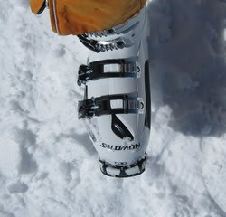
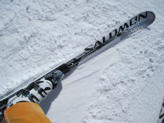

# ニューブーツ，SALOMON　X3-RCのインプレッション

📅 投稿日時: 2011-05-12 02:27:18

というわけで．

[ここ](d20110414.md)に書いたように．

新しいブーツを買ったわけですが．

一ヶ月ちょい履いたので，簡単なインプレッションをば．

SALOMONのブーツといえば．

2年前までのFalconシェルがむちゃくちゃやわらかかった印象があるので．

フレックスインデックス130といえ，このブーツも柔らかめかなぁ，

と思ったんですが．

結構しっかり硬いです．

同じインデックス130の，以前に履いていたATOMIC RT-CS 130より

かなりしっかり硬い印象です．

んで．

SALOMON 24hours LMを履いてみると．

板が全く変わったか？？？

と思うほど，挙動が変わります．

ATOMICブーツを履いていたときは，かなりずらしやすい板だと

思っていたんですが．

SALOMONブーツにすると，驚くほどエッジグリップが上がって

食いつき系の板に変わってしまった感じになります．

あと，板とブーツの一体感がすごい．

ブーツに直接エッジがついているような感じ．

それも，板のトップ，テール側のエッジがかなり効きます．

ちょっと前を押さえれば，板のかなりトップよりのエッジが雪面に切り込み，

ちょっと後ろに引くと，テールのエッジが雪面に食い込む感じ．

板に硬いプレートをつけたときと同じ反応です．

…このブーツ，ATOMICと比べるとかなりブーツソールが硬いんでしょうね～．

これは．かなりすごい．

わずかにでも前を押さえるような動きをすると，一気に板の

トップが食いつくので，ちょっと敏感すぎるか？とも思ったけど．

慣れてくると反応の速さにヨロコビすら感じます．

いやー．

すごいなぁ…

と，板をATOMIC D2 DEMOに履き替えたとたん．

あれれれれ？

あれ？

板が．

板がグリップしない…

板が外に逃げていく！！

どうしたことだ？？

SALOMONブーツはSALOMON板とバツグンの相性というのに，

ATOMIC板とは相性が悪いのかっ！？（SALOMONとATOMIC,今は同じ会社なのに…）

と，しばらく滑っていると．

私のいつもの滑りだと板のトップの押さえが過剰になり，板のトップが

逃げていることが判明．

ポジションをわずかに後ろ目に調整し，足首の曲げ量を抑えることで，

板のグリップ力が回復．

うーん．

このブーツを履くと，いつもの動きではATOMICの板に対しては

過剰な動きになっちゃうようだなぁ．

ATOMICの板，ソールがやわらかめのブーツと相性がいいのかな？

とりあえず，SALOMON 24hours LMは，トップを押さえれば押さえるほど，

トップのグリップが強くなり，トップのたわみも引き出され，

グリップしたまま小さな旋回半径で回れるようですが．

ATOMICの板は，トップを押さえすぎると，トップがグリップの限界を

超えて外に逃げてしまうようで…

あくまでD2構造の板は，角付けをしてワンテンポ待つことで，

上にコントロールデックがない，トップ部分のアダプターデックがたわんで

雪面からの圧を受けはじめ，

そのトップ部が受ける圧により，板全体がたわんで曲がっていく…

という，角付け主体の板なんだろうなぁ．

ということで納得．

2-3日滑ると，大体カンどころをつかんで，ATOMICの板でも

滑れるようになって来ました．

あと，SALOMONの板も，グリップが強く感じる分，ちょっと

ずらしにくいかな，と思ったけど．

慣れてくると，思い通りにずらせるようになってきました．

コブの中でも結構自由に動かせます．

んで．

この間．

久しぶりに以前のATOMICのブーツを履いてみると…

なんだこれ．

長靴みたいだ…

さすが200日近く履いたインナーブーツなので，

インナーはがばがば．

ブーツもかなり柔らかく感じます．

うーーん．

[初めてこのブーツを履いたとき](http://blog.goo.ne.jp/skier_nobu/e/43fba85bf678531c251000e0e43a3500)は，

「前後のフレックスはやわらかいけど，ダイレクト感があるなぁ」

と思ったものですが．

ダイレクト感は，今のX3-RCの方が優れてます．

とりあえず．

粘るフレックス感があるATOMICブーツと対照的に．

しっかりした硬さと敏感な反応の速さを感じるSALOMONブーツなのでした…
