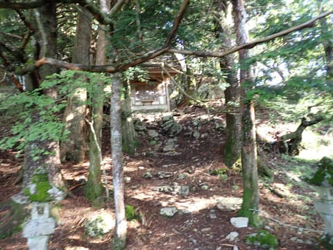
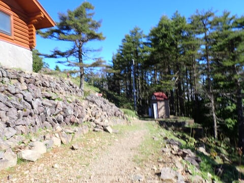
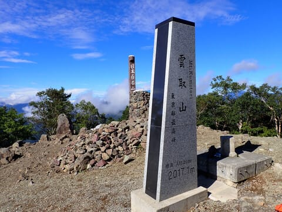

# 2023年9月，雲取山に登ってみた…その2，七ツ石山から雲取山山頂へ

📅 投稿日時: 2024-07-31 01:42:35

先週はなぜか出張が多く．

5日中4日間，昼休みが移動時間に

ぶつかって，お昼ご飯を食べる時間が

取れず．

お昼をおにぎりだけで済ますとか

抜くとかが多くて…

さらに先週から今週にかけて．

夜ご飯を食べられなかったのが3回（涙）

今日も夜ご飯を抜いてしまいました…

…だもんで．

気づいたら，またヤバいレベルに痩せて

ました（泣）

週末に山を走って運動してるから，健康でしょ？

とか思われるかもしれませんが．

平日に食事を抜いて痩せていき．

それでいて，週末はGarminさんに

オーバーリーチで体に害を及ぼすよ…

と怒られるくらいに運動しちゃってるので．

一見痩せてて健康に見えるけど．

実はかなり不健康なんだろうな…

と思う今日この頃．

とりあえず．

1週間，かなり食事を抜いたうえで

週末にヘビーな運動をすると，ムチャクチャ

ダイエットになりますよ

と，他の人がまねできない（というか，

しようと思う人もいない）アドバイスを

残したところで本題へ．

こんな前フリにもかかわらず，今日も

山登りレポートの続きです～！

ーーー

ってなことで．

七ツ石小屋ちょっと上の水場から，

しばらく上ると…

ぱっと日が射す開けた感じになり，

尾根筋に出ました！

どうやら，石尾根というようですね…

尾根筋をしばらく七ツ石山方面に進むと，

5分ほどで非常にささやかな感じの

七ツ石神社が現れてきて…

七ツ石神社を通り過ぎてさらに数分．

ちょっと開けたところに出たな，と思ったら…

どうやらここが，七ツ石山山頂のようです…！

七ツ石山山頂到着時刻は7:34．

5:25スタートなので，駐車場からここまで，

2時間9分ですか…

2時間ちょい，休まずに登ってきたので．

ちょっとここで休憩タイム…

でも．

そんなに景色が良い山頂ではないですね…

だもんで．

5分ちょっと休憩した7:40に，目的の

雲取山頂に向け出発！

で．

七ツ石山と雲取山．

標高差は250mなので，そのまま

あっさり登れると楽なのですが．

七ツ石山を経由する場合は，一旦

かなり下りますね…

せっかく登ったのに，またこんなに

降りるのか…（涙）

という下り坂を標高差100mほど下り．

そこからまた登り返していきます…

100m降りた後，また100m登り返した

あたりのところで．

いきなり目の前に，不自然に木が生えて

いない広場が広がります…！

なんじゃこりゃ，と思ったら．

ヘリポートのようですね…

確かに．

ヘリパッドのHマークが石で描かれてました…

とりあえず，このヘリポートまで七ツ石山から

23分．

これだけかけて，また七ツ石山と同じ標高に

戻っただけなのか…

ヘリポートまでは，かなり緩やかな上り坂が

続いていたけど．

ヘリポートを過ぎてからは斜度もちょっと

上がってきます…

でも．

ところどころ岩っぽい急なところはあれど，

全体的には歩きやすい快適な登山道が

続きます．

…そして，ヘリポートからさらに歩くこと

25分ほど．

雲取山の手前，小雲取山とやらに到着…！

と，Garmin様は言っているのですが．

周りを見たところ，まったく山頂らしい

表示はなく…

あるのは分岐点を示す看板のみ．

あまりにも殺風景なので，ここは止まらず

スルーするところかな．

そして，小雲取山を越えると．

木々の高さも低くなり，だんだん

見晴らしが良くなってきます…

振り返ると，富士山も見えますね…

今日は天気も良く，絶好の山歩き日和！！

先の方には，雲取山山頂下の

避難小屋の赤い屋根が見えてきました…！

避難小屋に向かう，最後の上り坂を

登っていきます…

ゴールはもうすぐ！

避難小屋の横には，トイレもありましたね～…

ってなことで．

避難小屋の横を通り過ぎてしばらく行くと…

雲取山山頂です！！

到着時間は8:42．

駐車場から山頂までの所要時間は

3時間18分でした～！！

（[続く](e90a694696ef4e7d1ef2196ab97b36e8d.md)）
