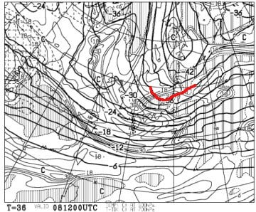
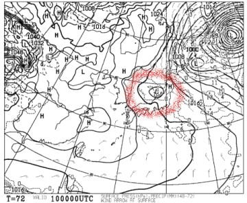
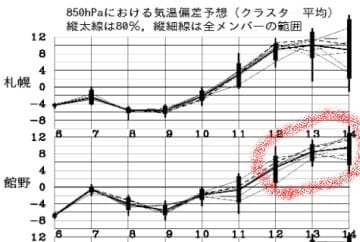

# なんと．明日から3泊4日で志賀高原で滑ってます～！

📅 投稿日時: 2020-02-07 23:21:16

🏷️ カテゴリ: [日記](cc4b5682fb7b8b144980957a978653fb0.md)

なぜか．

この2月10日に，休みが取れてしまい．

かなり無理がありながらも，何とか

休めそうな勢いだったので．

この土曜から来週火曜の祭日まで，

3泊4日で志賀高原で滑ってます～！！

8日朝は，10cmほど積もっていると

信じたいのですが…

もしかすると，降り始めが予想より遅く

なってきたので，朝は5cmほどしか

積雪が無いかも…？

ただ．8日夜9時の500hpa図を見ると．

大雪の目安，-36℃線が志賀に近づいて

来てます！！

これは…8日夕方からかなりの

勢いで降り始めて．

9日朝にかけて．20～30cmは

積もってくれるかも！！

そして，10日になっても，500hpaの

-36℃線が志賀近くに残るので．

10日も雪降りかも！？？

ただ．

10日朝9時の天気図の，この赤く

印した低気圧が通過後に

雪になりそうなので．

今の予想図なら，降り始めは昼頃，午後に

本格的に降る感じかな…

そして．

11日は終日晴れそう！

11日朝は，やわらか雪の圧雪で．

あさイチは最高のシマシマで滑れそう！

とりあえず．

まとめると．

8日（土）：朝までに5～10cmの積雪．

　朝は-10℃近くまで冷える．

　あさイチは圧雪の上にうっすら新雪．

　非圧雪コースはブーツパフ．

　昼間も-5℃以下をキープ．終日曇り～雪が降る．

　視界は悪そう…

　午後に向かってゲレンデは荒れ気味に

　なっていく．

9日（日）朝は-15℃クラスの激冷え！

　そして積雪20cm，ブーツ～脛パフ！

　パウダーデー！

　この日は昼間も雪が降り続ける．

　午後には雪が弱まるか…

　でも，終日-10℃程度の冷え冷え！

　寒いよ！！

　午後はゲレンデがモサモサ凸凹に

　なっていく

10日（月）この日も朝は-10℃以下，

　冷え冷えシマシマでスタート！

　朝は曇り～雪がぱらつく天気．

　午後は雪が時折強く降る．

　太陽は拝めなさそうだけど，

　終日冷え冷え，トップシーズン！

11日（火・祝）朝から晴天！

　朝はそこそこ冷えた，最高シマシマ！

　この日は太陽のもと冷え冷え雪を

　滑れるうえ，最高気温は-3℃くらいまで

　あがり，凍死しそうな10日までよりは

　暖かくて，絶好のスキー日和！

　志賀のトップシーズンらしい雪で，

　最高のスキー日和に恵まれそう…

という感じでしょうか．

いやーー．

この4日間，恵まれた冷え冷えコンディションに

なりそうです！！

…

…ですが．

12日以降は…

…

…今は考えないようにしておきましょう．

とりあえず．

恐ろしい後のことは考えずに．

今週末から11日の祭日に向けた，

トップシーズンらしい冷えひえ週末を

楽しみましょう！！！

…これが今シーズン最後の冷え冷え週末に

ならないことを祈るばかり…

では，今週末も志賀高原でお会いしましょう～！

## 💬 コメント一覧

### 💬 コメント by (大阪のS)
**タイトル**: Unknown
**投稿日**: 2020-02-07 23:30:04

今週末は絶好のコンディションのようですね！

というわけで私も日曜日は志賀に参戦します！

よろしくお願いします😊

### 💬 コメント by (新潟のスキーヤー)
**タイトル**: Unknown
**投稿日**: 2020-02-08 00:09:01

１１日はいらっしゃるのですね！

お宿はいつもの場所なんですが…

昼過ぎくらいに焼額に出没すると思います！

前回同様、お札を貼ったボーダーと二人で…

あとはウェアーが替わったSさんを見つけられるかですね！

私はSXが殉職したので黒い板履いてます！(^^;

### 💬 コメント by (よーこ)
**タイトル**: Unknown
**投稿日**: 2020-02-08 00:28:26

いつも楽しみに読ませていただいています。うちも明日から志賀高原3泊の3人家族で、なんと初めての志賀高原なのです。コンディションが最高と聞いてわくわくしています。いまから志賀高原が大好きになりそうな予感。

### 💬 コメント by (m&t)
**タイトル**: Unknown
**投稿日**: 2020-02-08 00:54:32

Sさん！その答えは、Gokuさんの名言迷言?「ギプスをしている様なものだから」です。

では、志賀高原で会いましょう!

### 💬 コメント by (かず)
**タイトル**: Unknown
**投稿日**: 2020-02-08 01:45:23

金曜奥志賀狙いで行きましたが朝-18度でかなり寒かったです  リフトは風で全て朝動かず  ゴンドラ10時半位からでした  うまく立ち回れて非圧雪ftかなりいただきました  1日たっているので硬かったですけど…  土曜も良さそうですね！日曜までいます！来週末だけ高温雨予報でその後少しもどる予報に変わってます？

### 💬 コメント by (レインボー)
**タイトル**: Unknown
**投稿日**: 2020-02-08 20:24:53

今日はかずさんとダウンヒルを５本ご一緒させて頂きました。毎日滑っている私でも感動するほどの好条件でした。

そのあとエキスパートに行ったら急に湿雪が。

実は数日前に滑っていて突然腰が。ロキソニン飲んで湿布貼って来たけれど、重い雪は身体に毒。誰かと違って冷静沈着なレインボーは、さっと帰って整骨院へ通ったのでありました。

### 💬 コメント by (大阪のS)
**タイトル**: Unknown
**投稿日**: 2020-02-08 23:01:21

前から思ってたんですが、「大阪のS」って呼びにくいですよね。これからは「アツシ」で呼んでくださいね(苗字で呼ぶのもややこしそう)

次からコメント書き込みも「アツシ」でします。(かぶってる人、いないですよね？)

### 💬 コメント by (Skier_S)
**タイトル**: 腰は完全に気にならず滑れるようになりました～！
**投稿日**: 2020-02-09 00:04:24

＞大阪のSさま

日曜参戦ですね…！

激冷えパウダーデーになりそうです．

志賀高原の登り路は，本格雪道だと思うので

気を付けてきてください！！

アツシさんは，他の人とはかぶってませんよ～！

＞新潟のスキーヤーさま

私は相変わらず午前はX-Race，昼前からはSX履いてると思います．

昼頃なら，SXを目印に探してください…！

＞よーこさま

日曜はちょっと天気が悪そうですが，でも，雪は最高冷え冷えの

いい雪質です！

日曜はマイナス20℃くらいまで冷えそうなので，

すごいあったかい格好で来てください…

＞m&tさま

では，ギプス効果（？）で滑るということで…

今度はゲレンデでお会いしましょう！！

＞かずさま

今のところ，来週の15日土曜日はかなりダメそうです…

16日もかなり気温は高そう．

それ以降は，まだ正確な予想はわかりません…

＞レインボーさま

え？かずさんとご一緒されたのですか？？

どうやって知り合ったのでしょうか…？

しかし，腰をやられたのですか．

今はもう滑れるレベルになったのですか？？

私がいうのもなんですが，無理をしないように…

