# 5月23日，土曜のかぐら速報…積雪状況，コースコンディション等

📅 投稿日時: 2015-05-23 23:37:31

とういことで．

本日日帰りでかぐらへ行ってきたわけですが．

明日かぐらに行こうかなぁ…

って人もいると思うので．

取り急ぎ，現在の積雪情報をば…

えー．

減りました．

そう．減りましたよ．

雪が…（涙）．

とりあえず，まだロープウェー山頂から

かぐらまでは，ぎりぎり滑っていけます．

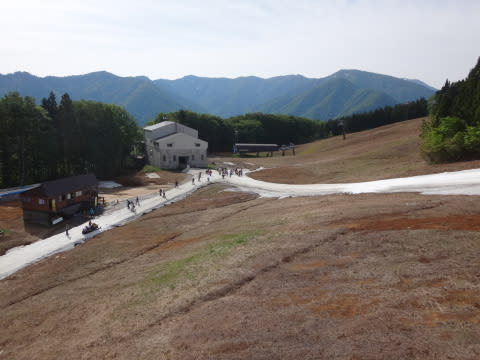

で，かぐらのメインバーンですが…

…

雪，減ったなぁ（涙）．

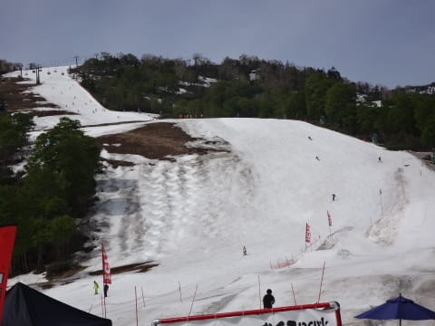

これは，減ったよ…（悲）．

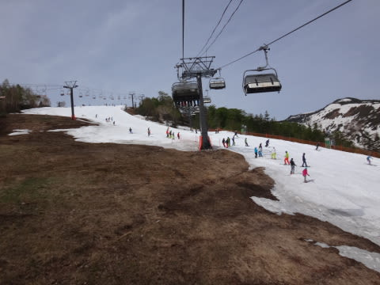

まぁ，でも．

朝のうちは良かった．

まだ，雪が掘り返されていないだけ，良かった．

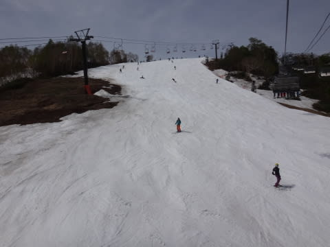

…ところが．

午前10時ごろになると．

結構凸凹になってきて．

…コブ溝に，何か危険なものが…っ！！

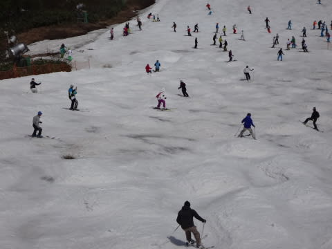

この，危険エリアはあっという間に拡大していき…

もう，コース幅いっぱい，どのコブ溝も土が

コンニチハしてきてます…（激涙）．

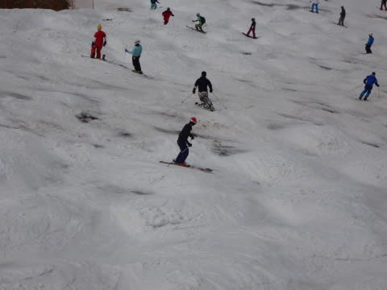

絶対，絶対，ぜーーったい．

板がボロボロになるので．

明日以降かぐらに行く人は．

傷ついても惜しくない板を履いていきましょう．

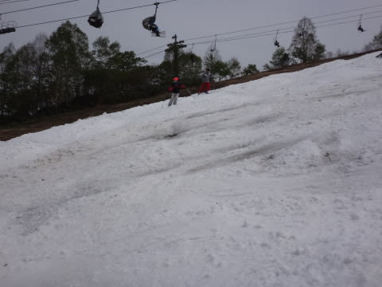

昼以降は．

もう，コブ山を滑らない限り，絶対に石を踏む

地雷原状態です．

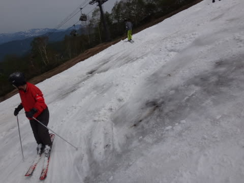

終わってる…

メインバーンも，終わってるよ…

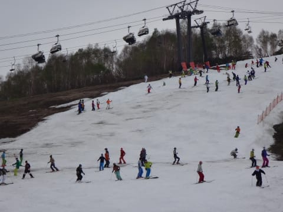

人口密度もすごいことに…

ジャイアントも，何とか雪つけして

滑れるようにしてはいましたが．

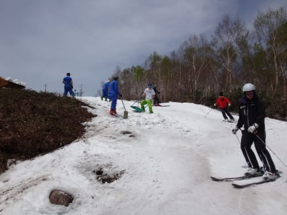

まぁ，滑ろうとは思わない方がいい感じ…（泣）．

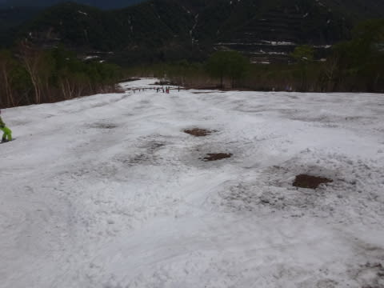

テクニカルは，もう何をかいわんやです．

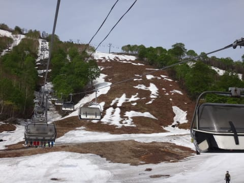

見るも無残…

ただ．

この状況でも．

ゴンドラコースとみつまたコース．

滑って帰れるようにしているのは，もう，

あれですね．

根性ですね…

素晴らしい．

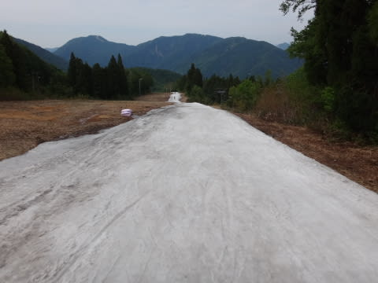

ってことで．

もう，かなり危険な状況になりつつある，かぐら．

せめてもの救いは，リフト待ちが少なかったことかな～

（最大2-3分？）

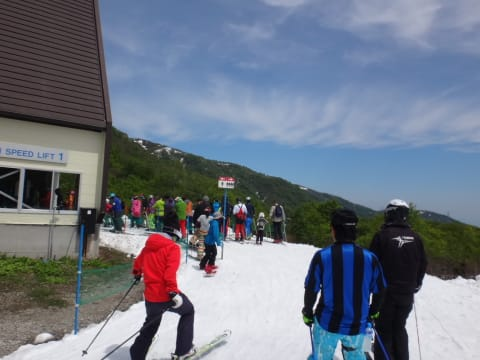

＃コースの人口密度は高かったけど

ってことで．

…もう，あまり楽しくないかぐら．

来週まで，雪がもつのか…？？？

詳細レポートは，また明日！
