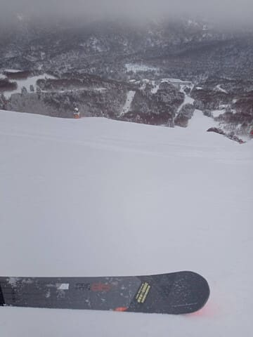
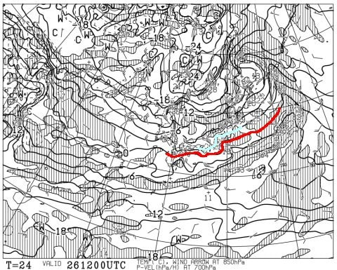

# 12月28，29日，今年最後の週末の志賀高原スキー場の天気は…土曜は冷えて終日かなりの雪降り，日曜は曇り～雪がぱらつく天気で寒い週末！

📅 投稿日時: 2024-12-26 01:54:33

えー．

本日も，志賀高原スキー場で滑っていた

特派員から情報が入ってきましたが．

今日は朝イチは曇っていたものの，

10時過ぎからは晴れて，いい一日

だったみたいです～！！

25日の水曜の焼額山は，

朝イチの気温は-10℃と冷え込み．

朝イチは雪は降っていないものの

曇り空でスタート．

昨晩からの積雪は20cmほどあった

ようです．

で．

朝イチのオリンピックコースは，

圧雪の上に数㎝の新雪が乗って，

滑りやすかったみたいです…！

それ以外のコースも気持ちいい圧雪で．

ガラガラな上に，10時過ぎには雲が

切れ始めて…

そのあとは，いい感じの晴れになったようです！

…志賀高原，久しぶりの晴れですね…！！

奥志賀のエキスパートコースも

見たところいい感じで．

これまでに積もった冷え冷え雪が

圧雪されたバーンを，人が少なくて

荒れない状態で，日が射す中

滑れるとは…

今日滑れた人は恵まれてますね…

こんな日に滑りたかった…

ということで．

この週末から，年末年始休みが始まる

わけですが．

…世間一般では年末年始休ですが．

…

私は宿題を抱えていて，完全に休む

ことはできなさそうですが…（涙）

とりあえず，この年末年始休みのスタート

となる，28，29日までの天気を予想

してみましょう…！

あ，29日以降の正月休みの予想は，

明後日くらいにやる予定です～！

ってなことで．

まずは26日(木)の850hPa気温図ですが．

志賀高原にかかっているのは水色の

-3℃線なので．

この時期としては平年並みくらいで

激冷えではないですね…

26日の地上天気図は，日本海側に

水色の降水域がかかっているので，

一見雪が降りそうですが…

JPCZが結構東にたなびいていて

西風の気配なので，志賀はそれほど

降らなさそうです…（泣）

続いて27日(金)の850hPa気温を見ると，

この日は志賀にかかっているのは水色の

-6℃線．

そこまで激冷えじゃないですが，結構

冷えてます…

そしてこの日の地上天気図は，

見事にJPCZがたなびいている感じで…

それも，志賀より西側にたなびいている

ので，これだと志賀にも降りそうな

パターン．赤く記した28という数字は，

12時間降水量が28mm．

積雪にすると28cmなので…

まぁ，そこそこ積もりそうな感じ．

続く28日の土曜の850hPa図を見ると．

この日に志賀高原に近づいているのは

-9℃線ですね…

そして，赤い0℃線は沖縄本島にかかる

くらいに南下してるし…これは冷える！

かなり寒い一日になりそう…！！

で，28日の地上天気図は．

…これは見事に日本海に雪雲が

かかってますね…

割と西風気味だけど，根性のある雪雲が

北アルプスを越えていくレベルの冷えっぷり

なので，志賀でも結構積もりそうな感じ…！

そして，29日の日曜の850hPa気温は．

この日も志賀高原には-9℃線が近づく

レベルなので，かなり冷えそう…！

この日の地上天気図を見ると．

日本海側に網掛けの降水域はかかって

いるけど．

等圧線が縦縞になっている強い冬型じゃ

無いので，そこまで降らなさそう…

ってなことで．

まとめると．

26日(木)：朝は晴れ，その後曇り．

　午後になると風が北に回って

　雪がぱらつくタイミングも．

　積雪はほとんどなし．

　朝は-5℃を下回る程度，昼間は山頂で

　-1℃くらいまで上がる．

　いい感じに締まった圧雪を滑れる

　よさそうな一日

27日(金)：前日の夕方から雪が降り，

　朝の積雪は10～20cm，ブーツパフ．

　圧雪コースもうっすら冷え冷え新雪．

　あさイチの気温は-9℃くらい．

　昼間も-5℃を越えず，終日雪降りの

　寒い一日．

　昼間も10cmくらい積もるかも？

　午後のゲレンデはちょっと荒れ気味．

28日(土)：前日からの積雪は20cm程度，

　この日も終日雪降りの一日．

　朝は-10℃をしたまわりそう．

　コース外はブーツから脛パフ．

　雪はちょい重めか？

　圧雪コースも数㎝の積雪．

　この日も一日降り続け，

　昼間も気温が上がらず，

　コースはボコボコになっていき，

　根性の無いスキーヤーふるい落とし

　デーになるかも…

29日(日)：朝までの積雪は数㎝．

　曇り，ときおり雪が舞う一日．

　この日も朝は-10℃近く，

　昼間もそんなに気温が上がらない

　寒い一日．

　朝イチは柔らかめトップシーズン

　シマシマバーン．

　朝のうちは冷えたトップシーズン雪で

　よさそうだけど，人も増えて雪も

　柔らかいので，午後は急斜面は

　凸凹になっていく

…という感じでしょうか…

木曜以外は，また雪降りの天気が続き，

太陽が拝めなさそうです…

今のところ，1月1日までの間で太陽が

拝めそうなのは30日だけっぽい感じで，

ひたすら冷えて雪が積もる年末に

なりそうな予感…

とりあえず，28日からは志賀高原も

全スキー場のリフトが動き出すようで，

今シーズンは雪不足の心配はなさそう

です…！！←いや，これだけ大雪ニュースが繰り返されて，雪不足を

心配してる人はいないから

人間ってワガママなもので，雪が降り

続けると，今度は晴れ間が欲しくなって

来るけど．ほぼ太陽が拝めない，雪降りが

続く年末年始になりそうですが…

また金曜の夜あたりに，正月休みの

天気予想をやります～！！

## 💬 コメント一覧

### 💬 コメント by (京都ヒロシ)
**タイトル**: Unknown
**投稿日**: 2024-12-26 18:10:04

待ってまーす♪

### 💬 コメント by (Skier_S)
**タイトル**: ＞京都ヒロシさま
**投稿日**: 2024-12-27 00:40:48

待っててください～！！

