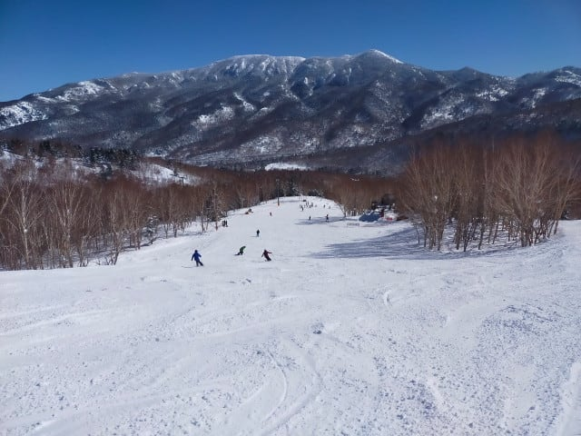

# 2025/2/15(土)の志賀高原焼額山スキー場は…終日晴れ，そこまで混まずいい感じ！昼間は気温が結構上がって一部雪は緩んだけど…

📅 投稿日時: 2025-02-16 00:45:06

ということで．

本日も予告通り，志賀高原で滑ってました～！

久しぶりに1日ずっと晴れの，絶好の

スキー日和でしたよ～！！

とりあえず，本日の志賀高原への上り坂は，

中野市街から上林のチェーンベースまでは

ほぼ雪がなく…

チェーンベースから先も，先週までの

大雪を考えると雪が少なめ．

スキー場の近くはさすがにしっかり積雪が

あったものの，予想より道路の雪は

少なかった感じでした…

で．いつも通り営業開始8:30前の焼額

第1ゴンドラに並びますが…

人は多いけど，晴天の土曜のわりには

思ったより少ないかな？

そして，8:30営業開始のゴンドラで山頂に

上がると…山頂の気温は-7℃と，

予想の-6℃から1℃ずれているものの，

おおむね予想通りの，この時期としては

比較的暖かめの気温ですね…

朝イチの山頂は…

天気も最高に良く，雪も冷え冷えで

いい感じですよ…！

そして，雪質はトップシーズンの冷え冷え

雪が締まった感じで．

板が走るのにエッジがしっかり効くという，

この雪だと何でもできちゃうように

誤解してしまう，強烈勘違いバーンだぁ！！

いい…誤解でも何でもいい．

こんな晴天のシマシマバーンを，

自分がうまくなったと勘違いできる

最高雪で滑れるなら，誤解でもいい…

とりあえず，自分がうまくなった感じが

する，最高のバーンですよっ！！

こんな晴天で，こんないい雪のバーンを

滑れるなんて…

いや．

今日は最高！！

雪質は最高だし．

コースも混んでないし…

天気も文句なしだし．

あぁ…なんてすばらしい…

と思っていたら．

10時過ぎには，ちょっとゴンドラが混んできて．

コース上の人口密度も上がってきました…(泣）

とはいえ，混雑しているコースはサウス

コースとGSコースのみで，それ以外の

コースは人口密度はそこまで高くなく…

それどころか，第2高速沿いの唐松コースや

白樺コースはガラガラで，

タイミングによってはほぼ無人状態！！

第2高速リフトもガラガラだし…

混んでいたゴンドラも，11時になると

人が減り始め，昼にはガラガラに

なりました～！！

2月の週末でこんなに空いてていいの？？

混んでいたGSコースも，せいぜい

この程度の人口密度だし．

トップシーズンで晴天の2月の週末で，

こんなに空いてていいの？？？

経営大丈夫？？

…って心配になるレベル…

ただ．

天気が良かった本日．

気温も0度近くまで上がりそう…という予想

だったのが，山頂でも0度を超えて+1℃以上に

上がってしまう暖かさで．

寒くないのはいいんだけど…

当たってほしくない

　日当たりのいいバーンは，雪の

　表面がわずかにしっとりするかも

という予想が当たり，ブナコースやオリンピック

コース，唐松コースはちょっと雪がしっとりと

固まって，ダマ状になってきたところも

ありました…

でも，雪が緩んだのは先に述べた一部の

コースで．

山頂付近や日当たりがそこまでよくない

コースは，終日いい雪質のままでした～！

そして，日当たりで緩んだ一部を除くと，

比較的締まった雪だった本日．

午後になってもバーンはそれほど荒れず…

比較的荒れているところでこの程度の

凸凹で納まったので．

今日も一日，ラストまで大回り板で

好き放題大回りができた感じで…

いつも通り，日が傾く営業終了の16時15分まで

あまりにもいい天気といいコンディションの

ため，休むのももったいなくて昼休みも全く

とらず．←あなたはコンディション悪くても昼休みを取らないでしょ

ひたすら滑り続けたのでした…

いやーー．

良かった．

今日も良かったよ…

最高だった…

…

ということで．

はい．

もうここまでくるといつものお約束ですね．

そうです．

皆さんの予想通りです．

今日も行きますよ～！

18時から20時まで営業の，第3高速リフトの

ナイター営業に今日も参戦です！！

自分がものすごくスキーがうまくなったと

勘違いさせてくれる，激烈最高級の

トップシーズンの冷え冷え雪．

この最高級の雪を焼額の最高レベルの

圧雪技術で最高に仕上げたこのシマシマ

バーンを見よ！！

ナイターは人が少ないので，この激烈

うまくなったと勘違いさせるシマシマバーンを

何本も堪能できます…！！！

ぐあああぁ…

一日滑った後に，さらにこんなものが延長戦で

味わえる，このシアワセと言ったら…！！１

ということで．

今日もお約束通り．

ナイター終了の20時まで，ひたすら

休まず止まらず，快楽をむさぼり続けたの

でした…

いやーー．

今日は最高だった．

一部緩んだところもあったけど，雪良し，

天気よし，人も2月の週末にしては少なく，

混雑なし…と，3拍子揃ったいい

一日でした～！！

そして天気も予想ぴったりで，

かなりいい感じでしたが．

明日はここまですっきり晴れでは

ないけど，一日曇りとか雪降りではなく，

曇ったり晴れたりで太陽も顔を出してくれ

そうだし．

雪もしっかり締まった感じで良さそうなので．

楽しめる一日になりそうです！！

また明日も志賀高原で滑ってます～！

## 💬 コメント一覧

### 💬 コメント by (富山県民)
**タイトル**: Unknown
**投稿日**: 2025-02-17 10:09:26

こんにちは。

2月15日は志賀高原も快晴だったのですね。

雪も大して緩まなくてよかったですね。

私は2月15日には山形県の蔵王温泉スキー場まで遠征しました。

蔵王温泉スキー場も快晴でした。

蔵王温泉スキー場に行ったのは5回目ですが今回でやっと快晴になりました。

過去に行った時はガスや吹雪、曇りばかりで最も良くて雲が多い晴れでしたが今回は雲一つない大快晴でした。

樹氷もとても見頃で樹氷原がとても綺麗でした。

景色も飯豊山や朝日連峰、月山、鳥海山、山形盆地、米沢盆地、仙台、太平洋まで見えて大絶景でした。

今まで5回蔵王に行きましたがこんなに快晴だったのは初めてでした。

ちなみに2月15日は午後1時半まで滑走してその後は秋田県横手市まで移動して横手かまくらまつりを見物しました。

### 💬 コメント by (Skier_S)
**タイトル**: ＞富山県民さま
**投稿日**: 2025-02-19 01:11:25

2月15日はいい天気でした！

私は蔵王温泉スキー場はかつて昔に1回しか行ったことが無いですが，

今年は蔵王も雪が多いみたいですね…

