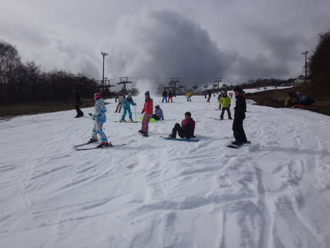

# 11月29日のYeti詳細レポート…晴れのち曇り，すごい混んだよ（涙）

📅 投稿日時: 2015-12-01 01:05:48

アサマ2000が明日から営業開始するという

ニュースを聞いて，

「2日遅いよ…」

と泣きたくなる今日この頃．

皆様，いかがお過ごしでしょうか（涙）．

なぜ…なぜあと2日早くオープンしない…（泣）．

ってことで．

昨日は速報モードになってしまった，

イエティの詳細レポートをば…

…ってか，もうそろそろイエティレポートを見たがる人も

いないのでは…

今日あたりは，八方や栂池，熊の湯レポートの方が

人気がありそうな気がするが．

でも，Yetiレポートに，行くのだ．

…富士山がすっきり見える晴天で始まった，この日曜日．

スキー用に登る道でも…

気温は1℃，時々0℃になることもあり．

路面は凍結してなかったけど，

もう少し早いと危なかったかも…

オールナイト営業明けのこの日．

朝8時の通常営業開始時のリフト券売り場は，

今シーズン一番の列がついており…

うむ？

今日は混みそうな気配…っ！

日陰では，霜が溶けずに残っており．

うーむ．

この日の朝は，気温が低かったようですね…

で，ゲレンデに出てみると．

アイスクラッシュだけじゃなく，人工降雪機の

雪も混ざっており．

雪は結構柔らかめだなぁ…

そして．

オールナイト明けだけど．

朝イチは，人も少な目！

人工降雪機も動いたから，

コース幅も広がったかな…

ただ，朝9時にはもうリフト待ちが2-3分になり…

あらららら？

コース上の人口密度が，かなり上がってきたんですが…（涙）．

そして，11時には…

クワッドリフト3分待ちくらいに…

それどころか．

普段待たないペアリフトにも待ちが…っ！！

オーマイがー！！

このスキー場，ペアリフトなら待ち0，ってのが

いいところなのに…

コース上の人口密度は，午後にはもう…

ああ．ダメな感じ…

人間ポールを縫って滑らないといけないよ…（泣）．

おかしい．

他のスキー場がいくつかオープンしたから，イエティは

混まないはず！

…と，思ったのに．

意外と逆に，他のスキー場がオープンしたら

混むのか…！？？

雪は，最後の落ち込みこの部分．

ここが，ちょっと薄くなりかけた以外は，

雪の厚みは十分あり．

まぁ，地雷が無いだけ，他のスキー場よりましかな…

…とは，思ったものの．

でも，この人口密度と…

このリフト待ちは耐えられない…（これでリフト待ち5-6分）

そして，普段は並ばないペアリフトも

こんな感じ…（泣）．

ペアリフトは，最大でもリフト待ち1分程度なのが，

まだ救いか…

しかし．

他のスキー場がオープンして，人が分散するか？？

と思ったのに．

意外と混んだ，この週末のYeti.

これで，今シーズン最後．

最後…のはず！

来週からは，志賀高原通いだっ！！

（7週続けて見たこの景色もしばらく見納め）

## 💬 コメント一覧

### 💬 コメント by (栗東の傭兵)
**タイトル**: はじめまして
**投稿日**: 2015-12-01 17:02:00

楽しく読ませて頂きました。当方は三代目ステップワゴンでこの冬でアウトバックに乗り換えるものです。雪山に行く回数は少ないですが買い換え車両が似てて参考になりました。これからも読ませていただきます。そして質問、ルーフキャリアをアウトバックではテルツォかイノーかで迷ってるので、貴殿のルーフキャリア事情を書いて貰えるとすごくありがたいな！とリクエストさせて頂きます、是非お願いいたします、お忙しいのは重々伝わって来てますので、ネタが切れたときのネタでお願いいたします。

### 💬 コメント by (Skier_S)
**タイトル**: 栗東の傭兵さま
**投稿日**: 2015-12-02 01:37:51

コメントありがとうございます～

をを！BSアウトバック購入ですか．

スバル車は，雪山では無敵ですよ～！！

高速やロングクルーズの安定感，

山道を走った時の楽しさは

ミニバンの比ではないですから．

私のルーフボックスは，

http://blog.goo.ne.jp/tsakamot2001/e/010f5ad4bacff064b6340fbac0cba4c4

に詳細がありますが…

激安INNOを使ってますよ～！！

