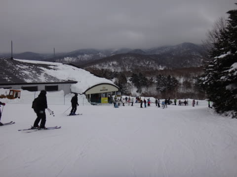

# あけましておめでとうございます！…2014年元日の志賀高原の状況は？

📅 投稿日時: 2014-01-01 23:58:57

🏷️ カテゴリ: [2014スキー滑走日記](c992167609b6415052179ee69ea1ea7d8.md)

えー．

あけましておめでとうございます．

2014年も明けましたが，相変わらず志賀高原滞在中のSkier_Sです．

んで．

本日は．

初日の出ファーストトラックというものに参加して．

わがホームゲレンデの焼額山頂から，

2014年の初日の出を拝んできました～

まず，暗いうちからゴンドラに乗って山頂へ．

山頂では，日の出をまだかまだかと…

お神酒など飲みつつ待っていると…

わずかな雲の隙間から，2014年の初日の出です！

拍手と歓声が沸き起こります！

んで．

初日の出を拝んだら，ゲレンデ開放っ！

朝日が射す幻想的なコースを…

我先に滑っていきます．

なぜかほとんどのスキーヤーがオリンピックコースに下りていったので．

…わたくしめは．2014年のジャイアントスラロームコース，

一番乗りでいただきました．

ですので．

今年，ジャイアントスラロームコースを一番最初に滑った

男，と呼んでください←だれもそんな風に呼ばないって

ってことで．

ファーストトラック終了後，8時半からは通常営業ですが…

このころには，なんだか曇っちゃいましたね．

初日の出，ぎりぎり拝めたようで…運がいいのかな！？

で．

通常営業も10時ごろになると．

あー．

今日もゲレンデの人口密度は高めになってきましたね～．

…とはいえ．

ゲレンデ人口密度がピークの午前10時過ぎでも，

ゴンドラはこんな感じで…

今日は終日，第1ゴンドラの待ち時間はなかったのがラッキー！

やっぱり，元日に滑ろうって人は少ないのかな～．

と思っていたら．

昼ごろから．

ガスが出て，視界が…(涙)

そして，昼過ぎには．

時折，強く雪が吹き付ける天気に…

気温も昼間でマイナス7度近く．

風もあるので，寒いよ…

午後は結局．

こんな感じで．

雪が降ったり止んだり…山頂はガスで視界が悪い，という．

あんまり良くないコンディションで．

ちと残念な感じ…

雪がたっぷり降ってくれれば良いけど．

残念ながら，降ったり止んだりで，なんだか

あんまり積もる感じじゃないので．

そろそろ雪が薄くなっている場所も…

うーむ．

ぼちぼち，どっさり降って欲しいかも…

ちなみに．

ナイターでも，こんな感じで…

降ったり止んだり．

これが降り続けると積もりそうなんだけどな～．

降ったり止んだり，なんですよね．

今のところ，夕方から夜10時までの積雪は10cm程度．

明日は午前中まで雪が降り続けそうだけど…

そんなにドサドサは積もらない感じ．

うーん．

もう一降り欲しいなっ！

という感じで．

今年もよろしくです．
