# 2023/4/2(日)の志賀高原スキー場速報レポート！…一日晴天！早朝はいい感じの締まったバーンだけど，気温が高くすぐに緩んで午後は荒れ荒れ

📅 投稿日時: 2023-04-03 00:54:42

ということで．

今日も志賀高原で滑ってきて．

先ほど帰ってきました…

いや．

木，金ともに睡眠時間3時間前後と，無理して

睡眠時間を削ってスキーに行ったというのに…

土曜の夜に現地でスキー仲間と夜中まで飲んで，

そして日曜は朝6時の早朝から滑ってしまった

ので…

土曜の夜も睡眠5時間ちょいという．

お前は何をやっているんだ

と，自分で自分にツッコミを入れる週末

だったんですが．

今回，帰宅時に犠牲者優しい仲間の方が

帰りに乗りあってくれて，

帰りの運転を強要した運転してもらったので．

車で3時間ほど寝れたのが救い…

これが無かったら，たぶん死んでた…

ってなことで．

これから明日の朝いちの宿題を間に合わせるため，

またちょっと仕事します←スキーしている場合だったの？

取り急ぎ，今日の志賀高原の速報レポートをば…

えー．

まず．

先に書いた通り，昨晩夜遅くまで飲んでたのに，

睡眠時間5時間で起きて，朝6時スタートの

焼額山スキー場の早朝から参戦！！！

早朝券を買わなくても，焼額1日券なら

朝6時からゴンドラが滑れるということもあり，

早朝開業待ちは，予想以上に人が多かったですね…

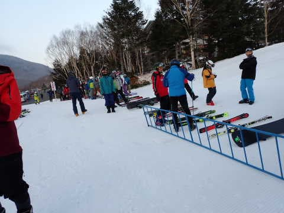

で，早朝はギリギリ氷点下だったので…

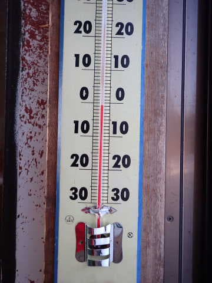

バーンは硬めに締まった，いい感じの

シマシマ！！！

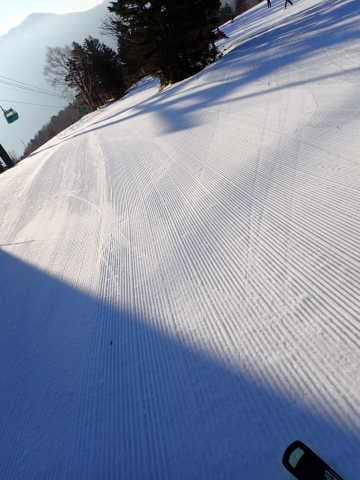

硬いのがあんまり好きじゃない人は，

早朝の2－3本はきつかったかもしれないけど…

3本目以降は表面もかすかに緩み始め，

ちょうどいい気持ちいいバーンに！！！

気温の高い今シーズン，この時期はやっぱり

早朝に限る…！！

無理して朝早起きしてきて良かった…

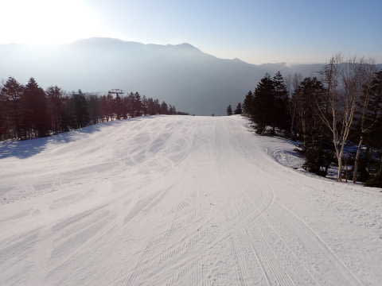

ただ．

一部，圧雪でフラットにしきれなかったところも

あったようで．

圧雪のクオリティが異常に高い焼額としては，

一部には珍しく凸凹がありましたね…

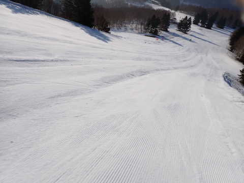

早朝は人は多めながらも，ゴンドラ待ちも

ほとんどなく．

今日は学校の春休み期間だから，混むんじゃ

ないかと思ってたけど，

早朝の時間が終わると，逆に人が減って

リフト，ゴンドラもガラガラになりました…

こんなガラガラでいいのか？？？

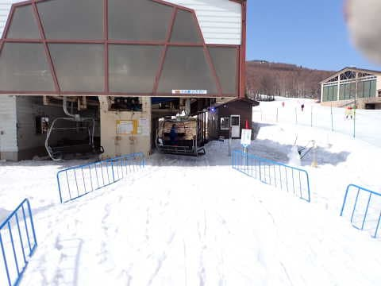

ただ，気温は朝7時にはプラスになってしまい．

最高気温は＋7℃くらいまで上がり，

さらに強い日差しもあったので…

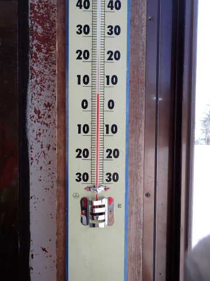

ゲレンデは，朝8時には緩み始め．

朝9時過ぎには，荒れ始めてきました…(涙)

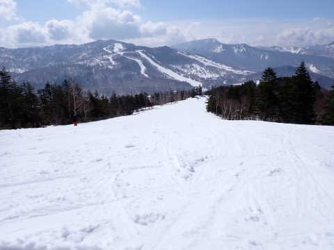

昼前になると，かなり荒れ荒れバーンになり，

ゲレンデの人も一気に減りました…

春休み期間というのに，ここまでガラガラとは…！

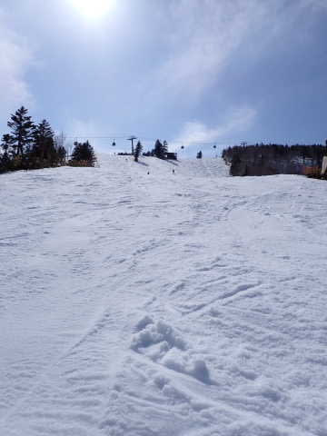

そして．

ゲレンデは荒れていっただけじゃなく…

白樺コースはかなり雪が薄くなり，

ブッシュがかなり出てきたし．

唐松コースもところどころブッシュ．

そして，GSコースにも，わずかですが

雪が薄くなって下地が見えかけてきた

ところもあり…

まぁ，唐松・白樺は今日で終了ですが．

やはり雪が少ない…（涙）

（分かりにくいけど，うっすらブッシュが出ている）

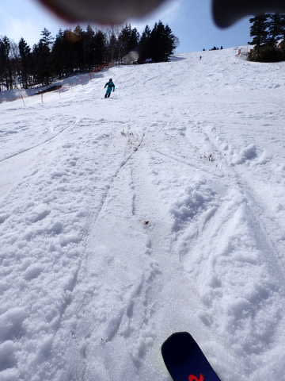

ってなことで．

今日は午後はかなりの荒れ荒れバーンに

なりながらも，雪はストップ雪という

ほどではなく．

そこそこ板は滑ってくれたので…

GWの春スキーみたいなもんだと割り切れば，

意外と楽しく．

睡眠不足というのに，また昼休みも取らず，

ラストの15:30までひたすら滑り続けて

しまったのでした…

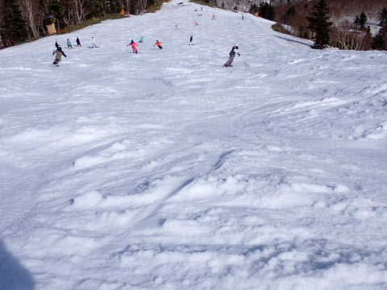

…しかし．

焼額，もってあと2週間かな…

4月22日の週末までもってくれるか微妙．

GWまでは，

これから奇跡の冷え込みで新雪がどっさり

積もって，冷え冷えが続いて雨も降らない

とかいう奇跡でもない限り，絶対ムリですね…（涙）

そして．

今週はまた，4日から7日までずっと気温が

高そうで…

さらに7日には気温が高い上に雨が降りそう（泣）

かなりヤバい感じです…

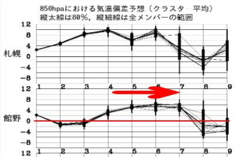

おそらく，志賀高原がまともに滑れるのも

あと2週間ほど．

予想よりかなり早いシーズンオフになりそうな，

残念な感じです…（激烈な涙）

ホントに来週以降，奇跡の冷え込みで

1mほど雪が積もってくれないかな…（懇願）

## 💬 コメント一覧

### 💬 コメント by (ダウンヒル)
**タイトル**: Unknown
**投稿日**: 2023-04-03 10:44:25

やはり、心優しい仲間の方がおみえだったのですね!20,000ステッカーを貼り、且つ、見たことあるウェアを纏っていたので、そんな気がしてました。人徳ですね!!

ハイリスクなチャレンジも冷や汗かきつつこなせましたし、オールスターの方々にもご挨拶出来たりと、楽しく無事に過ごせました!有難うございました。

また来シーズンも宜しくお願い致します。

### 💬 コメント by (Skier_S)
**タイトル**: ＞ダウンヒルさま
**投稿日**: 2023-04-04 05:47:07

この週末はお世話になりました～！！

今シーズンは20000チャレンジ成功など，いろいろありましたね…

今シーズン，あまり一緒に滑れませんでしたが，また来シーズンもよろしくお願いします．

