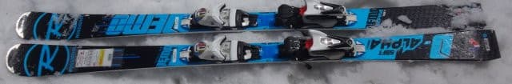
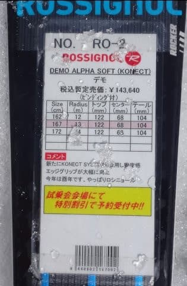
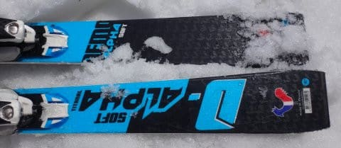

# 2018シーズンモデル，スキー試乗レポート第24回…ROSSIGNOL編その3

📅 投稿日時: 2017-07-07 01:48:18

まだ続くの？？

…という感じのスキー試乗レポートですが．

ええ．

まだ続きます．

まだつづきますよ～！！

でも．今回を含め，あと残り2回で

終わる予定なので．

今しばしお付き合いを…

…今回も，以前試乗した板をもう一度履いた，

2回目の試乗レポートになります．

ロシニョール編です．

では，どうぞ～！

---

◎ROSSIGNOL DEMO Alpha SOFT 167cm（2回目）

基礎小回り（小回りベースオールラウンド？）

この板も．

[前回の試乗](e3802d91d316cb55319ada228fcc67f78.md)でいい印象があったので．

次期主力機候補として，2度目の試乗に挑みました…

前回の試乗の時．

一の瀬ファミリーの緩斜面の，柔らかめの

雪では気持ちよくきれいに曲がっていった

この板ですが．

一の瀬ファミリーの急斜面．

朝のうちの，比較的固いバーンを滑ってみたところ…

スピードを出していくと，あら．ちと弱い…．

トップスピードを出していくと，167cmでは

ちょっと回りすぎる感じが…

回さないでおこうと角づけを弱めると，

今度は固い斜面で板がずれていきます…

決してエッジグリップが弱い，ヘロヘロな

板ではないので．

回りすぎるのに乗って，あまりスピードが

上がりすぎないところでくるくる回っていけば

面白いけど…

ハイスピード出していくとちょいとたわみすぎて．

ハイスピードの固い斜面だとずれていっちゃいます．

緩斜面～中斜面の，ある程度ゆったりしたスピード

（普通にゲレンデでクルーズする程度のスピード）だと，

エッジに乗って，気持ちよくきれいに回って

いけるので，普通に履く分には全く問題ないのですが．

トップスピードでちと物足りない感じなので．

この板も私の次期主力機候補からは

外れた感じです…

うーむ．残念…
