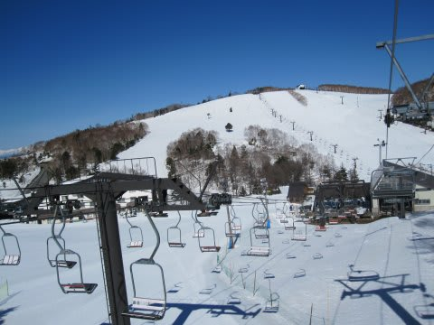
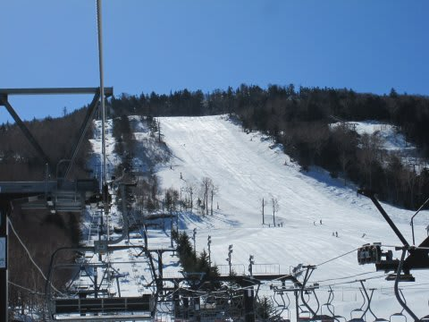
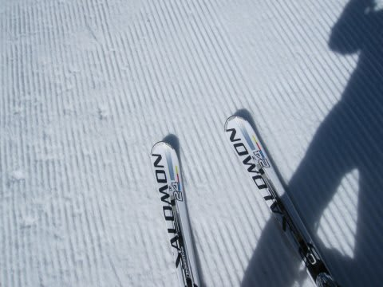
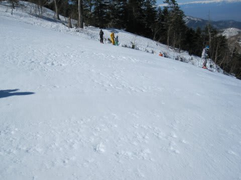
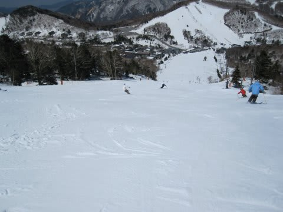
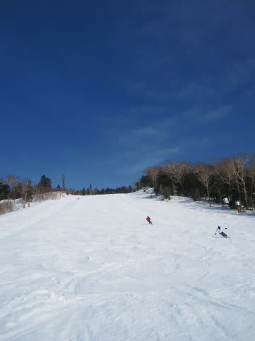
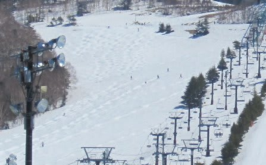
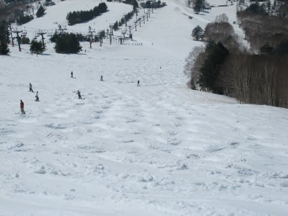
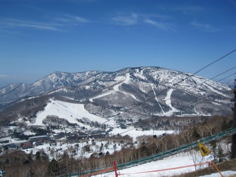

# 4月17日　日曜日の志賀高原スキー場

📅 投稿日時: 2011-04-18 01:05:28

🏷️ カテゴリ: [2011スキー滑走日記](ca488c98cfb9169941c3e73770dcefb56.md)

で．

雨の土曜日が過ぎて．

日曜は．

朝から快晴！！！

日差しは強いですが，気温はしっかり冷え込んでます．

車には霜がつくぐらい．

ということは．

これが意味することは．

朝イチの一の瀬ファミリーのゲレンデは，かっちり固い

アイスバーンです．

隅から隅まで凍りついてます．

滑るとびりびりと強烈な振動が伝わる電動マッサージ斜面．

アイスバーンの大売出しです．

日が照っているので，このアイスバーンも1時間くらいで緩むかな…

と思っていたところ．

2時間以上緩まなかった…

というより，10時を過ぎて表のざらざらが取れて，

部分的につるつるの氷になってきた…

10時半には，一の瀬の下の緩斜面は緩み始め．

緩み始めると一気にやわらかくなりましたが．

上半分は，12時近くまで固かった…

昼過ぎには，上半分もようやく緩み始めました．

午後には，小回り道ができ始めましたが．

しかし．コブ斜面になるほどでもなく．

人も少なめで．

午後4時のリフトストップ時間まで，大回りOKでした．

下半分は，ちょっとやわらかい板がもぐる雪になってますが，

雪の汚れや板への張りつきがなく，この時期とすれば

十分いい条件ですね～．

そういえば，昼過ぎごろ．

高天ヶ原のコブも行ってみましたが．

なんか，中途半端なラインコブでした…

いつもこの時期は全面コブになってる気がするんですが．

珍しいですね．

ここ数日，午前中は雪が固すぎて，掘れないんでしょうね．

コブ溝に土が出てくるようなこともなく．

まだまだ十分な雪の量がありますね～．

今年は雪が多いです．

高天ヶ原からは営業終了した焼額が見えますが．

まだ第1高速沿いもオリンピックコースもまだ土が出てませんね…

例年より1-2週間，雪が消えるのが遅いでしょうか．

で．帰り道．

道路は完全ドライでした．

今日は夏タイヤでも全く問題なかったです…．

…しかし．

そろそろ，高速の交通量が戻ってきましたね．

関越が，高坂先頭に最大30km，50分渋滞．

うーーーん．

経済活動が復活するのは大歓迎ですが．

…やっぱり渋滞はいやですね…
