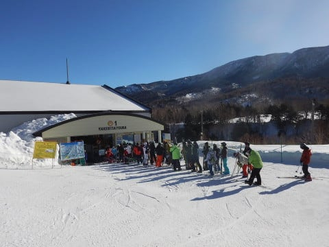
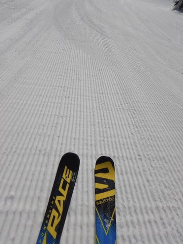
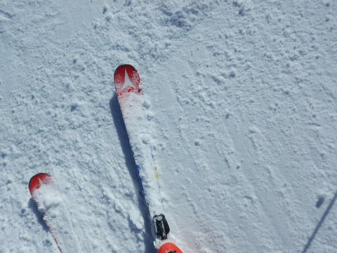
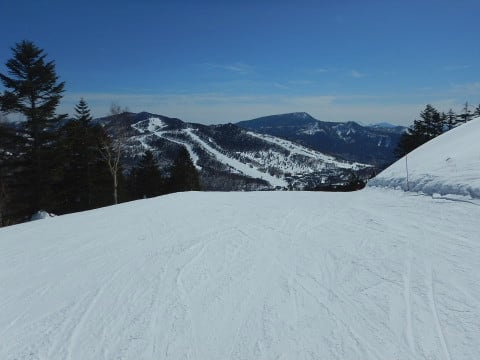
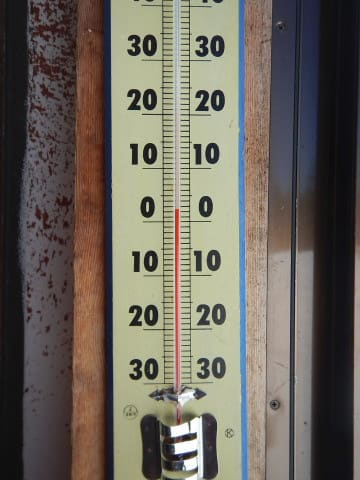

# 2019/2/24(日)の志賀高原，詳細レポート！…終日晴天なれど，ゲレンデは硬め．暖かかったので，日が当たる東向きバーンは雪がちょっと緩んだけど…

📅 投稿日時: 2019-02-26 02:32:08

🏷️ カテゴリ: [2019スキー滑走日記](c3e4496fc0fb7f9c17ff21214a35b1ace.md)

えー．

やっぱり，28日木曜日は．

志賀高原でも，昼ごろから

液体が空から落ちてくる

予想になってきた今日この頃．

皆様いかがお過ごしでしょうか（涙）

…ただ．

最新の天気図では．

3月3日の日曜は，何とか夕方まで

ギリギリ天気がもってくれそうに

なってきたので．

この週末の土日は．

スキーを滑っている間に，

空から落ちてくる液体を浴びる

心配は無くなってきた感じです

でも．

営業終了後．

日曜夜から月曜にかけては．

雨になりそうですが…（泣）

ダメだ．

神は，まだ踊り足りないと言っているようです…（涙）

ってな悲しいニュースのあとは．

日曜の志賀高原，詳細レポート！

えー．

まず．

日曜は朝から，すっきり晴天っ！！！

朝にこんなにすっきり晴れたの，

久しぶりじゃなかろうか…

いつも通りの焼額第1ゴンドラ営業前に

並びますが．

さすが天気のいい日は，待っている人も

いつもより多い気が…

8:30営業開始の第1ゴンドラで山頂に

上がると…

朝の気温は，-6℃．

ほぼ予想通りの，そこそこの冷え込み！

そして，山頂のゲレンデは…

そうです！！

シマシマっ！！！

通常営業開始前に行われている

ファーストトラックで滑った

跡が残ってるけど…

ガチガチアイスバーンという

私の当初予想を裏切り．

下地は硬めながらも，

表面はそこそこエッジが効く，

締まった感じの圧雪！！

晴天のシマシマ，いい感じっ！！！

…と，朝イチの人の少ない

GSコースを2-3本滑っていると…

固めの圧雪の表面が崩れていき．

なんだか，殺人コロコロが大量に

発生してきちゃったんですが！？？？

そして…

じきに，殺人コロコロばらまき妖怪に

よってばらまかれたコロコロが．

コース全面を覆い尽くして

締まったのですが…！！？？（涙）

…せっかくの晴天なのに…

GSコースが楽しかったのは，

わずか数本のみか…（涙）

だもんで．

オリンピックコースはどんな感じかな？

…と，見に行ってみると…

…これは，かなり固めですね…

あさイチは硬いながらも，表面が

ざらざらした感じで，まだエッジが

多少は効きますが．

人が大勢滑ると，磨かれてツルツルに

なっていきそうなコンディションですね（泣）．

あぁ…

天気がいいだけに．

これで普段の2月の，トップシーズンバッチリの

雪だったら…

ちょっと残念…

で．

午前9時半には，コース上の人も増えていき．

そして，ゴンドラ待ちも多少出てきたので．

ちょっと残念な殺人コロコロバーンの

焼額を脱出し．

奥志賀へやってきました～！

奥志賀は，スキーヤーを殺す

殺人コロコロが出てないよ！

リフト側のエキスパートコースは，

かなり固めに締まっているけど，

エッジが研いであれば快適に飛ばせる，

ハイスピードフラットバーン！

…でも．

結構固いので．

エッジを研いでない板だと，ちょっと

辛かったかも…

でも．

見ての通りのフラットバーンで．

リフト待ちも多少はあったものの，

全然我慢できるレベルだったので．

晴天の中，気持ちよく滑れましたよ～！

…ただ．

やはり，昼ごろになってくると．

硬い部分は磨かれてツルツルに

なり始めてきて．

氷が削られたものが溜まった部分と，

ツルツルとが入り乱れてきて，

ちょっと快感度は落ちてきたかな…

昼ごろには，日差しも強く，

気温も上がってきたので．

おそらく，そろそろ焼額の殺人コロコロも，

柔らかくなって滑りやすくなってるんじゃ

ないかな？？

と考えて．

昼ごろには，マイホームゲレンデの

焼額へ復活！

気温が上がったので，予想通り

殺人コロコロはほぼ消えてたけど．

さすがに，山頂でも+2度と，

かなり気温が上がり…

さらに，日差しも強いので．

日が当たる東側の唐松コースや．

GSコースの下部なんかは，

結構雪が緩んでいて…

うーむ．

これは，3月下旬の雪みたいなんですが…

…とはいえ．

東向き以外の斜面，

GSコース上部やオリンピックコース，

パノラマ-サウス等のコースは，

ほとんど緩んでなくて．

むしろ，ところどころ固い下地が

出てきちゃってる感じで．

焼額は，硬いところと緩んだところが

場所によってミックスしているような．

なかなか雪質変化が激しい感じ…

とはいえ．

午後になるとゴンドラは飛び乗りだし．

コースの人もいなくなり．

晴天ピカピカの下，貸し切りバーンを

かっ飛ばせる，この快感！！

さすがに夕方になると，多少

荒れてきた感じはあったものの…

なんと．

ここで，嬉しいボーナス！

昨日，今日と．

大会のためクローズされていた

白樺コースが…

営業時間残り1時間を切ったところで，

一般開放！

…貸し切りで，一般客が滑ってないコースですから．

この時間になっても，シマシマっ！！

そして，人がほとんど帰っちゃった

日曜の夕方なので…

誰も滑ってないよ！！

いやーー！

滑れたのはわずか2本だったけど．

夕方になって，またシマシマバーンを

美味しくいただきました…

…ってな感じで．

今シーズンにしては珍しく，

夕方まで一日快晴が続いた本日．

今日もお約束通り，日が傾く

営業終了まで，ガッツリ滑って

帰ったのでした…

うーむ．

久しぶりの晴天の一日で．

やっぱりスキーは，太陽のもとやるのが

気持ちいいなぁ…

と，思いながらも．

これで，普段の2月の雪質だったら…

と，ちょっと残念に思わずに

いられない…

そして．

次はまた28日，5日と液体が降ってきそうで．

そのあとも，高温が続きそうなので．

…考えたくないけど．

もう，トップシーズンの最高雪質で

滑れることは無いのかも…（激涙）．

今シーズン，トップシーズンが短すぎ．

スキーシーズンとは，短いものよ…（刹那感）

## 💬 コメント一覧

### 💬 コメント by (musi)
**タイトル**: 野沢温泉
**投稿日**: 2019-02-26 13:40:25

両親サービスを兼ねて、23・24は志賀高原

ではなく、野沢温泉を滑ってきました。

23日はガスが掛かったり小雪に降られましたが、

24日は快晴でした。

23日こそ、軽い雪が薄く積もりましたが、

野沢も標高の低いコースは、重たい雪になり、

コース脇もふわふわの新雪に見えて、そのままカッチ

カチに固まり、標高の高い部分も固めが多く

一部アイスバーンでした。

やはり全体的に雪が少ない影響なんでしょうか。

道路も完全にドライでした。

平成最後のスキーシーズン奇跡の3月のドカ雪、

の為に皆で冷え冷え踊り、功徳を積みましょう。

なんとか今シーズン中にSさん達の雄姿を

捉えるのを目標にシーズン後半戦に臨みます。

（あ、まだ猫魔/アルツの早割チケットが

　未消化だ・・。）

### 💬 コメント by (若杉勲71)
**タイトル**: Unknown
**投稿日**: 2019-02-26 16:39:08

志賀高原情報

本火曜日は、申し訳ないけどオール二重丸。天気は快晴で0ど前後。ビューポイントのそばで野外昼食を堪能。ヤケビ二重丸、奥志賀二重丸。エキスパートは特上。一ノ瀬も二重丸。たかまのこぶはかちかち山だったけど、まあ行くとこすべてが感激レベル。それでもレインボークラブ員は2時きっかりに打ち上げて、四時には宴会を始めているのでありました。

### 💬 コメント by (FCAMEL)
**タイトル**: 白樺開いたんだー！
**投稿日**: 2019-02-27 02:46:20

さすがSさん、最後わずか二本の無傷の白樺滑れたなんて、

日頃の精進の賜物としか言いようがないですね！

私はこの週末は白樺二日滑れなかったせいで異様にストレスがたまりました。

ちなみに月曜は朝一奥ゴン二本だけ滑りましたが、

晴天の中この季節とは思えぬカリカリバーン、

救難訓練受講用に念のため履いたオールマウンテンで、

オフピステ装備全部しょって今季最高速が出ました！

これはこれで楽しいんですが季節考えるとやはり異常ですね。

ゲレンデの雰囲気はなんだかもうシーズン終了ムードですが引き続きよろしくお願いします！

### 💬 コメント by (Skier_S)
**タイトル**: 今週末もアイスバーンかも…
**投稿日**: 2019-02-27 03:19:31

＞musiさま

野沢も日曜は晴天だったんですね．

しかし，雪はやっぱりヤバい感じですか…

とりあえず．

3月以降の奇跡の冷え込みを信じて，ひたすら祈って踊るしかないですね…（涙）．

…そして．

3月以降，キンキンに冷え込んだ最高の志賀高原でお会いしましょう…！

＞若杉さま

ええええええ！！

火曜日，良かったんですか…

雪は緩まなかったんですか？？

いいですね～．．．．．

28日に液体が空から落ちてこず，いいバーンコンディションを

キープし続けてくれるよう，祈りましょう…

＞FCAMELさま

そうなんですよ．

午後2時ごろから，ずっとパノラマ～サウスを回して，

オープンを待ち続けてました…

そのおかげで何とか滑れたのですが，しかし滑れたのは

最後の2本だけ（涙）．

もう少し早くに開けてほしかった…

でも，ホントに雪はシーズン終了感が漂う状況に

なってきましたね…（泣）

