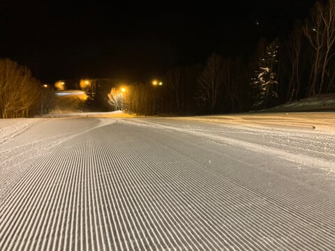

# 実は今週，20000m達成者が誕生していたらしい…そして明日から何とか志賀高原へ復活！！

📅 投稿日時: 2024-02-11 00:01:08

えー．

3連休のはずの本日．

私は一日家で過ごしていたわけですが…

見たくない事実が送られてきましたね…

本日は，ものすごいい晴天で，

雪質も最高だったようです…（涙）

あぁ…

私が行かない日は晴れなくていいのに…

猛烈吹雪でドカ雪が積もってくれれば

いいのに…

さすが3連休なので，あさイチはこんな感じで

並んでいる人も多かった第1ゴンドラですが．

昼間はそこまでひどく待たなかったようで…

いやー．

晴天で雪もよく，

コース上も見たところそこまで混雑

してないから…

なんだか，よかったみたいですね…

ちなみに，昨日圧雪車が壊れて一部非圧雪

だった奥志賀エキスパートコース，

今日は完全圧雪だったようです．

まぁ，夕方に曇って雪がちらつき始めた

ようですが．

基本的に，営業時間はほぼずっと晴れていた

ようで…

あぁ…

なぜ私が行けない日に限って…

そして．

ナイターも…

うぎゃーーー！！！

超シマシマっ！！！

冷え冷え雪の最高シマシマッ！！！

かなりよかったみたいで，

うらやましい…

あぁ…ホントはこの3連休で

2回ナイターに行けたはずなのに…

1回だけしかこの極上ナイターを

楽しめないとは…ッ！！（涙）

とりあえず，

今晩は夜中に5～10cmくらい積もって

くれそうなので．

明日は終日曇り空ながら，

朝は冷え冷えの柔らかめ圧雪の

Goodコンディションになりそうです…！

ってなことで．

今日は涙を呑んで仕事をしてたけど．

そして，仕事はまだ終わってないけど．

必殺，終わったことにする

という技を繰り出して，

明日から志賀高原へ復活します…！！

…でも，3連休中日だから混むだろうなぁ…

ってなことで，話題は変わって．

コロナ禍この方，営業リフトが減ったり

リフトが減速運転になったりで，

なかなか達成が難しくなり，

新規チャレンジャーが減った，

20000mクラブゴールドへの道ですが．

なんと．

今週．

新たに20000mを達成した，

ちょっとおかしい人素晴らしい達成者が

生まれたようです…！

…あ，このBlogを読み始めたばかりの人で．

20000mチャレンジって何のことか

知らない人は，

[この説明記事](e9ca7ed0b1181e99c8b655a493838954f.md)や[こんなチャレンジ記録](e88a135f694d88ef49cb5ab33e5bcee51.md)

読んでやってください…

で．

一ノ瀬第3クワッドが営業してない今，

平日でも修学旅行生とかで混む一ノ瀬

ファミリーでは，もう1日滑走標高差

20000mは達成不可能と思っていたの

ですが…

木曜は一ノ瀬ファミリーナイターもあり，

ナイター込みで無事達成したようです…！！

とりあえず．

普通の人ならやろうとは思わない普通の人間では

達成できない1日滑走標高差20000mを

達成したということで．

自分は終わった人ですということを示す

素晴らしい記録を達成した人であることを

示す証，ゴールドステッカーを

授与する予定です…！

あー．

でも．

決して普通の人はチャレンジしようと

思わないでください．

滑り始めて2時間後くらいに，

「なんで自分は飲まず食わず休まずで，

　こんなことやってるんだろう…」

と虚しくなるチャレンジです．

繰り返しますが．

普通の人はやってはいけないチャレンジです．

常識的な人は，健全で平和な世界で

過ごしてください…

ってなことで．

明日から2日間，志賀高原で滑ってます～！

## 💬 コメント一覧

### 💬 コメント by (副院長)
**タイトル**: Unknown
**投稿日**: 2024-02-11 17:51:42

連休混雑避けて、サンバレーでぐるぐる。リフト待ち無し。ガリガリでした。

明日は午後目掛けて、遠征してみるかと、思ってます。焼額の雪はよかったのでしょうか？

### 💬 コメント by (Skier_S)
**タイトル**: ＞副院長さま
**投稿日**: 2024-02-12 00:55:16

焼額の雪は，サウスとGS，オリンピックコースはちょっと下地が

硬めのところがありましたが…

白樺や唐松，パノラマは大丈夫でしたよ～！！

