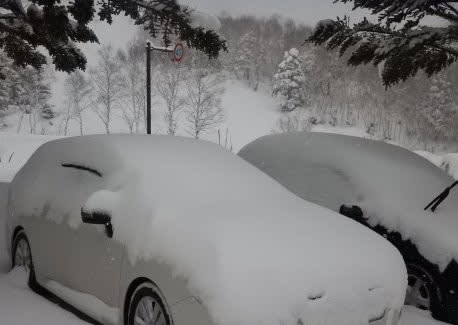
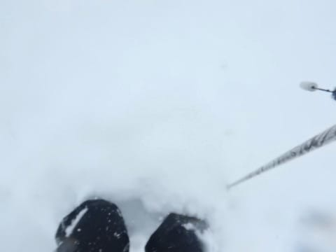
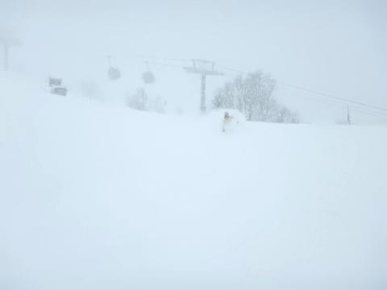
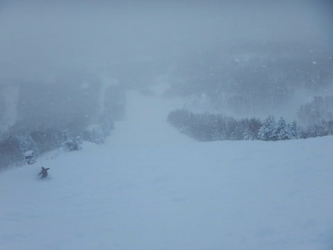
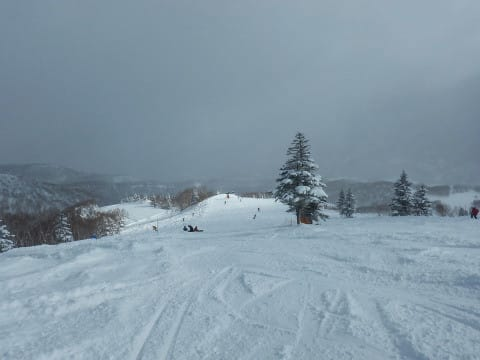
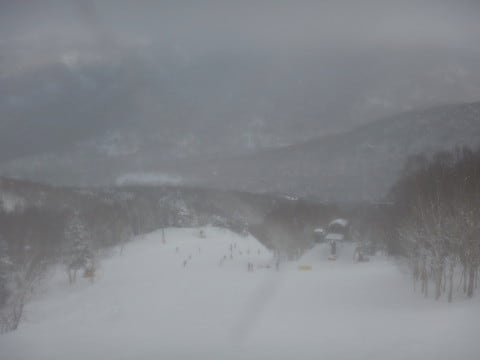
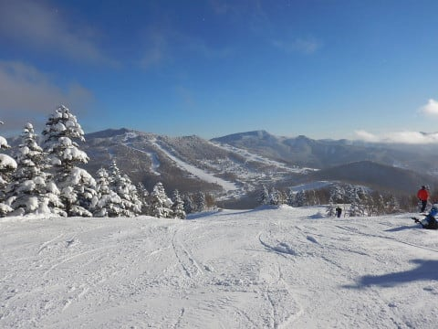
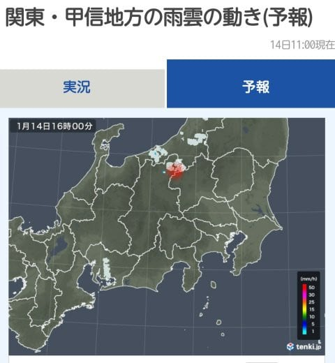
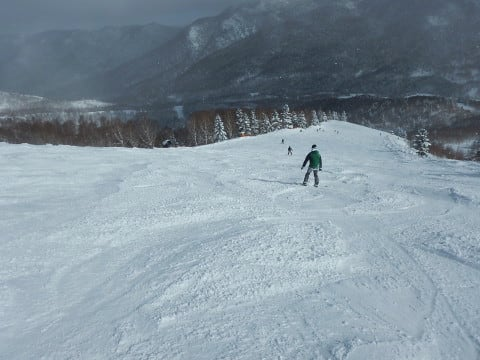

# 1月14日（日）の志賀高原・焼額山スキー場速報モード…あれ？予想外した？？朝はひざパフ！昼過ぎまで曇り～雪．夕方は晴天！

📅 投稿日時: 2018-01-15 01:33:48

🏷️ カテゴリ: [2018スキー滑走日記](c11b88dc181f34079ab41db74a3587646.md)

えー．

ということで．

今日もいつも通り．

お約束のリフトストップまで滑ったので．

帰宅はいつもの深夜パターン…

だもんで．

日曜定番の速報モードです！

今日の朝は予想通りの雪降りで始まったのですが…

あり？？

車に積もった雪を見ると，

積雪30cm近くあるんですが？？

…確か．

誰かの予想では．

水曜段階の予想では全く降らず．

金曜の修正予想でも5cm，せいぜいブーツパフの

積雪と言っていた気がするのですが…

これがブーツパフですか？？

どう見てもひざパフなんですが！？？

焼額のオリンピックコース．

すごく楽しいひざパフパウダーなんですがっ！？？？

どうしてくれるんだ～！！！

誰かの予想のおかげで，太い板を

持ってこなかったよっ！！←自分の予想でしょ

まさか，こんなに積もるとはっ！！

そして．

すっきり晴れるはずの予報なのに．

曇り～雪降りの天気がずっと続き．

時折日が射す瞬間もあるものの…

午後2時過ぎまで，なぜだか続く

曇り空…（涙）．

確か，誰かの予想では．

水曜段階の予想では終日晴れ．

金曜の修正予想でも，朝のうち雪は残るが

昼ごろには晴れるはずだったのでは？？

誰だ～！

適当な予想をする奴は！！←だから，自分だってば

でも．

晴れるのだ．

じき，晴れるはずなのだ．

私が晴れるというのだから，晴れるはずなのだ！！

…

…

晴れた！

ふはははは！

私が晴れと言ったら晴れるのだ！！

…でも．

すっきり晴れたのは午後3時近く…（涙）．

…今日の予想，外しました…（激泣）．

でも．

なんだかこんな感じで，志賀高原近辺にだけ

ピンポイントで雪雲がかかっていたようで．

うーむ．

予想しきれなかった…（涙）．

ちなみに，今日のゲレンデの雪質は．

朝イチは10cm程度の軽いパフパフパウダーが

コース全面を覆い．

昼ごろになると，パウダーが蹴散らされて凸凹に

なっていき．

凸凹の谷間は，アイスバーンとまでは行かないけど，

ガリガリした感じの，ちょい硬めの下地が顔を出してきて．

午後のバーンコンディションは，かなり疲れる

雪でした…

返す返す，先週の雨が惜しい…

でも．

本日．

予想は外したけど．

午前中はパフパフパウダーを楽しめたので，

良かったとしよう！！←問題をうやむやにしようとしている

## 💬 コメント一覧

### 💬 コメント by (はなげ親分)
**タイトル**: うぎゃ～
**投稿日**: 2018-01-15 10:29:12

1ゴン故障で運休!!

### 💬 コメント by (Skier_S)
**タイトル**: はなげ親分さま
**投稿日**: 2018-01-15 10:56:57

あら…

せっかくの平日スキー、それも晴天冷え冷えの

朝なのに…

ご愁傷様です（合掌）

### 💬 コメント by (はなげ親分)
**タイトル**: お騒がせしました
**投稿日**: 2018-01-15 11:18:48

1ゴン復活しました。

私の平日スキーの時は、よく何かが起こる…

### 💬 コメント by (はっち)
**タイトル**: お声がけ下さりありがとうございました
**投稿日**: 2018-01-15 16:34:37

滑りにはついていけませので、いつかタイミングがあえばゴンドラだけでもまたご一緒できればと思います。　それにしても朝一は予測がいい方に外れて良かったですね！

### 💬 コメント by (Skier_S)
**タイトル**: はっちさま
**投稿日**: 2018-01-17 03:05:44

コメント返信遅くなりましてすみません…

日曜の朝イチのひざパフは楽しめましたね～！

でも．

降らない予想だったので，太い板を

持って行かなかったのが痛いです…

では，また志賀高原でお会いしましょう！

