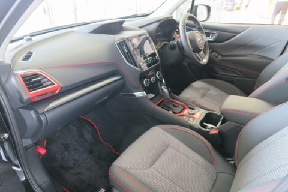

# 新型フォレスターに試乗してみた…早くも試乗車が出てたよ！

📅 投稿日時: 2018-07-15 00:45:12

🏷️ カテゴリ: [車試乗](c07dec5709d34bd74e1f6cb9c8291061b.md)

ってなわけで．

本日，納車日だったので．

E型Levorgをスバルに受け取りに行ったのですが．

ディーラーに行ってみたところ…

…あれ？？？

7月19日発売の，新型フォレスターが

あるじゃないですかっ！？？？

…まだ発売前のはずなのに…？？

Dラーさん「あ，これですか？

　今日，ついさっき試乗車が届いたんですよ！」

なんと．

発売前なのに，試乗車が来ているのか…っ！！

私「え？これ，試乗できるんですか！？？

　試乗っ，試乗させてくださいっ！！」

Dラーさん「…え？？」

一瞬固まるDラーさん．

…そりゃそうでしょう．

今日，納車日で新車を受け取りに来たのに．

違う車に試乗したがる客は，そうそう

いないでしょうから…

Dラーさん（試乗って…そもそも，あなたこれから

　しばらく車買い替えないでしょ？？？）

という表情を一瞬したように感じたけど

Dラーさん「……え，

　えぇ！いいですよ！！どうぞ！」

と，一瞬の間の後．

快く試乗を引き受けてくれたのでした！

…ってことで．

先代はSJでしたが．

今回の形式名はSKとなる，新型フォレスター．

写真で見るより，ボンネットが高く見えて．

かなり押し出し感の強い感じのデザインです．

実物を見ると，結構迫力を感じる造形．

で．

トランクが広い！

開口部がガバッとありえないくらい広く開いて．

実際のカタログ寸法より広々使える感じ．

リアシートをたたむと，こんな感じだし…

これで荷室の広さが不十分だと感じる人は

そうそういないでしょう…

ドアもかなり広く開くし．

乗降性も悪くない感じ．

グレードはX-Breakだったので．

荷室やシートも撥水仕様で，

室内にもオレンジのアクセントが

入ります．

内装は驚くほど高級…ってほどでは

ありませんが．

でも，先代のフォレスターのユーザーは

悔しくなること間違いなしの質感アップ．

ステアリングも，ヒーター付きの本革だよ…

そして．

リアシートが思ったより広い！

外から見た感じより広くて．

私が運転席のポジションを調整した状態でも，

これだけのスペースがあるので．

これなら，後ろ座席に座った人からも

文句は出ないでしょう…

ちゃんとコンソールの後ろに，リアシート用の

エアコン噴き出し口があるし．

リアシートにもシートヒーターが

ついてます．

…Levorgにも，リアシートヒーターが

欲しいんですけど…

ってことで．

中の広さ，内装のクオリティは，結構いい感じ．

後ろ座席にも人が乗ることが多かったり，

トランクに積む荷物が多い人は．

フォレスターがかなり優位に立ちそうです…

で．

とりあえず，走ってみましょうか…

まず，ゆっくり動き出してみると．

…あれ？意外とステアリングが軽い？？

スバル車らしからぬ，かなり強めのアシストで，

ステアリングはするする軽く回ります．

そして，走り出すと．

おっと…

意外とサスが柔らかい．

かなりバネレートは低めな感じ．

ブッシュもそんなに固めておらず．

ダンパーも突っ張る様子もなく，

すっとストロークしていきます．

だもんで，段差や路面の突き上げなどは，

かなり柔らかく受け止めます．

ただ，その分．

ロールや，ピッチ方向のダイブなどの動きは

大きめに出ます．

…これは．

アスファルトをハイスピードでフラットライドで

かっ飛ばすというよりも．

荒れたオフロードや轍で凸凹になった雪道なんかに

合わせこんでいるんじゃなかろうか…

うむ．

オンロードでの特性だけを突き詰めたんじゃなく．

オフロードでも走れるよう，サスストロークを

しっかり出せるように，SUVとして真面目に作りこんで

あるんじゃないかな～？？

で，今回の試乗コース．

かなりのタイトコーナーが続く，アップダウンの

激しいコースがあったのですが．

サスが柔らかいにもかかわらず．

ライントレース性は十分．

コーナーの続く山道で，ゆらゆらするような

ことは全く無く．

私にとっては，問題なく山道を攻められる

レベルです．

スプリングレートが低いにも関わらず．

妙なロールの揺り戻しもなく，

ピシッと狙ったラインに乗せていけたので．

かなり太めのスタビが入っているのかな～？

で．

車内はかなり静かです．

多少ロードノイズを拾いますが，

遮音をかなり頑張っている感じがあります．

そして．

気になる2.5L直噴エンジンですが…

私が乗っている，RBレガシィのFB25エンジンより

馬力がちょっとだけ上がってるようですが．

…全く違いが分からないレベル．

車重も，BRレガシィとSKフォレスターで全く

同じなので．

かなり似た感じの走りでした…

CX-5のディーゼルのようなパンチの効いた

トルクは無いけど．

2Lに比べれば，するする走る感じ．

アップダウンのあるワインディングでは，

SI-DriveをSモードにしておけば，

気持ちよく回りますし．

Iモードでも，かなりの登り坂でなければ，

低回転で十分なトルク感で走っていき．

パドルシフトと併用すれば，アップダウンの

激しい道も問題なく走れます．

これまでターボ車に乗ってた人にとっては，

ちょっと物足りないかもしれないけど．

2LのNA車に乗ってた人は，かなりパワーアップ感を

感じるんじゃないでしょうか…

そして．

最後のとどめに．

アイサイトツーリングアシストが

ついてます！

0km～のレーンキープ機能が付き．

停止保持もできるし．

あとは，最近はやりの停止保持

（AVH．信号待ちなんかで一旦停止したあと，

ブレーキを離しても停止し続ける）

もしっかりついてるし．

うーむ．

LEVORGを買う前にこのフォレスターが

出てたら．

家族でスキーに行くときとか，

後ろ座席に人を乗せることが多いので．

かなり真面目に，購入候補になってたなぁ…

しかしなぜ，そうそう滅多にない，新車納車という

イベントがあった日に．

新車の納車レポートを書かずに，別な車の

試乗レポートを書いているのだ…？？←自己突込み

## 💬 コメント一覧

### 💬 コメント by (なるなる)
**タイトル**: Unknown
**投稿日**: 2018-07-15 01:08:28

新車のレポートを期待していたのですが、まさかのフォレ試乗記ですか。

良い意味で期待を裏切って…

新車を受け取りに行って、別の車を試乗するって、普通は無いと思いますw

### 💬 コメント by (Skier_S)
**タイトル**: なるなるさま
**投稿日**: 2018-07-15 01:22:30

ディーラーに到着して，新車の確認をしていた時，

自分の車よりも隣のフォレスターが気になってしまって．

ついつい試乗してしまいました（笑）

いや…LEVORGのレポートなら

世の中いっぱいありますが．

新型フォレスターに乗ったことある人は

まだまだそうそういないよな…

フォレスターの試乗レポートの方が，速報する価値は

あるよな！！！

…と，納車日に違う車のレポートを書いてしまいました（笑）．

かなり皆さんの想定を裏切ったかと…

### 💬 コメント by (もりや)
**タイトル**: 納車おめでとうございます
**投稿日**: 2018-07-15 05:00:57

LEVORG納車おめでとうございます。2.0ターボの圧倒的な加速力が病みつきになりそうですね(笑)私もSUBARU車一本でプロジェクトXを進めてますが、スキーに行く時に使用するか、しないかの問題で壁にぶつかっています。それによっては車種の選択が変わって来ますし・・・どうしようか日々悩んでます(笑)

### 💬 コメント by (Goku)
**タイトル**: 私も
**投稿日**: 2018-07-15 08:42:44

私も試乗してきました～✌

期待通りとても良くて、そのまま乗って帰りたい気分でした。

### 💬 コメント by (Skier_S)
**タイトル**: E型Levorg現在いろいろ取り付け中
**投稿日**: 2018-07-16 09:58:08

＞もりやさま

をを！スバル1本ですか…

スキーに行くときに使うべきだと思いますが．

アウトバックやフォレスター，雪道での

安定性は特筆ものですよ．

スキーに4人で行くなら，アウトバックに

ルーフボックスあたりをおススメ…

＞Gokuさま

あ，そちらでも試乗車出てたんですね！

予想より良かったですね～．

CX-5との一騎打ちでしょうか．

でも，CX-5のディーゼルだと，値段が…

ここはやっぱりフォレスターが本命じゃ

無いでしょうか！？？？

### 💬 コメント by (つーちゃん)
**タイトル**: スバリスト
**投稿日**: 2018-07-16 11:56:41

Gokuさんもスバルになれば

スバル率が更に上がりますね、、、

｢志賀高原スバリスト倶楽部｣結成できるんじゃないですか？笑

### 💬 コメント by (Goku)
**タイトル**: 専用Ｐに搭乗口
**投稿日**: 2018-07-16 21:05:24

Ｓさま

フォレスターの実車を見るまで、ＣＸ－５もかなり有力でしたが、実車を見たらフォレスターが相当優位に立っています。

つーちゃんさま

確かに私までスバルになると、焼額山Ｐにはスバル車がズラリと並ぶことになりますね。

いっそのこと、スバルにヤケビのスポンサーになってもらい、専用駐車場とイチゴンスバルユーザー優先搭乗口を作ってもらいましょう(笑)

### 💬 コメント by (しんちゃん)
**タイトル**: まさかの新型試乗記
**投稿日**: 2018-07-16 22:14:10

レヴォーグの試乗記と思いきや、新型フォレスターの試乗記とは、さすがに話題に敏感なブログですね。

なんだかCX-5よりよさそうな感じですね。

外装、内装、走り、どれをとっても雪国に欲しい機能がてんこ盛りですね。い～な～♪

三菱オーナーの肩身の狭いこと（泣）（涙）

今度、フォレスター試乗しに行ってみよ～っと。。。

### 💬 コメント by (Skier_S)
**タイトル**: ナビ取り付けられず…（涙）
**投稿日**: 2018-07-17 06:26:59

＞つーちゃんさま

Gokuさんもスバル化したら，

朝礼メンバーのスバル率の高さは

すごい感じですよね…

あとは三菱教の方にも

宗旨替えしていただくのでしょうか（笑）．

＞Gokuさま

CX-5，ディーゼルはすごくいいんですけどね．

ガソリン車との勝負なら，フォレスターが

室内の広さその他で有利になるかと…

アイサイトツーリングアシスト，さっそく

使ってみましたが．

これはいいです…

0kmからのステアリングアシストは，

街中のトロトロ渋滞で活用してます（笑）．

＞しんちゃんさま

まさかのフォレスター試乗記でした（笑）．

ガソリン同士の比較なら，CX-5より

いい感じでした．

フォレスター，雪道には最高なんじゃないでしょうか…

LEVORGは最低地上高が低すぎて，

ラッセル車になりそうな予感…

### 💬 コメント by (ほっぽ)
**タイトル**: 車高
**投稿日**: 2018-07-17 06:59:40

Ｓさん

レヴォーグで車高の低さが気になったら、車高調取り付けて車高上げるといいですよ。(^^;

本来の使い方とは異なりますが、

大体どのメーカーも純正+20mmくらいは上がります。

アウトバック並みとはいきませんが、

私のＢＰレガシィは冬は車高を20mmほど上げています。

ほぼ下を擦ることはないので雪道でも安心して走れます。

尤も、折角のビルシュタインが勿体ないですが。

### 💬 コメント by (Skier_S)
**タイトル**: ほっぽさま
**投稿日**: 2018-07-18 02:55:29

車高調ですか…！

その手があったか…

ただ，ご指摘のように，GT-Sのビル足をわざわざ

車高調にしてまで車高を2cm稼ぐかというと…

うーむ．

微妙な感じですよね（笑）．

### 💬 コメント by (ほっぽ)
**タイトル**: 車高調
**投稿日**: 2018-07-19 19:10:59

Sさん

新車でいきなり足回り交換は勿体ないですが、

5万kmも走ればビルシュタインもヘタるので、

その頃に検討しても良いと思います。

メイドイン神奈川のテインなどはストリート用で

使いやすい車高調を発売しています。

以前は同じく都筑区のプローバで車高の上がるバネを

発売していましたが、販売終了したようです。

レヴォーグで車高を上げないニーズ、実はあったようです。

### 💬 コメント by (ほっぽ)
**タイトル**: 車高を上げる
**投稿日**: 2018-07-19 19:12:24

Sさん

失礼しました。

車高を上げないニーズの間違いです。

### 💬 コメント by (Skier_S)
**タイトル**: ほっぽさま
**投稿日**: 2018-07-20 03:16:00

車高調って使ったことないので

詳細は分からないのですが，

仮に夏と冬で車高を変える場合は，

スプリングも毎回変えるんでしょうか？？

スプリングレートを変えずにプリロードだけで

車高調整しようとすると，夏か冬かどちらかの

乗り心地や操縦性が悪化しそうですね…

夏と冬で毎回スプリングを変えるのも大変そうですし，

さすがにそこまではしないのでしょうか…？

### 💬 コメント by (ほっぽ)
**タイトル**: 車高調
**投稿日**: 2018-07-20 06:59:44

Ｓさん

今の車高調は安価なモデルでも全長調整式になっています。

バネのプリロードは一定で、シェルケースの全長で車高を調整するので、

厳密に言えば車高ダウンとアップでアライメントは変わりますが、

バネもプリロードも変わりません。

ＴＥＩＮだと減衰力調整も遠隔操作で車内から変更できたり、

Ｇを感じてリアルタイムに自動で変更する装置も別売りしていて、

なかなか考えて作っています。

Ｓさんのようにタイヤ交換前にしっかり下回りをメンテする方なら、

タイヤ交換の際に車高の上げ下げは全く問題ない作業と思います。

車高の上げ下げだけは、レンチで調整リングを回す必要はありますが。

### 💬 コメント by (Skier_S)
**タイトル**: ほっぽさま
**投稿日**: 2018-07-21 01:36:01

あ，ですよね～．

さすがにプリロードだけで車高調整したらとんでもないことに

なりますよね…

ただ，一般的なマクファーソンストラットは，

車高を落とすとロールセンターが下がって，

ロールモーメントが伸びちゃうので…

アーム取り付け位置を変えないのなら，

あまり車高は落としたくないですよね（＾＾；

でも，最近のパーツはいろいろなのがあるんですね…

