# これから23日までにスキー場は冷えるのか？かぐら・熊の湯はオープンするのか？天気図から予想してみた

📅 投稿日時: 2019-11-15 03:50:18

🏷️ カテゴリ: [スキー天気予想](c6554f5c3c106093b511a8daae23757e8.md)

ということで．

23日予定だったアサマ2000のオープンが，

アプローチ道路の台風19号被害により，

[29日に伸びて](https://asama2000.com/2019/11/06/%e5%8f%b0%e9%a2%a8%e7%ac%ac19%e5%8f%b7%e3%81%ab%e3%82%88%e3%82%8b%e3%83%81%e3%82%a7%e3%83%aa%e3%83%bc%e3%83%91%e3%83%bc%e3%82%af%e3%83%a9%e3%82%a4%e3%83%b3%e3%81%ae%e5%9c%9f%e7%a0%82%e5%b4%a9%e3%82%8c/)しまいましたが．

かぐら，熊の湯，丸沼，鹿沢，湯の丸など．

23日オープン予定のスキー場が

たくさんあるわけで．

…しかし．

まだ全く雪の気配が無い，今日この頃．

果たして，23日までに冷えるのか？？

天然雪はありそうなのか…？？

ということが，全国1億2000万人の

このブログ読者の全員が気になって

仕方ないと思うところ．←読者1億2000万って…日本国民全てが読者だったのか！？？

ってなことなので．

これから1週間の天気を，天気図から

読み解いてみました～！！

まず．

現在．14日の夜の，850hpa気温図を

見てみますが…

おおっと．

赤く印した0℃線．

標高1500m程度なら雪になる

目安のこの線．

今シーズン，ほぼ初めて，

長野県より南まで下がってます…！

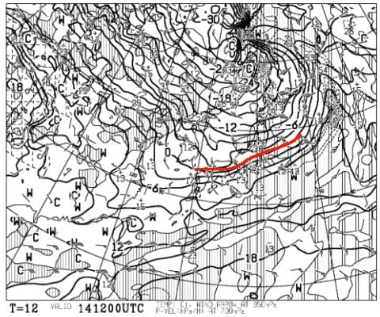

これは，長野・新潟の山は氷点下．

人工降雪機が動かせるよ！！！

ってなことで．

現在のかぐらのライブカメラを見ると…

赤く囲った，かぐらゲレンデ上部．

人工降雪機が動いてます！！

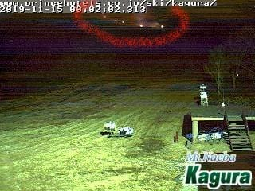

（かぐらHP，[かぐらゲレンデライブカメラ](https://www.princehotels.co.jp/ski/kagura/livecamera/)より）

そして．

熊の湯のライブカメラも見てみましたが…

こちらも人工降雪機，動いてますね！！

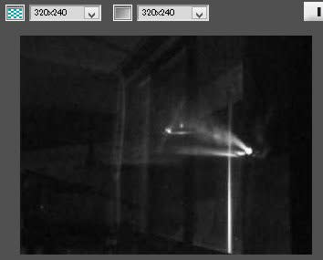

どちらも今シーズン初の降雪機稼働．

ようやっと，シーズンに向けての準備が

始まりましたよ～！！！

あと1週間でゲレンデができるのか…？？

気になるところですが．

これからの天気図を見てみると．

15日朝9時の850hpa図は…

まだ，0℃線は長野より南にありますね．

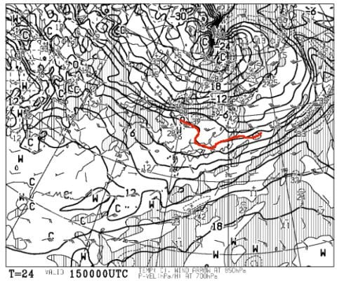

うむ．

15日（金）の朝のうちまでは，

人工降雪機が動かせそうですね…

ただ．

15日の夜9時の天気図では．

ううーーーむ．

0℃線は東北くらいまで上がっちゃう…（涙）

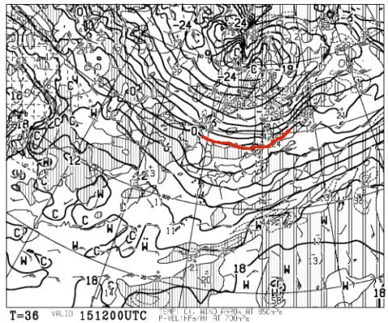

これは人工降雪機の稼働は無理．

…ってなことで．

人工降雪機は，残念ながら15日の朝には

止まってしまいます．

その後，16日も0℃線は長野・新潟より

北に上がっちゃってるので．

この日も人工降雪は厳しそう…

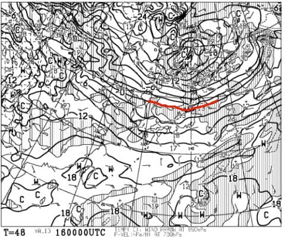

次の17日の日曜は，ギリギリ0℃線が

志賀にかかってそうに見えるけど…

うーむ．人工降雪は厳しいかな…

動かせたとしても，夜中の一瞬．

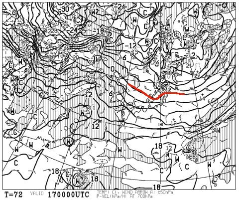

その次の18日も，天気図は載せませんが．

ちょっと雪が降りそうな気温ではないです…（涙）

というより，気温は結構上がっちゃいそう．

次の19日．

この日も，0℃線は長野の北にあるので．

それほど冷え込みそうにありませんね…（泣）

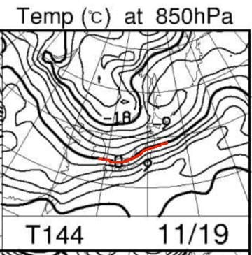

そして，19日はちょっと降りそうなので．

…雨になりそうですね．

18日の高温と19日の雨で，15日に積もった

雪が溶けちゃいそう…（泣）

そして．

20日からは，ちょっと冷えそうです！！

0℃線，長野より南にまで下がってます！！

-3℃線が志賀高原にかかっているので，

結構冷えます！

おそらく，19日深夜からは人工降雪機が

ガンガン動かせます！！

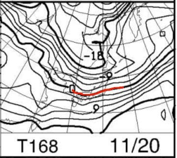

そして，21日も，0℃線は長野の南～西を

横切っており．

20，21日はそこそこ冷えて，

おそらく20，21と昼間も人工降雪が

動かせるのでは…？？

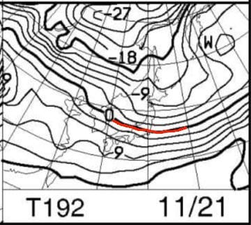

が．

この2日間の地上天気図を見てみると．

降水域の網掛けが長野・新潟には

かかっていないので．

…冷えそうなこの2日間，

天然雪は降らないでしょう（涙）

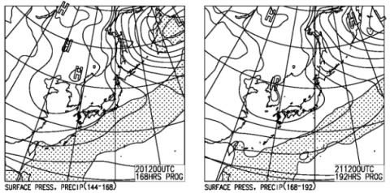

なぜ…なぜ冷える日には降ってくれないんだ？？

ってな感じで．

まとめると．

14日（木）夜から15日（金）朝までは

人工降雪機が動かせるまで冷え，天然雪も

わずかにあるかも．

けど，15日朝から19日付近までは，

気温が高めで人工降雪は厳しそうなうえ，

19日は雨になり，

15日までの雪はほぼ消えるか…

20日（水），21（木）は冷え込みそう．

昼間も人工降雪が動かせるくらいに冷える．

地上天気図では，雪になってくれそうに

無い感じなので，人工降雪頼み．

22日は人工降雪機が動かせるか微妙…

ってなことで．

23日の積雪は，ほぼ20，21日の2日間の

人工降雪のみ．

2日間の人工降雪だけでは，オープンは

厳しいか…

という感じです．

うーーーむ．

1か月予想を見ても，11月頭の予想では

冷えるはずだった11月下旬．

赤く囲ったように，なぜか平年比2～3℃

高くなりそうな予想に変わっており．

12月に入っても冷えなさそうという（涙）

一体，何の仕打ちだ，これは…（泣）

あぁ…

ヤバい．

ヤバいよ．

このままでは，今シーズン前半も，

まともなコンディションで滑れるのは，

12月中旬以降になりそう…

せっかく，焼額はオープン予告の一週間前，

11/30のオープンが可能ならプレオープンすると

予告してくれているのに…

30日のオープンも微妙な感じ…（泣）

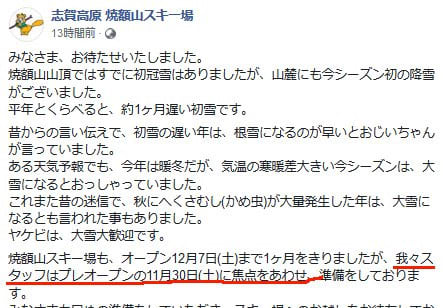

（[焼額山FB](https://www.facebook.com/yakebitaiyama/posts/2498818216880176)より）

…ということなので．

皆様におかれましては．

日ごろの行いを極めて品行方正に

していただくとともに．

毎晩毎晩，冷えることを願って

熱烈な冷え冷え踊りを神様に

捧げ続けてくださいますよう，

重ねてお願い申し上げます…

## 💬 コメント一覧

### 💬 コメント by (yumi)
**タイトル**: Unknown
**投稿日**: 2019-11-15 06:56:53

Ｓさぁ～ん⛷️❄️☃️

くまちゃん🐻のオープンが 怪しくなって来ましたね😢😢😢

我が家では 毎晩毎晩どころか 毎日、早朝から 降れ降れ 冷え冷え 踊りを 狂乱舞しております🎵～

⛷️⛷️⛷️🎵～

### 💬 コメント by (Skier_S)
**タイトル**: ＞ゆみさま
**投稿日**: 2019-11-16 01:34:09

熊の湯の23日オープン，かなり厳しいです…

必死に冷え冷え降れ降れ踊りを狂乱舞し続けてください…

