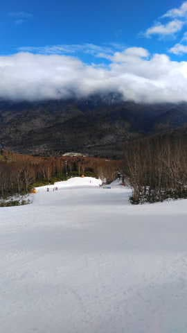
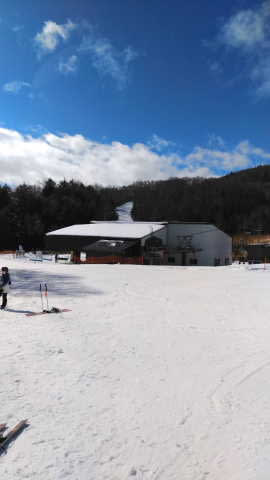

# 12/23(木)の志賀高原スキー場は，午前は吹雪→あられ→みぞれ→雨→晴れ，午後は曇り→あられ．23日はそんなに積もらないけど，24日は積もる！

📅 投稿日時: 2022-12-23 02:36:18

えー．

昨日の段階で，本日22日は

　志賀でも標高が低いところは雨~みぞれ．

と予想していたわけですが…

焼額特派員によると．

朝の営業開始直後は雪だったものの…

激しいあられが降ってきたかと思えば，

それがだんだんみぞれから

雨に変わったらしく…

雨になるという残念な予想は

当たったようです（泣）

幸いそれほどザーザーぶりではなかった

ようですが，すぐには降り止まず．

ウエアがびしょびしょになるくらい

だったみたいですね…(涙)

でも．

11時ごろには雨も止んで．

11時過ぎには，日も射したようです！！

うーん．

今日は晴れると思わなかったんだけどなぁ…

でも．

なんと．

雨のあとの日差しで，雪は表面が融け，

滑りが悪い雪になっちゃったようです…(泣)

雨も降ったし，雪も悪いし．

ゲレンデの人は少なかったみたいですね…

でも．

日が射した時間は短く．

13時ごろには曇りはじめ，

14時ごろにはガスも出て．

16時にはすごいあられが降ったみたいで．

今日はかなり目まぐるしい天気だった

ようです…

とりあえず．

以上の特派員情報によると．

今日は激しい天気だった

一日だったみたいですね…

そして．

今日の雪で一旦解けてしまった雪は，

このあと冷えるので，カチカチの下地と

なりそうです（泣）

で…

23日は，激烈に冷えます！

…それだけじゃなく，風も強まりそう…

リフト，ちゃんと運転できるかな？

昨日の予想の通り，23日は

志賀高原殺しの西風

だけど．

めちゃくちゃ冷えるので，

根性のある雪雲が北アルプスを超えてきて，

朝のうちはちょっと積もりそう…！！

ただ，西風なのでドサドサ積もるのは

期待薄ですが（ちょい涙）

ただ，23日夜中から北風に変わり…

24日朝は，昨日の予想より積もるかも？？

運がよければ，朝は20cm以上の積雪に

なるかも？？

そして一日雪が降り続けて，昼間も

結構積もりそう！

今の天気図だと…

24，25日に志賀に行く人は．

脛パフ，運がよければ膝下パフくらいに

なる可能性があるので．

太い板を持っていってもいいかも？？？

ただ．

24日の朝は，志賀の登り道もかなり積雪が

あると思うので…

ちょっと早めに着くように出かけるのが

吉かな…

うーーん．

明日金曜に積もるなら，土曜はゴンドラ

動くと思うけど…

土曜にゴンドラが動くかどうか微妙…

ただ，土曜は積もるので，日曜は

ゴンドラが動くかな？？

とりあえず．

一の瀬ファミリーは，今日の雨にもやられ

なかったのか，人工降雪を打った正面バーンを

23日12時からオープンするようです！！

…天狗コースは24日からのオープン．

丸池も24日に開くみたいですね…

（[志賀高原中央エリアホームページ](https://shigakogen.co.jp/archives/14738)より）

でも，高天ヶ原クワッドはまだ動かないのか…

本来なら先週末にほぼ全面オープンだった

はずの志賀高原．

今週の土日の積雪で，ほぼ全面滑れるように

なってくれますように…！！（祈）

…そして早く焼額第1ゴンドラ動いて欲しい…

## 💬 コメント一覧

### 💬 コメント by (新米パパ)
**タイトル**: Unknown
**投稿日**: 2022-12-23 07:48:58

明日から2泊、焼額山でいよいよ雪山シーズンデビューです。

湯沢あたりでデビューこなしたかったけど雪なくていきなり、志賀の道がシーズン初日なのでビビってます。

とりあえず早く出て慎重に慎重を重ね明日の山道がんばります。

ゲレンデも、初日はケガなく慣らしが必要ですね。

### 💬 コメント by (レインボー改めブラボー75)
**タイトル**: Unknown
**投稿日**: 2022-12-23 13:10:32

金曜日の志賀高原情報

朝の上林-4℃、蓮池-9℃、極めて寒いが天気はいい。

ヤケビは今日も４ロマと２高のみ。風が極めて強いので寒くて寒くて。2高降り場で昼前に-15℃を記録。

唐松は硬めでコロコロも。根性なしスキーヤーを振り落とすには十分な環境でした。

昼前の高天は-10℃。ワゴン車には横風がこたえます。

いよいよ明日は太板見参！でも、強風が半端なさそうで心配です。

### 💬 コメント by (アリス)
**タイトル**: Unknown
**投稿日**: 2022-12-23 19:09:08

S様

恐ろしいほど、Sさんの天気、ゲレンデ予想が当たります🎵

四ロマ到着8時10分、気温－12℃と絶好のスキー日和🎵

朝一のリフトは、ブラボーさんと同席させていただき朝から楽しいの一語でした🎵

前のお客さんが唐松へ行く中、ブラボーさんとサウスへ一番乗り‼️

シマシマから伝わる心地良い振動❗️

日常生活では味わえないこの幸福感☀️

あー生きていて良かった🎵

前を滑るブラボーさんが宇宙人に見えました😅

これが、GSコースならば昇天しちゃいます😅

早くゴンドラ稼働して欲しいですね🎵

四ロマから右手に見えるゲレンデは、オリンピックコースでしょうか⁉️

まだ、うっすら土が、、、

今日もランチなしで、ラストぎりぎりまで😅

そろそろ脚が限界です😅

ブラボー様

お世話になりました。

ありがとうございました。

Gokuraku様

アドバイスありがとうございます。

アドバイス肝に命じます。

可能であればGSコースでイタリアンパンツのスキーヤーを探しますね🎵

YASのTシャツ着て行きます。

鼻毛親分御夫妻様

ウェアー新調されて、気が付かず挨拶が遅れますた。とてもお似合いで素敵です。

### 💬 コメント by (Skier_S)
**タイトル**: 今週末は積もるよ！！
**投稿日**: 2022-12-24 00:29:59

＞新米パパさま

明日の朝は道もすごいことになってると思いますし，

寒くて吹雪気味で根性の無いスキーヤーは滑ってるどころじゃない感じです…

でも，雪不足よりマシかな？？

私も土日は焼額滑ってます～！

今シーズンもよろしくお願いします！

＞ブラボー75さま

寒い日にはゴンドラが恋しくなりますよね…

おそらく日曜にはゴンドラが動くはず！！

もしかしたら，土曜の昼ぐらいに動き出すかも…

＞アリスさま

今日は晴れたようですが，明日からは雪降りになりますよ～！！

4ロマから見えるのは，オリンピックコースですね．まだ薄っすら土が見えてましたか（涙）

土曜か日曜にはゴンドラが動き出すはず…

では，焼額でお会いしましょう！

