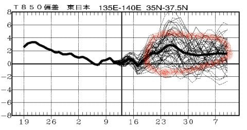

# 2010年7月，2歳の子連れで座間味でダイビング！エピローグ2…カメラテストの結果，後日談

📅 投稿日時: 2021-11-12 00:55:16

🏷️ カテゴリ: [ダイビング日記](ce3a7a8d424d112fce83ee85c81a0e344.md)

えー．

やはりというか．

当然というか．

熊の湯スキー場．

オープン予定の13日の営業開始を諦めた

ようです…（涙）

（[熊の湯スキー場ホームページ](https://www.kumanoyu.co.jp/lift/)より）

あぁ…

しかし．

本日発表の1か月予想を見ても…

これから先の12月上旬まで．

大体平年並みが続きそうで．

冷えなさそうですね…（泣）

今から振り返ると．

上の図の水色矢印の10月18日から

22日までの異常な冷え込みが

もったいなく思えますね…（涙）

まぁ，

平年より気温が高い異常高温になってないだけマシ

だと，ポジティブに捉えましょうか…

なんてったって，12月になってもほとんど

雪が積もらなかった2019年の11月だと，

平年比+2℃前後がひたすら続く予想の

こんな年もあったんですから…

…この年は，熊の湯も一度オープンした

直後，雪解けですぐクローズになり．

その後11月30日までオープンできなかった

という，悲惨な年でしたね…

それに比べれば，今年はまだマシなはず！！…と信じたい

ってなことで，本題へ．

今日も座間味ダイビング旅行記のネタ

なのですが…

あれ？

座間味ダイビング旅行記は，前回エピローグ

やって終わったんじゃないの…？？

とお思いでしょうが．

実は[前回のはエピローグ１](e57eeabcbbede4af71615b822784f072f.md)．

今回，エピローグ2が続くのだ！

ーーーー

ってなことで．

今回．

C-4040の後継機として購入した

IXY210のカメラテストでしたが．

「ざんねーーーーーん」

という結果に．

きわめて残念ながら．

帰ってきて，今回座間味で撮った写真を見て，

「これはとても，超名機のC-4040の代わり

にはならん！！！！」

ということを痛感．

C-4040撮影

IXY210撮影

うーーん．

C-4040の方がコントラストがはっきりしているし，

海の色の出方も良いですね…

光が差し込んでいる部分の細かなニュアンスも

いいし…

C-4040撮影

IXY210撮影

こっちの比較でも，IXYはコントラストが足りない感に

あふれてますね…

暗いところの諧調感が全然ない…

C-4040では，バックが黒に向かってきれいなグラデーションに

なっているのに，IXYではバックが塗り絵みたいなブルーに

塗りつぶされちゃってます．

ダイナミックレンジが強烈に足りない感じ．

暗い部分での色合いや濃淡といった情報感がなく，

そこそこの色があるところから，一気に黒つぶれ状態に

沈んじゃってる感じです…

…まぁ，14000円のカメラならこんなもんなのかな～

所詮，やたら画素数を増やして低感度になり，レンズの

回折限界を超えてきている1200万画素機は，

光学系がよく出来た400万画素機にかなわない，

ということですね．

とりあえず，今回のテストの結果．

前向きに捕らえれば．

次回のコモドクルーズのまでに

「テストしといてよかった～」

という感じ．

というわけで．

座間味から帰宅した週末のこと…

…なんだ？これは？

なぜ，私の手に？？？ 

…

でも．

…この箱を良く見ると…

USEDのシールが張ってあります…

そう．Getしたのは中古品です！

秋葉原をぶらついていたところ．

たまたま程度の極めてよい中古品が

あったので，ついつい…

しかも，このカメラを買って数週間後．

後継機が出ていないというのに，

S90の生産をCanonはやめてしまい．

あっという間に量販店の店頭から

消え去りました．

名機の評判が高いS90．

もう入手が出来なくなるということで

私が買った直後から，中古の売値は

5000円近く値上がりし，ハウジングも品薄．

購入直後，1万円近く値上がりしたと

思ったら，あっという間に市場から

消えました…

かなりきわどいタイミングでのGet

だったなぁ…

しかし．

今回のカメラ購入騒動．

高いカメラを買うか，安いカメラを買うか．

悩んだあげく．

[「安く上げるために，安い方を買っておこう～」
という判断](efb3b24e69d6ff057fbdc43402c8c11bd.md)をしたのに．

結局カメラを2台買う羽目になった

というオチでした（涙）

でも．

[次回，コモドクルーズ](e71f0faf0d2dbf98590a16bb7abe5a502.md)からは．

この新カメラでの撮影です！

（追記：ちなみに，ダメ出しされたIXYは

　このあとも[2014年に水没する](e4bd4e031e50288a155b34e6e9b547630.md)まで

　妻用カメラとして活用されました…

　そして，その時に私のカメラもS120へ

　世代交代しました．

　その時の経緯は，[このあたりの記事](e7b1ed1c4f2346b92cd121b28a9e45143.md)から

　書いてます…）
