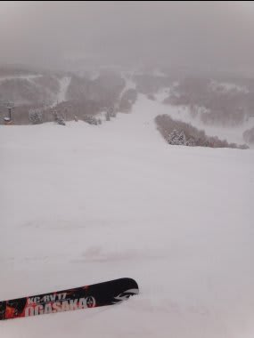

# アイスバーン＆吹き溜まりの難しいコンディションには…

📅 投稿日時: 2012-02-28 02:22:48

って感じで．

この週末は．

全国的にアイスバーン＆もさもさ新雪の難しいコンディションだったようですが．

まぁ，アイスバーンって言っても4月ごろと違って．

表面が結構ざらざらした感じの比較的「柔らかい」アイスバーン．

＃一の瀬ファミリー上半分だけ，4月ライクな固いアイスバーンだったけど（涙）

焼額のオリンピックコースなんかは，ある程度エッジが研いである板なら

つんつるてーん，って流されてしまうことはない状況でしたね．

…ただ，上に乗っているモサモサの雪とのコントラストが強すぎ，

つんのめったり落とされたりという足場の変化に戸惑っちゃう，という感じ．

そんなときに．

強力な味方になったのがこいつ．

そう…

今シーズン，[ただでもらってしまった'09 OGASAKA KC-RV 170cm．](d20120112.md)

こいつは．

比較的ルーズ目にエッジを仕上げてあるので．

キンキンにエッジを仕上げてあるSALOMON 24hours LMと違い，

アイスバーンでガツンと制動してつんのめることもなく．

かといって，エッジを立ててないわけじゃないのでズルズルに

ずれるのでもなく．

適度なグリップ感でアイスバーンでもズラし操作が行えます．

それも，柔らかい新雪でのズレ感と非常に近い感じでズレてくれるという…

ということで．

他の人たちが手間取っているアイスバーン＆モサモサMIXバーンも．

まるで何事もなかったかのように滑っていけました．

＃…こ，個人の感想です．あくまで．

＃傍から見ると，ひいこら踊ってるみたいに見えたかも…（笑）

いやー．しかし．

この板．

とても4シーズン目の板とは思えない．

気に入った．

エッジグリップだけに頼るのではなく，ズラシで迎え角を作れば

きれいにターンしていくという，この板の特性が存分に生かせますな．

アイスバーンのオリンピックコースを快適に小回りできました．

やっぱりこの板，最高の小回り板ですねっ！

＃だから大回り用の板だってば

## 💬 コメント一覧

### 💬 コメント by (雪上の翁)
**タイトル**: Unknown
**投稿日**: 2012-02-28 09:32:21

コメ連チャン失礼いたします。

これの一つ前のKCRV履いてました(^^)

乗り味がイメージと違って

すぐに売ってしまったのですが、

オガ板の品質と性能は世界一といっても過言ではないのかと、思います。

といいながら今シーズンはK2のリクターと言う楽チンお気楽板を履き、

先シーズンまでHEADのスーパーシェイプを履いていました（爆）

サロモンはオレンジ色のモノコック（古っ）依頼履いていませんが、

どっしり系が好きなので、

LMは履いてみたい板の一つです(^^)

3月はしっかりエッジを研いでしのぎたいと思います（笑）

今週末は志賀ではなく菅平に行くのですが、日曜日は雨、覚悟ですかね（泣）

### 💬 コメント by (Skier_S)
**タイトル**: 雪上の翁さま
**投稿日**: 2012-02-29 00:13:02

お，KC-RV履いてましたか．

私はKC-RVが2本目のOGASAKA板です…

かなり気に入ってます．

私は，現在春スキーやシーズンイン用に履いているSALOMON DEMO X3の前は，

HEAD Supershape Speedを履いてました…

これも独特の乗り味で好きでした．

でも，こいつはどっしり系というより

軽快なやさしい感じの板でした…

どっしり系が好きなら，LMもいいけど，ATOMIC D2 Type-Aも悪くないかもです…

で，今週末の天気は，低気圧の移動予想がだんだん遅くなってきているので，

雨が降るのは日曜夜になりそう．

なので，今の時点では日曜の雨はなさそうです…

