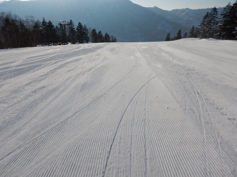
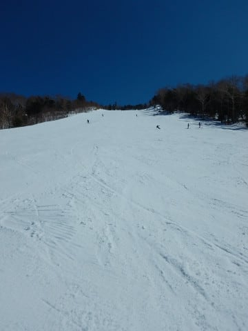

# 3月25日(日)の志賀高原は…ぴかぴか晴天！気温は高めだったけど，一の瀬ファミリーと寺子屋の雪は良かったよ

📅 投稿日時: 2018-03-26 00:48:07

ってなわけで．

本日も志賀高原で滑っていたわけですが．

…春ですねぇ…

ぴかぴか晴天の，典型的な

春スキーの一日でした…

まず．

朝．

前日ナイターに行ったあと，

夜遅くまで飲みに行っていたというのに…

…そうです．

いつも通り，気づいたら早朝営業の焼額第1ゴンドラの

前にいるではありませんか！！

今日の早朝は，50人くらいゲート前に待っていたのでは

ないかなぁ…

結構な人出でした！

…しかし．

睡眠時間4時間で出てくるのにやはり多少

無理があったらしく←自分で無理と認めているのか…！？？

ブーツを履いている間にゲートオープンしてしまうという

失態（涙）

営業開始に間に合わなかった…（泣）

それにもめげず，ゴンドラで山頂へ向かうと…

うはー！！

ピカピカ晴天っ！！

そして，山頂の気温は-8℃と，

放射冷却も入って結構いい冷え込みです！

で．

朝イチのゲレンデは…

ふはははははははははははは！

シマシマっ！！

ちょっと硬めだけど，ツルツルではなくエッジは効くので，

硬めが好きな人にはたまらないハイスピードバーン！

ガッツリ締まった，このシマシマを滑り下りる快感…

これだから，早朝はやめられませんな！！！

そして，通常営業開始の8時半ごろには…

山頂の気温は，すでに-1℃と．

結構気温が上がってきましたね…

通常営業開始ごろでは．

ガチガチに固まってたバーン表面がちょっと緩んで，

ちょうどいいくらいのバーン状況で．

そのうえ，ゲレンデの人も少なく．

ピカピカ晴天のもと，ガラガラの超絶快感

快楽満点バーンを堪能！！

いやーー．

いいよ…

もう，快楽に昇天しそう…

…って快楽が10時ごろまで続いたけど．

10時になると，結構人が増えて，ゴンドラ待ちも

ゲートの外までぎりぎり人があふれるかどうかの，

2-3分待ちになって来たし．

さらに，日が当たる東側斜面は雪が

緩みだし…

日当たりのよいオリンピックコースなんかは，

重いザブザブした感じの雪になっていきます…（涙）

日が当たらないGSコースの主要部は，

午前11時近くまで，結構いい雪でもって

くれたんですけど．

でも，いつもならガラガラになる日曜の

昼近くになっても，わりと人が多めで．

多くの人が滑ることで，昼頃には

焼額のゲレンデはほぼ全面，

春の雪が蹴散らされた荒れ荒れ斜面に…（涙）

だもんで．

焼額の呪いが解けたSkier_S．

一の瀬方面へ脱出！←えらく簡単に呪いが解けるんだな…

一の瀬ファミリーの正面バーンは…

…焼額と全然違う…

昼になっても，まだ雪は全く緩んでなくて．

きれいなフラットバーン！

朝日が当たらない西向きバーン，

日差しの強いこの時期，東向き斜面と

全然雪質が違うよ…

晴天の昼過ぎでこの雪質なら，

全然いいじゃないですか！！

寺子屋方面へも遠征してみますが…

雪質は悪くないけど．

一の瀬とそんなに変わらない雪質で．

だのに，ちょっとリフトが混んでいたので…

第3クワッドリフトが飛び乗りでいける，

一の瀬ファミリーへ復活！

ポールバーンで立ち入り制限されていた

パーフェクターコースが，13:30にオープン

したので…

飛び込んでみると．

うはーーー！！

この時間になっても，超絶最高の

コンディション！

オープンしたてで，人もいないし，

激烈Good！！！

ってな感じで．

午後は一の瀬ファミリーをメインに

滑ってましたが．

いつもは人がぐっと減る日曜午後にもかかわらず．

春休みだから，ゲレンデの人は意外と多めで．

さすが午後3時には，ちょっと荒れ始めてきたかな…

で．

焼額がホームゲレンデの私ですから．

やはり最後は焼額に戻らないと…

と，夕方に焼額へ戻ると．

…すごい凸凹…

そして，日が陰ったバーンは，

この凸凹のまま固まり始めており…

なんだか，すごいバーン状況なんですけど（涙）

でも．

この凸凹のまま固まった，疲労激増バーンを．

早朝から滑り続けて体力が尽きかけている

体に鞭を打ちつつ．

いつものルーチン通り，しっかりリフトストップまで

滑り続けたのでした…←なぜそこまでして滑るのか…

ということで．

一の瀬が意外と午後まで雪が良くて．

結構楽しめた本日ですが．

なんだか，もう春ですね…

もう一降りほしいけど．

望み薄かな…（ちょっと涙）

## 💬 コメント一覧

### 💬 コメント by (Unknown)
**タイトル**: Unknown
**投稿日**: 2018-03-26 02:46:44

>焼額の呪いが解けたSkier_S．

>一の瀬方面へ脱出！

春のファミリーに Skier_S さんが存在している = 焼額は雪質的に終了

というのが早々に焼額を脱出してきた方々の共通認識のようです。

土曜日には登場しなかったことで信憑性が高まりました。

### 💬 コメント by (ほっぽ)
**タイトル**: 昨日も
**投稿日**: 2018-03-26 05:45:40

Ｓさん

昨日もゴンドラ乗り場で見かけるも、山頂に着けば既に姿はなく、残念ながらすれ違いでした。

ちょっとズレると、ほぼ１日合わないですね。。。

午前中に奥志賀へ移動してみましたが、相変わらずの奥ゴン待ちが長くエキスパートに逃げて終了、午後は横手山、渋峠に遠征してました。

渋峠はハイシーズン並みの雪質でビックリしました。

奥志賀エキスパートで無料体験していたレスキューの春用ワックスもいい感じでした。

今日からロイヤルファミリーが奥志賀へ来れらるようです。

滑走レポートをアップしておきました。

http://www2.tokai.or.jp/nana_hoppo/

### 💬 コメント by (olaf2125)
**タイトル**: すごい荒れ方
**投稿日**: 2018-03-26 07:39:15

昨日は1ゴンで色々お話しできて楽しかったです。(^^)

午後のGSコースの荒れ方にびっくりです。

ラストは結局奥志賀第3に戻りました。(^^;)

また次回もよろしくお願いします。

（雪があれば…）

### 💬 コメント by (michi)
**タイトル**: Unknown
**投稿日**: 2018-03-26 08:09:58

土曜に参戦予定が息子のインフルにより行けなかった反動で（？）昨日は早朝初参加。

並びの人が多くてビックリしましたが滑り始めたらゴンドラは飛び乗りだし、ゲレンデに人が少なくバーンも硬めで飛ばせるし楽しすぎました（爆）

午前中はそれほど緩まずマズマズのコンディションで良かったですね。

しかし早朝から参加すると1日が長く疲れが半端ない(^_^;)前日ナイターから早朝〜通常〜ナイターなんて自分は絶対に無理で〜す（笑）

### 💬 コメント by (虫)
**タイトル**: 缶バッチ
**投稿日**: 2018-03-26 12:50:25

こんにちは、初めまして。いつも天気予報で大変お世話になっています。		

3年前ぐらいから、子供をスキーに連れだし始めたので、志賀の

ピンポイントの天気情報を求めて、Sさんのブログを見る様になりました。

子連れのスキーなので、万ｍなんて高低差は現実の物とは思えないのですが		

昨日、一昨日と、「缶バッチがもらえる」というのを餌に、7歳になりたて

の子供と親子3名で回ってみました。		

一昨日は、高天原、東館、西舘、高天原、寺子屋、一の瀬、焼額、奥志賀→

バスで帰還。（収穫：缶バッチ×３）	

昨日は、高天原、一の瀬、寺子屋、東館、一の瀬、焼額、一の瀬、寺子屋、ブナ平、西舘（収穫：缶バッチ×３、オコミン缶バッチ×１）。ざっくりでも昨日は3600ｍリフトで上がった計算になると思います。		

子供が気に入ったバーンはリピートしながら、志賀高原の広さや多彩なコースを		

楽しめました。焼額では、もしかしたらＳさんと会えるかななんて、きょろきょろしてたんですが、まさか、寺子屋まで遠征されてるとは。焼額の雪はちょっと

なんですよね。冷え冷え踊りで、シーズン延長を息子と祈ります。		

それと、Ｓさんの運転の安全と、お体も！！。

ご自愛と、楽しいスキー○ちがいなお話今後もお願いします。（矛盾）

### 💬 コメント by (もりや)
**タイトル**: 早朝ナイター
**投稿日**: 2018-03-26 18:00:59

週末はお疲れ様でした。早朝から終礼まで参加し一の瀬ファミリーナイターへ行きました。シマシマバーンを子供達とトップスピードで滑走しましたが、1時間滑った所で娘がリフト搭乗中に寝ていた為娘を撤収させ、息子のお許しを得て残り1時間残した所で全面撤収しました。いや〜疲れました。また今週日曜日に早朝より参戦いたします。

### 💬 コメント by (なるなる)
**タイトル**: Unknown
**投稿日**: 2018-03-26 23:40:06

昨日・今日と志賀高原行ってきました。

昨日は、S様を探したのですが、タイミングが悪かったのか、お会いすることは出来ず残念でした。

私は、今回が今シーズン最後の志賀高原だと思います。

### 💬 コメント by (Skier_S)
**タイトル**: 日曜はあったかかったですね…
**投稿日**: 2018-03-27 02:26:46

＞Unknownさま

はい．

その認識は極めて正しいです（笑）

＞ほっぽさま

あら…

またすれ違いでしたか．

タイミングが合わないと，なかなか

会えませんよね…

午後は渋まで遠征ですか！

まぁ，焼額の午後の雪は，ちょっと楽しくなかった

ですからね…

一の瀬もわるくなかったですよ！

＞olaf2125さま

昼の焼額の雪は，かなり重かったですね…

私も一の瀬方面へ脱出しましたから（笑）．

やっぱりこれからの時期，早朝勝負です．

また次回お越しの際も，早朝からご参加ください～！

＞michiさま

早朝からの参加，お疲れ様でした！

早朝からだと，昼くらいには結構疲れ果てますよね…

そんな中，ナイターまで行く人もいますから（笑）．

私もスーパー小学生＆幼稚園児に負けないようにしないと！

＞虫さま

初コメントありがとうございます～！

お子さん連れでスタンプラリーチャレンジされたのですね．

いろいろめぐると楽しいですよね…

もしかすると，日曜は一の瀬あたりで

すれ違ってたのかもしれませんね（笑）．

我が家は，家族で滑るときは小学生が無料の

焼額ばっかりになっちゃいます…

今シーズンは，これからも志賀高原にいらっしゃるの

ですか？

また次の機会にお会いできればと思います…

シーズンがまだまだ続くよう，しっかり冷え冷え踊りを

踊りましょう！

＞もりやさま

土曜ナイター→日曜早朝→日曜通常営業→日曜ナイター

の4連コンボ，お疲れ様でした．

このフル日程を滑り切る小学生と，

日曜早朝からナイターまで滑り続ける幼稚園児に

驚異を感じずにいられません…

新たな伝説が生まれた瞬間だったと思います（笑）．

また日曜にお会いしましょう！

お子さんたちにもよろしくお伝えください．

＞なるなるさま

あら．

日曜に志賀にいらっしゃったのですね…

午前中は焼額にいたのですが，午後は一の瀬

ファミリーで滑ってました．

お会いできずに残念です…

これで今シーズンはおしまいと言わず．

まだまだシーズンは続くので，

気分が向いたらまた志賀にお越しください～！

