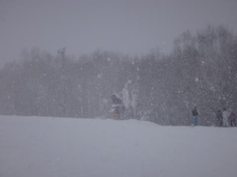
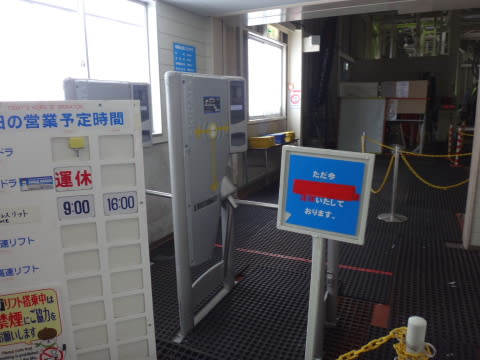
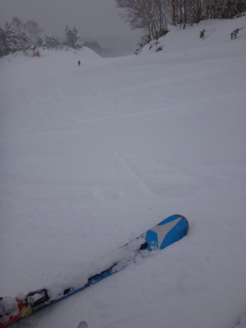
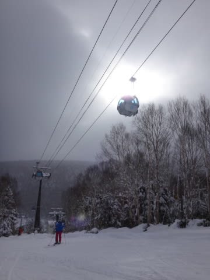
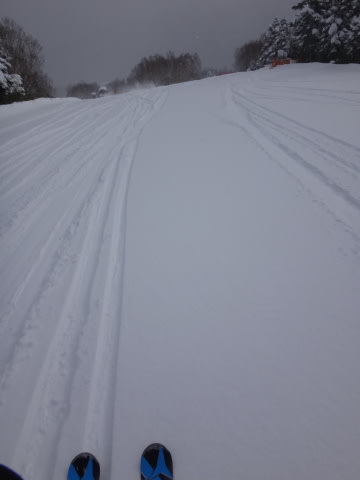
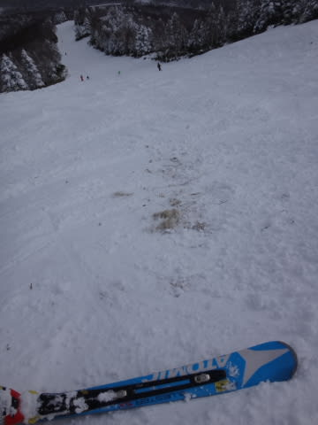
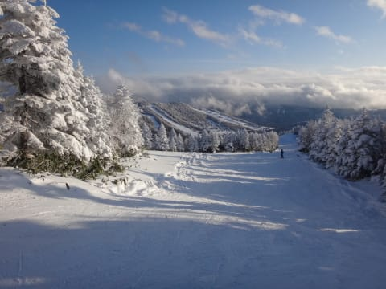

# 12月7日の志賀高原，焼額山のコンディションは…速報モード

📅 投稿日時: 2014-12-08 01:22:48

🏷️ カテゴリ: [2015スキー滑走日記](c09ea645cfc085f86dfcd80f49599dd89.md)

えー．

本日も志賀高原で滑ってきたわけですが．

…いつも通り，帰宅時間が日付変更線を越えてしまったので．

今日は，速報モードで…

今日も，朝は激しい雪降りで始まって．

今日は，焼額のゴンドラが動く～っ！！！

と，超楽しみに，焼額に向かったところ…

え？

何？

なんだ～っ！！！

機器故障で，運転開始の見込み立たず？

4ロマのみの営業だと…？？

がががががーーーん．

一体，これはどうしたことだ（涙）．

と，

悲しくペアリフトを滑るわけですが．

でも…

うは！

柔らかい圧雪！

今シーズン初の，きれいな柔らかいハイシーズンの圧雪！

雪は最高っ！！！！！

…これでゴンドラが動けば…

と，残念に思っていた，午前11時．

無事，修理が終わって，ゴンドラが動き出しましたよ～！！

1本目のゴンドラコースは…

うははははははははははははははは！！！！

そうだよ．

この日を待っていた！！！

最高のフカフカ雪！

最高に気持ちいいロングターンしたい放題！

1シーズン忘れていた快感が，ここに！！

…と．

気持ちよく3本ほど滑ったら…

あら．

人工雪を付けてない上の方，雪が意外と薄いのね…

ってことで．

途中かなりデンジャラスゾーンが…

でも．

午後は天気も良くなり．

最高の柔らかい雪質で．

いい天気のもと滑れて．

いやーーーー．

本格シーズンが始まった！！

って感じの一日でした…

ってことで．

詳細は，明日!

## 💬 コメント一覧

### 💬 コメント by (れお)
**タイトル**: お世話になりました～
**投稿日**: 2014-12-08 11:06:18

日曜日はお世話になりました!!

おかげさまで、シーズン初スキーがとても楽しかったです♪　息子も大喜びでした!!

それから、娘さんの上達ぶりにビックリ!!

非圧雪もものともせず、リフト終了後もハイクアップで滑ろうとするなんて!!

素敵な猿スキ…、違った(汗)、女子スキーヤーに育ってますねヽ(^o^)丿

シーズン初スキーで疲れて15時頃帰ろうかなって思ってた私、反省します!!

あと、２ゴンがちょっと心配…。もう少し頑張って欲しい～!!

### 💬 コメント by (Skier_S)
**タイトル**: れおさま
**投稿日**: 2014-12-08 23:11:28

昨日はお世話になりました～！

娘と一緒に滑ってくれて，ありがとうございます．

うちの娘も，帰り道の途中で

「楽しかった～！」

ってことで，また一緒にすべりたがってますので．

今度ご一緒することがあれば，またよろしく

お願いします…

しかし．

うちの娘がハイクアップしてまで滑りたがるとは…

完全サルですね（笑）．

明日からは，ゴンドラが止まる代わりに，

2高が動くようです～．

今週末は，2高＆2ゴン動いてほしいなぁ．

