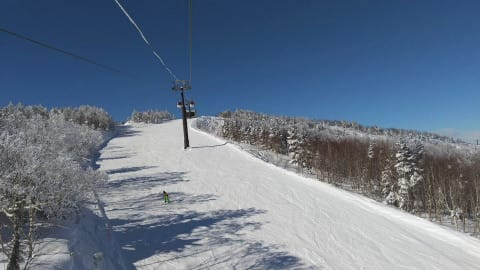
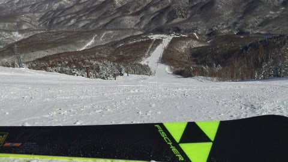

# 冷え冷え祭り終了のお知らせ…23，24日はやっぱり液体が降る危機！そして，かぐらはシーズン券払い戻し！？？

📅 投稿日時: 2021-01-19 02:18:06

えー．

本日．

志賀高原の特派員からの写真を見た時…

…

…のたうち回りました．

いや，どうせ平日なので，緊急事態宣言が

出てようが出てまいが，スキーに行けない

日だったのですが．

…それにしても…

何というか…

すっきり最高の晴天で．

最高雪質の極上シマシマのこのバーン！！！

これを見て，

「うらやましい」

と思わないスキーヤーがいるだろうか！

今日は一日，気温も上がらず．

あさイチは-10℃を下回る冷え冷えで．

ゲレンデもこんな感じで誰もいない

無人貸し切り状態だったので…

営業終了時まで，ほぼ営業開始と変わらない

完全にまっ平らな，きれいな整地バーンで

いてくれたようです…

こんな日に仕事をしている場合じゃないぞっ！？？

…早く仕事辞めて，志賀高原に移住したく

なってきた…（ここでたぶん移住した先輩たちの悪魔の誘いが多数来る（予告））

…そして．

たった今，月曜深夜…志賀高原は降ってます！

かなりの降りです！

明日の朝までに，最低20cm．

…この降りだと，もう少し積もるかな？

明日の朝イチは，冷え冷えパウダーです！

そして．この雪は明日も降り続き…

明日は終日冷え冷えパフパフパウダーデーに

なりそうですね…

で．予想通り20日は，雪降りのあとの冷え冷え

晴天最高の一日になりそうですが…

が…

うむむ？？？

21日以降，すごいことに…！！

…これ，昨日の予想より，悪化してない？？

21日から24日まで，平年比+4~+6℃！？？

まぁ，21日は気温が上がるけど，

晴れてくれそうで…

ちょっと昼から雪が緩むものの，21日までは

楽しめそうですね．

22日はぐっと気温が上がり．

最高気温+5℃を突破しそうだけど．

まぁ，この日は曇り空だから，

雪はそこまで壊滅的に悪化しないかな…

ヤバいのは，やはり週末．

23日は…

…うげげげげ（涙）

志賀高原には，+6℃線が近づくの？？

これは…昼間は+7~8℃くらいまで

上がるか…

そして…

地上天気図もヤバい．

どうやら今週末は，週末を狙ったように

高温＆液体の襲撃を受けそうな予感…（涙）

24日の日曜も，昨日の予想から変わらず．

今の天気図だと，液体直撃コースです…

とりあえず．

これはきっと．

私がスキー場に行かなくてどうでもいいやと

思い始め．

いつもの踊りを踊らなくなったからなのかも…←だから，あなたが志賀高原の天気決めてるんじゃないから

ってな感じの，非常事態宣言下のスキー場なわけですが．

18日からしばらく休業になったかぐらスキー場．

シーズン券の払い戻しが行われるようですね．

（[かぐらスキー場ホームページ](https://www.princehotels.co.jp/file.jsp?id=334383)より．以下同）

どうやら，

・これ以降の利用を諦める途中解約

・解約せずに休止期間分のみの払い戻し

のどちらかを選べるようで．

解約の場合は，営業休止以降の日数分を日割りで

払い戻しになるようです．

で．

解約しない場合は，休止期間の日数分を

日割りでシーズン終了後に払い戻しになるうえ，

営業休止期間中は杉ノ原，軽井沢，万座などが

タダで使え，その他舞子やNASPA，GALAなどを

割引で使えるようです！

うーむ．

シーズン券はかなり高いので，

自粛でスキーに行かない場合にも，

滑れなかった分返金してほしい

と思ってしまうところではあるが．

…これは，志賀高原がつぶれないように寄付したと

思って，あきらめよう…

## 💬 コメント一覧

### 💬 コメント by (Hide)
**タイトル**: Unknown
**投稿日**: 2021-01-19 07:45:02

S 様

まさになんという事でしょう・・・・。

私も今月突撃予定でしたがほぼ諦めています（泣）

状況的に2/7の解除は難しそうですよね。

困ったなあ～

### 💬 コメント by (横須賀のウルトラセブン)
**タイトル**: 入替り
**投稿日**: 2021-01-19 14:23:46

うーん肩の骨折ぐらいでは、あきらめがつかなくなってき

た～特派員の方は察するに極〇スキーヤーさんでしょう

か？こうなったら綾瀬はるかさんの新番組のように極〇

さんと魂が入替るしかないな～セブンは毎日魂入替り・入

替わり踊りを踊り続けます。そして「信州中野のウルトラセ

ブン」に改名します。

### 💬 コメント by (レインボー73)
**タイトル**: Unknown
**投稿日**: 2021-01-19 15:28:08

火曜日の廃墟と化した志賀高原情報

たくさん書いたのに消えた!　再チャレンジです。

『焼額山てんきとくらす』で風速15mを超えると、ゴンドラはほぼストップなのですが、今日は正面からの北西風なので、なんと動かしてくれました。ニゴンから一路１ゴン下の非圧雪へ。嬉しい！レインボー隊が一番乗り。さらさらふわふわの乾燥粉雪が25cmくらいかなあ。さらさら過ぎてあまり浮かないけど、エス様の心を揺さぶるのには十分な快感！

ごめんなさいね。さらなる快感はこのあとです。

みんながオリンピックに向かうなか、強運な私は一人スーパーへ。前のボードの子がコケたので、ウハウハ新雪40のファーストが私の手に、じゃなく足に！　こんな幸せってあります？　長く生きてきてよかった！　妻に猫の世話を任せっぱなしにしてきてよかった！　

スーパー下のイーストは、狭く圧雪されていました。非圧雪の新雪は、止まると怖いので回避。あとはひたすら１ゴン下を滑って、ダイヤモンドへ。

オリンピックは朝圧雪になったので、魅力薄でパスしましたが、隊員によると重めだったとか。嬉しい！

その後のダイヤモンドは視界が悪すぎたので、二本でやめ。

ファミリーは粉雪吹き上がる烈風なので、高天原のレストランダケカンバへ逃げ込みました。風が強過ぎ！

### 💬 コメント by (レインボー73)
**タイトル**: Unknown
**投稿日**: 2021-01-19 15:57:12

火曜日の志賀高原情報2

寒いのでラーメンをと、高天原のダケカンバへ。go to eat は500円単位で釣りが出ないので、1000円きっちりのチャーシューにしました。ここは美味しいね。分厚いチャーシューが５枚も入ってこの値段。実質800円ですから、シャバよりお得かな。

ここで腹の立つできごとが。テーブルにヘルメットや手袋などを置いてチャーシューを頼んでいたら、外人のスキー指導員が私の席の椅子にウエアを掛けて談笑。英語で文句を言う実力もないので、男は黙って別の場所へ。

その外人、結局コップで水を飲んだだけで、レストランの中で１円も落とさずに去っていきました。文化の違いかなあ！

許せん！

その後の東館もふかふか。だけど、かんしゃめんで足を取られないようにするのが未熟で太ももに！

こんな日はやっぱり西館様。風も弱く雪も溜まる。しかし、高天のリフトが止まったらヤケビに戻れなくなるので、高天原へ。

高天原の非圧雪はカチカチの大きなコブで有名な所。普段は老人の行く所ではないけれど、こんな日には躍動します。コブも埋まりふかふか。気持ちよかった！スーパーに次ぐ本日のベスト２でした。

ヤケビに戻ると、降りしきる雪で斜面がリセットされていて快適。だけど一人の隊員が『もういいよ』と口にしたので、レインボー少し前で終了したのでした。

エス様から見れば、なんたる贅沢と怒られそうですね。

### 💬 コメント by (レインボー73)
**タイトル**: Unknown
**投稿日**: 2021-01-19 18:05:17

しんちゃん様

先に話されていた防寒対策についてです。

今日はマイナス10℃以下で強風15mの極寒でしたが、私は一切気になりませんでした。

対策その１　有り余る財力を使って（？？）、カイロミニ9枚。両足の甲、両手、両手首（貼らないカイロ用のリストバンド）、両膝（昔の捻挫跡。ＣＷＸの上に貼る）、片肘（老人性？肘痛）

遠方から何万円もかけてスキーに来るのなら、僅か数百円で快適が買えるならと、私は思います。

対策その２ 

スキーウエアは割高ですよね。最近ユ○クロで、ウルトラライトダウンの袖無し3900円を買いました。かさばらず、暖かく、安い。ユ○クロや、ワー○マンを有効に活用したら、かなりスキーライフが広がると思います。

対策その３　私は老人なのにスピードが好きなので、転んだら危ない。だからスポンジに覆われたプロテクター（よろい武者？）を常用しています。これが暖かい。肘痛に貼るカイロミニも、プロテクターのおかげで熱が逃げません。

しんちゃん様のような上級者に、私のような三下冷奴が物申すもおかしいですが、老人ゆえに防寒対策にはくしんしております。

### 💬 コメント by (かず)
**タイトル**: Unknown
**投稿日**: 2021-01-19 19:31:50

本日やっと遠征行ってきました！視界不良 雪重 かなり手強い…リフトもなかなか動かない  もう志賀しか滑れないのかもしれません笑

### 💬 コメント by (レインボー73)
**タイトル**: Unknown
**投稿日**: 2021-01-19 19:56:48

お借りします。かずさん、今日は奥志賀に行く暇がありませんでした。明日は野沢に浮気しますから、また来週お待ちします。志賀は廃墟と化しました。むたどんどん来てください。あなたの行動が、志賀を存続させます。

### 💬 コメント by (かず)
**タイトル**: Unknown
**投稿日**: 2021-01-19 21:03:41

本日妙高です！志賀しか行かなくなって何年でしょう？若Sさんと知らずイエローグローブを勧められたころのような笑 遠征して志賀の滑りやすさ痛感しました…明日ヤケビGS出力全開と悩みましたが遠征先リベンジです   来週以降色々心配ですがよろしくお願いします  Sさんも緊急事態解除になるよう祈ってます！

### 💬 コメント by (ほっぽ)
**タイトル**: 1/19　志賀高原
**投稿日**: 2021-01-19 23:33:45

Ｓさん

今日も一の瀬ファミリースタートでヤケビへ。

どこもひざ下パウダーで新雪滑走が楽しめました。

パウダーはもう要らねぇ、そんな気分です。

何と贅沢な。

遅いランチは銀嶺で、午後は西館と思ったらうっかり見過ごし

フードが強風で運休、タマゴンも運休で袋小路、ゲームオーバーです。

結局パルゴンで山の駅へ上がり、シャトルで一の瀬に戻って本日終了。

いきなりパルゴンと今シーズン初シャトル乗車になりました。(^^;

今日は計画性の無い行動に反省です。

明日はビシっと締まったシマシマバーンをＧＳ板で終日かっ飛ばそうと思います。

http://hoppo.officialblog.jp/

### 💬 コメント by (しんちゃん)
**タイトル**: 楽しく拝見しています
**投稿日**: 2021-01-20 01:01:53

レインボー73様

いつも現地レポート楽しく拝見しています。

防寒対策もありがとうございます。参考になります。

### 💬 コメント by (Skier_S)
**タイトル**: 一体いつ緊急事態宣言解除になるんだろう…
**投稿日**: 2021-01-20 02:35:04

＞Hideさま

このままだと，2/7の解除はかなり厳しいですね…

私も一体いつ志賀高原に舞い戻れるのか…（涙）

＞横須賀のウルトラセブンさま

早期退職で，リアルに「信州中野のウルトラセブン」になるという

選択肢がありますよ（笑）．

私も早期退職して志賀高原の麓に住みたくなってきました．

＞レインボー73さま

今日もレポートありがとうございます～！！！

ひたすらパウダーの一日だったんですね…

レインボー前に切り上げるとは勿体ない！！

勿体ないお化けが団体で襲いに来ますよ！！

＞かずさま

あ，妙高だったんですね…

今日は標高が低いところはちょっと雪が重かったと思います．

8日の夜は気温が高めだったので，やっぱりこういう日は志賀に限りますよ～！

＞ほっぽさま

パウダーはもう要らねぇ…

そんなセリフ，人生一度でいいから言ってみたいです…

明日は今度はピカピカ圧雪天国だと思います．

「シマシマはもう要らねぇ…」

と言えるかも（笑）．

