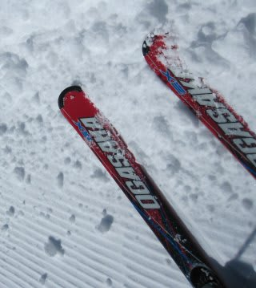
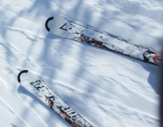
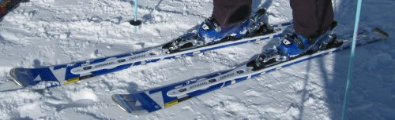

# いろんなスキーを履いてみた

📅 投稿日時: 2011-01-14 01:36:29

先日の志賀高原は．5人で行ったのですが．

あれですね．

最近の板は，ビンディングが最初から板にくっついちゃってるのが多くて．

そーゆー板は，だいたいワンタッチでビンディングがブーツソールサイズに

あわせて調整できるようになってるんですね．

ということで．

今回．

ブーツサイズが一緒だった人などもいたので，5人全員で順番に板を

とっかえひっかえして滑ってみました．

うーーん．

やっぱりいろんな板で滑るのは面白いですね～．

まずはこの板．

OGASAKA　Keo's　EX　170cm．

2シーズンほど前の板になりますか…

結構張りが強い板ですね～．

それも，メタルとか補強材の強さじゃなく，ウッドコアに

しっかり腰がある感じ．

んで．

オガサカにしてはエッジグリップが強く，

ずらしよりむしろエッジに乗って曲がる感じがするという．

うーん．なんか，オガサカらしからぬ板だなぁ…

張りが強いので，回転弧は大きめになります．

やわらかめの雪だったので，スピードを出していくと板が

食い込んでしまい，ズラシのコントロールは難しめ…

板の重量感もあり，やっぱりロングターンベースなのかな．

けど，GS系の板のようにメタルの反発力はなく，

返りは比較的しっとりとした感じだったのが印象的ですね～．

結論：ごめんなさい．私はあんまり好きじゃない…

んで，次の板．

OGASAKA TC-QR 165cm

昨シーズンの基礎小回り用の板ですね．

5人行った仲間のうち，2人がOGASAKAって時点で

すでにこの仲間の指向が読み取れるかと（笑）．

この板…

同じ小回り用のはずなのにっ！

私のSALOMON 24hours LMとは対極にありますな．

ずっしり感のあるLMとは打って変わって，すさまじく軽快．軽量．

んで，非常に動かしやすい．

ずらしやすいって言っても，ずれずれじゃなく，しっかり足場がある中で

板が動いていってくれる．

軽くて動かしやすいので，思ったところに板を動かせます．

何でもできる気になります．

がっちりグリップする板じゃないので，雪質によってグリップが

大きく変化することもなく，やわらかい雪と硬い雪が混ざっているような

ところでも安心して突っ込んでいけます．

一見弱そうな板なのに，ハイスピードで窒息することもなく，

スピード耐性も高い．

なんとも不思議な乗り味の板…

結論：SALOMONとえらい違うが，小回り板のひとつの理想形かも．

んで．

次．

'11 ATOMIC D2 DEMO TYPE-S 160cm.

今シーズンのTYPE-Sです．

DEMO「X」TYPE-Sではないです．X無しのTYPE-Sです．

トップモデルではないですが，エキスパート向け小回りスペシャル板ですね．

これは…

OGASAKA TC-QRと好コントラスト．

超グリップ系，小回りスペシャル．

エッジがぐぐぐっとグリップして，ぐにょーーんと板がたわんで，

そのたわみに沿って板が強烈な回旋力を生み出します．

トップが内に入ってくるというより，たわんだエッジ全体が丸く

雪をつかんで，板全体で強烈な回転力を発生している感じ．

160cmだと，私には弱いのかな？

ものすごくたわむので，ありえない小旋回半径で回ります．

んで，スピードを出していくと，ターン後半に板が右から左へ

飛んでいきます．

まさに飛んでいきます．空中で板が体から遠くに離れていきました…

んで，体が伸びきる限界で雪面を捉え，グリップするとまた反対に

すっ飛んでいくという…

手が雪面をぐりぐり摺る小回りどころか，腰が雪面に触れるんじゃないか？

って内傾角の小回りができます．

私の滑りを見ていた板のオーナーは，板が左右に吹っ飛んで行き，

あまりにも内傾角が深い私の小回りをみてウケてました．

そのくらい強烈です…

＃人が少なくて雪面が完全フラットなバーン限定

結論：まさに小回りスペシャル．オールラウンドな板じゃない…

で．

この日の結論としては．

TC-QRも良かったけど．

やっぱり私は自分のSALOMON 24hours LMの乗り味が一番好き…
