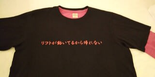

# 昨日も死んでた

📅 投稿日時: 2020-12-01 10:56:02

🏷️ カテゴリ: [日記](cc4b5682fb7b8b144980957a978653fb0.md)

昨日は夜1時くらいにblogを書いていたのですが。

書いてる途中で眠たくなり、ちょっとだけ…と布団に入ったら。

皆さんの予想通り、朝まで寝てました

死ぬほど眠いときに、ちょっとだけ寝るというのは、

リフトが動いているのに帰る…ってのと

同レベルに難しいことだと認識しました…←普通の人には当てはまらない例えでは？

ってことで。

次回から某メンバー作製の、20000mクラブ名言Tシャツ着て

滑らないと…！

（よく分からないオチだ）

## 💬 コメント一覧

### 💬 コメント by (レインボー73)
**タイトル**: Unknown
**投稿日**: 2020-12-01 14:08:42

リフトが動いてるから帰れない!

リフトが悪いんじゃないのに。

そういう行動を、私達は『スキーヤーエス化』略して『エス化』とよんでいます。

仕事疲れで爆睡した人には悪いけれど、今日のクマはまさに天国。朝一からリフト二本動かしてくれるし、雪質、天気とも100点満点。

来客の用があったので10時半にやめるつもりだったのに、あと一本だけ滑ろう、もう一本だけ滑ろう、いやいや今度こそ帰るぞ。一本ごとにエス化していく自分がそこにはいました。

何かきっかけがなければ、もはややめられないアリ地獄に落ちてしまった私に、やっと光明をさしてくれたのは、なんと光をさえぎる雲様でした。

ありがとう雲様。突如の出現で斜面を見にくくしてくださったのです。ありがとう。やっと帰れます。

そのまま車まで滑って、たどり着いたのは、なんと13時。

いつも14時まで滑るレインボー隊の凄さも、改めて認識できました。

それから、物欲が止められないことも、私達は『エス化』と呼んでいますが、わたしも靴と板を新調してしまいました。知られたらきっと妻は鬼化します。怖いです。

### 💬 コメント by (西舘)
**タイトル**: Unknown
**投稿日**: 2020-12-01 17:09:07

レインボー様ってば本当に面白い。

西舘の宿にもレインボー様のファンがたくさんいて、「妖怪足つかみ」はその事象を表す共通の単語になっています。

「エス化」ですね、今シーズは恐らく当たり前の様にみんなが「エス化」してどーのこーのと会話することになるてしょう。

### 💬 コメント by (レインボー73)
**タイトル**: Unknown
**投稿日**: 2020-12-01 18:57:49

私は名古屋育ちですのでわかります。鮎釣りのために家族の反対を押し切って、鮎に近い岐阜に引っ越した不届き者です。この4日間、y口さんと夜を共にしました。と言っても変な関係はお互いお断りですけど。

二人でリフトで話していて開発しました。エス化。

実際には○本化とはなしていますが。

ぜひ流行らせてください。あんな凄い人は他にいませんから。

### 💬 コメント by (Skier_S)
**タイトル**: 生き返りました
**投稿日**: 2020-12-02 01:45:00

＞レインボー73さま

S化ですか…

あと1本をひたすら繰り返し営業終了までいるだけじゃなく，

みんな夜に寝れなくなるんですね…．

そして，レインボーさんも見事に物欲含めエス化されたわけですね（笑）

＞西舘さま

物欲が止まらないことをS化というなら，板を5セット買った西館さんもかなり

S化が進んでますね！

