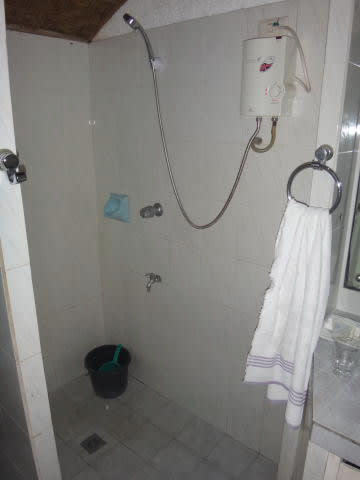

# 2016年8月　子連れで再訪！モアルボアル旅行記エピローグ…泊まったホテル，カバナビーチリゾートはこんなところ

📅 投稿日時: 2017-10-06 01:32:36

いやーー．

明日，ついにYetiがオープンして．

2018シーズンが開幕するわけですが…

さすが，もう[Yetiのコースはほぼ完成](https://www.facebook.com/YetiSnowtown/posts/1457313111024727)してますね～！

しかし．

10月第1週にオープンって，すごいよなぁ…

…

…でも．

なんだか．

オープン日の金曜も，翌土曜も．

…雨になるっぽいんですが（涙）．

7日朝9時の地上天気図を見ると…

うーむ．

水色で塗った降水域が，日本を覆ってます（涙）．

（すごい久しぶりに，このBlogに天気図載せた気がする…）

おそらく，

金曜は，昼までは降らずにもつと思いますが…

Yetiでは，金曜昼過ぎ～土曜の昼ごろまで降り続け．

特に，土曜早朝は降りが強くなりそうなので．

土曜の朝の営業開始は遅れる可能性が大

ですね…

そして．

今日まではかなり寒い日が続きましたが．

打って変わってこの3連休．

水色矢印で示すように，

気温はかなり上がりそうなので…

雨＆高温で，この3連休のゲレンデコンディションは，

ちと苦しい状況っぽい感じ…

しかし．

こんな状況にありながらも．

まるで明日のYetiのオープンが他人事のようで．

私が明後日シーズンインすることがまだ信じられない

今日この頃．

皆様，いかがお過ごしでしょうか．

ということで．

非常に長い時候の挨拶のあとは．←ここまでが本題かと思ったら…これが時候の挨拶だったのか…っ！！

本題の．

モアルボアルレポート．

いや，前回でモアルボアルレポート，終わったんじゃないの？？？

ってお思いでしょうが．

自分でもそう思ってましたが．

今回は，エピローグです…

ってことで．

去年の旅行から，すでに13か月過ぎてしまった，

かなり旬を外してしまった感じのモアルボアル

レポートでしたが．

モアルボアル，やっぱりいいところでした…

なんてったって…旅費が安い！

現地の物価（飲食代等）が安い！

ダイビングフィーが安い！

モアルボアルの町中も，ちょっと怪しい雰囲気だけど

　食事するところもいっぱいあってそこそこ楽しめていい！

…そして，海も良くて．

イワシの群れは一見の価値あり！

ぺスカドール島も，サンゴがきれいで

きれいな海で，いい！

さらに…

エメラルドグリーンダイビングセンターは，

子連れ同乗OK！

ってことで．

今のところ，我が家のリクエストにぴったり

マッチしている感じ．

ただ，私の嗜好から，じっくりマクロ系の

ポイントに入らなかったので…

底生ダイバー（じっくりマクロ系ダイバー）の

満足度は不明ですが（笑）．

最後に．

今回，モアルボアルで泊まったホテル．

「カバナビーチリゾート」についての情報を…

このホテル．

外から見ると「あれ？これがホテル？」

って感じの外見ですが．

このドアをくぐると…

こんな感じで，向こう側に海が見えます．

ちなみに，この右側に並んでいるのが，

今回泊まったガーデンビューのお部屋．

ガーデンビューの部屋の中はこんな感じ．

ツインの部屋になります．

冷蔵庫，電気ポット，TV，ドライヤーはありますが，

セーフティーボックスはありません．

貴重品はフロントで預かってくれます．

水周りは…

こんなものでしょうか．

まぁ，お値段相当で．

ちょっと古さを感じます…．

バスタブは無く，シャワーのみ．

シャワーも簡易湯沸かし器で，

そんなに給湯力は強くないです…

一応，石鹸やらシャンプー，歯磨き粉は

ついてます．

タオル，バスタオルもあります．

無線WiFi無料使い放題．

ネットのスピードは普通に使えるレベルで，

結構早いです．

コンセントは形状は日本と同じタイプ．

日本のコンセントはそのまま刺さりますが…

電圧は240Vなので，日本の100Vとは異なります．

240V未対応のモノをそのまま刺さないようご注意を．

で．

部屋からは直接海は見えませんが，

前にこんな感じのテラスがあって．

部屋の前は，こんな感じのお庭が見えます．

部屋の前から，海の方へ向かうと…

ビーチチェアが並んでます．

昼間はここでのんびりすることもできますが…

普段，ほとんどここに人はいませんでした．

やっぱり，ほとんどのゲストはダイバーだから，

昼間は人がいないのかな？

ここを，海沿いに進んで行き，

海に突き出す桟橋テラスの根元部分までくると…

この写真右側，吹き抜けのレストラン席，

左側に青い壁のレストランの建物が見えます．

ちなみに，ここで真右を向くと…

海に突き出す桟橋テラスに続いてます．

ちなみに，桟橋テラスの先，屋根の下は

こんな感じのテーブル席になってます．

…ここでも食事ができるのかな？？？

レストランの横を通って，さらに奥に行くと．

何度もレポートに出てきたプールに出ます…

子連れには，プールがあると大変うれしいですが．

この近辺で，プールがあるホテルは

あんまりないんじゃないかな．

ってことで．

割とこじんまりしてますが．

これで一泊一部屋約7000円（一人じゃないよ！ルームチャージだよ！）

程度という，かなりリーズナブルな価格の

このホテル．

娘も結構気に入っているので．

またモアルボアルに来るなら，

ここに泊るだろうな～．
