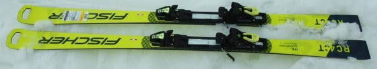
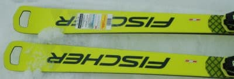
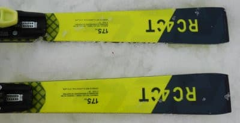
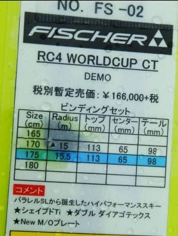

# 2022シーズンモデルのスキー板，試乗レポートその22…FISCHER RC4 Worldcup CT

📅 投稿日時: 2021-07-16 05:33:35

🏷️ カテゴリ: [スキー板試乗](c0bd8048615710cee890e403a36cc9a2b.md)

今日もいろいろヤバくて，

更新時間がヤバい感じですが…

それでも今日は書きためておいた

2022シーズンモデルスキー板の

試乗レポートを投稿！

2022シーズンモデルのスキー試乗レポートも，

これを含めて残るは3機種．

レポートも残りわずかになってきました…

今回はフィッシャー編．

とはいっても，一度乗った板の長さ

違いですが．

では，どうぞ～！

○FISCHER RC4 Worldcup CT 175cm

基礎オールラウンド．

…鋭い方は，

「あれ？この板の試乗レポート，

　以前にもあったような…」

とお思いかとおもいますが．

…そうです．すでにエキップさん主催の

試乗会で[一度乗っている](e2fa8e05f4cce7222def88c257ed49f57.md)のですが．

その時は長さ170cm．

今回履いたのは175cmです．

170cmの板だと，ちょっと大回りする

には回りすぎるな…

と思っていて．

この時はまだ物欲選手権前で，

次期大回り用主力戦闘機を探して

いたのもあり，もう少し長い

175cmの板をはいてみたのでした…

ってなことで，5cm長い板を

履いてみたところ．

やっぱりCTは，前回履いた感じと

あまり変わらず．

メタルの張りが強く，強いばねを

履いたような感じで．

で，グリップが強烈に強い，

カービング専用マシンですね…

ずっしり・ガッツリとしたグリップ感が

あるので，板をずらしたり動かしたり

仕様と思わない，かなり強烈な板．

さらに，175cmになると，さらに直進性が

上がって強烈さはランクアップします．

…でも，板のラディウス自体はR=15mと，

純粋ロング板に比べれば小さめなので，

山回りで小回りっぽくテールを抑え気味に

滑ると，板が切れて意外と小さいターン弧で

回ってくれます．

そして，板のばね感が強いので．

大回り板ではありえない速さ，強さで

返りが戻ってきます．

この返りを使って滑っていけば，

ターン弧はミドル程度のターン弧に

なっていきます．

ただ…板自体がかなり強いので，

このようなたわみと返りがでてくる

スピード域は高め．

スピードが出ない領域や，柔らかい雪で

板にたわみが出しにくい領域では，

かなりまっすぐ進んでいきます…

そして，板がグリップするスピード域と

雪の硬さになった場合，いきなり強烈な

グリップと回転力を発揮するという，

かなりじゃじゃ馬的性格の板です．

ただ，ハイスピードでの整地で，

このじゃじゃ馬的性格を使いこなせれば，

強い武器になると思います…

朝イチ限定ハイスピード中回り板としては

いいけど．

大回りベースの普段履きに使うには

ちょいと手ごわいかな…

やっぱりRC4 RCの方が普段履きには良さそう，

と思ったSkier_Sだったのでした

## 💬 コメント一覧

### 💬 コメント by (Unknown)
**タイトル**: Unknown
**投稿日**: 2021-07-16 07:54:28

楽しく拝見させていただいております。

ブログ読んでいていつも思うのですが、かなり過酷なスケジュールの中、お仕事をされているように見受けられます。

突然の質問で恐縮ですが、36にはひっかかっていないのでしょうか？

### 💬 コメント by (Skier_S)
**タイトル**: ＞Unknownさま
**投稿日**: 2021-07-16 21:33:34

お気遣いありがとうございます．

純粋に勤務時間で計算すれば，私は余裕で36の基準は突破しています…

ただ，労基署が入ると私は救われるのではなく怒られる方なので，

残念ながら36協定は私を守ってくれません（涙）

### 💬 コメント by (Unknown)
**タイトル**: Unknown
**投稿日**: 2021-07-17 19:01:09

＞Skier_Sさま

お返事ありがとうございます。

Skier_Sさんが職場でどのようなポストに就いておられるか存じ上げておりませんが、Skier_Sさんを守ってくれない(状況を把握していない？)会社はいわゆるブラックとしか言えないような気がします。

余計なお世話かもしれませんが、Skier_Sさんが会社に今の状況を訴えかけないと、部下の方々の労働環境も改善されないと思います。

すいません、ホントに余計なお世話ですね。

今後も楽しい記事を期待しております。

### 💬 コメント by (Skier_S)
**タイトル**: ＞Unknownさま
**投稿日**: 2021-07-17 23:43:15

いや…自分が言うのもなんですが，私の会社は組合員に対しては，

かなり恐ろしいほどホワイトです．

すごいホワイトな会社なんです．

ただ，ホワイトな会社を維持するためには，ある程度のレベルの人は

業務調整による人の手当てやら稼働管理やら，

他社からの応援やら会社の買収やら，苦労しないといけないんですよね…

