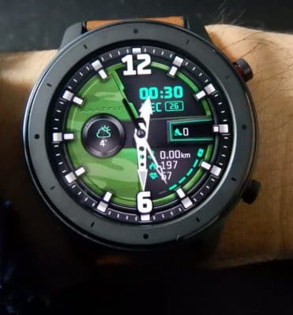
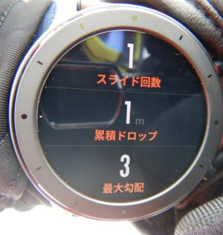
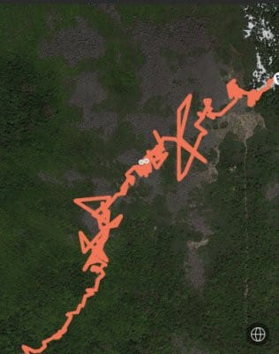
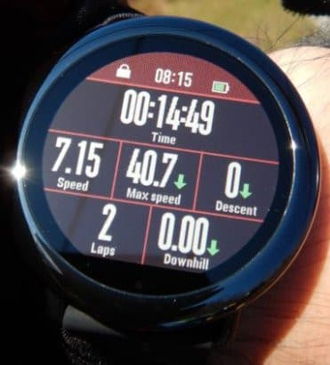
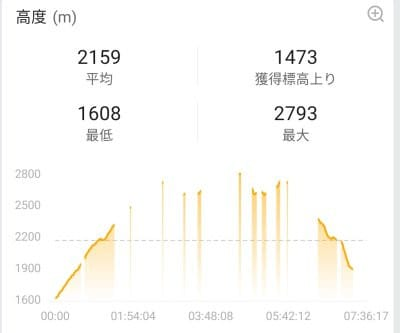
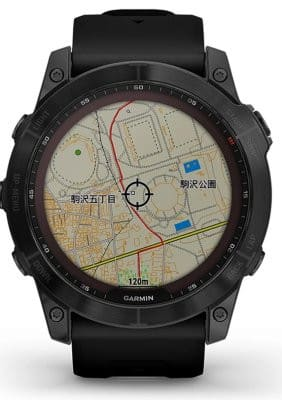

# 新しいスマートウォッチ，Garmin Fenix7Xを買ったよ！その1…なぜGarmin Fenix7Xを買ったのか？

📅 投稿日時: 2022-08-08 04:29:39

（Garmin Fenix7Xのレポート全16回のもくじ

機能説明，登山用地図の作り方，登山で使ってみた…など

は[ここをクリック](e516b23a4874189de2e9208be87fa5184.md)）

えー．

前回・前々回とGPS精度のレポートを

やっちゃってるし．

さらに購入から1か月以上経っていて，

今さら感がありますが…

[1か月ちょい前に開催された物欲選手権](e8f9549107cb957571ed35f5bfda9bcbe.md)に敗れ，

ついつい購入してしまったスマートウォッチ，

Garmin Fenix7X．

こいつの購入レポートの詳細を

書いてみようかと．

えーっと．

まずですね．

私はすでに二つのスマートウォッチ，

Amazfit GTRとPACE君を所有している

というのに．

なぜ，今回また新しいスマートウォッチを

買おうと思ったのか？？

という点を振り返ってみましょう…

Amazfit GTRとPACE君．

それぞれ，1万円前後のスマートウォッチと

考えればかなりいい出来だったんだけど．

この二つのスマートウォッチの

特徴をまとめてみると…

○Amazfit GTR君

【いい点】

・1万円ちょいと安い

・有機EL画面がきれい！

・一回充電すれば，電池が3週間くらい

　もつ！これはすごい！

・リアルタイム心拍・睡眠測定などは

　結構精度は高い

・運動ログ機能もスキー，登山，ランなど

　自分が必要とするものは揃っている

【ちょっと残念だった点】

・GPSを使うと電池が20時間くらいしかもたない

・GPS精度があまり高くなかった（涙）

　GPS感度も低く，よく電波を見失った

・最初は問題なかったのに，途中のアップデートで

　謎のバグが仕込まれスキーの滑走標高差が

　正しく出なくなった

・旧モデルになったからかファームアップデートが

　全くされず放置プレイになり，バグが直らず（泣）

（スキーで滑走標高差200mのコースを1本滑っても，

　滑走標高差1mになっちゃってます(涙)）

（まっすぐ歩いた記録なのに，GPS精度が低く　

　軌跡がぐちゃぐちゃに…(泣))

ってなことで．

普段使いの時計とか，ライフログ的な

機能は満足だったんだけど…

私的には，GPSの精度が低くて

山歩きの際の歩行距離やスキーの滑走距離が

正確に測れなかったのと，

スキーの時に一番重要視する滑走標高差が

測れなくなったのが痛い．

○Amazfit PACE君

【いい点】

・8000円くらいと激安！

・反射型液晶での常時表示が便利

・安いのに，普通のスマートウォッチが

　もつ機能は大体揃っている

・着信やLINEメッセージ通知で絵文字が

　ちゃんと表示される

・本体に音楽を入れてBluetoothイヤホンで

　スマホ無しで音楽が聴ける

・スマホ無しでもログのGPXファイルを

　書きだし，USB経由でPCに送れるし，

　GPXファイルを読ませればルートナビが

　できたりと，8000円と思えない多機能…

・GPS精度や感度はGTR君よりかなり高い！

【ちょっと残念だった点】

・電池が4-5日しか持たない．GPSを入れると

　20時間弱で電池切れ．

・気圧高度計が無いので，高度の測定が

　不正確だった…（滑走標高差の精度がちと低め）

・時計単体で一日滑走標高差が確認できず，

　スマホを見ないと分からなかった

・スマホアプリでも標高ログが正しく出ず，

　滑走標高差も2倍で表示される謎バグが…

・コいつも旧モデルになったからか

　ファームアップデートが全くされず

　放置プレイ状態（泣）

（最初は大丈夫だったのに，ある日のアップデートから

　スマホで標高データを見るととぎれとぎれになり，

　正しくログが表示されないバグが…(涙))

ってな感じで．

ふたつとも良いスマートウォッチで，

結構満足していたんだけど…

しばらく使っているとバグが仕込まれて

しまったという悲しい状況に（泣）

とりあえず，記録マニアの私としては．

「もう少しGPSやら標高なんかの記録精度が

　高いスマートウォッチが欲しい…！」

という欲が出てきて．

・高度計，速度，GPSの位置精度測定が正確

・リアルタイム心拍測定が正確

・アクティビティ時の表示画面の

　カスタマイズが自由にできる

・一回の充電で電池がむちゃくちゃ長持ちする

という条件のほか，

山登りをする際に，

「地図を確認するのに毎回スマホを

　見るのがめんどくさいから，

　時計で地図と，次のポイントまでの

　残り距離が確認できるといいよね…」

とかねてから思っていて．

…こんなわがままな条件を備えた

スマートウォッチは，

GarminのFenixシリーズ一択

なので．

（今はGarminのFORERUNNER 955シリーズも

　条件を満たすけど）

ここ数年，買おうかどうしようか…

とは悩んではいたのですが．

（Garmin Fenix7X．地図を見れるのがすごい！）

ただ．

このFenixシリーズ．

Fenix6まで，タッチパネルじゃなくボタン操作

だったんですよ…

これだけの多機能ウォッチ，ボタンだけで

操作するのは辛い…

という理由を言い訳に，

「こんな高いスマートウォッチ要らないよね…

　なくてもいいはず…

　タッチパネルじゃなくて使いにくそうだし！！」

と自分を騙して，物欲を抑えていたのですが．

なんと．

今年1月に発売になったFenix7シリーズから．

ついにタッチパネル搭載

というニュースが！！

…ヤバい．

これはヤバい．

買いたい…

欲しいぞ！！！

でも，高い…お値段が高すぎる（泣）

ってなことで．

「もし…もし，ぼぉなすというものが

　予想より多かったら．

　自分へのご褒美にスマートウォッチを

　買い替えよう…」

と，自分への言い訳を考えていたところ．

会社も私のご無体労働に罪悪感を感じているのか（？）

ぼぉなすというもので，ある程度報いてくれたので．

今回，

「日々ご無体な仕事を頑張った自分へのご褒美」

として，Garmin Fenix7Xを購入したのでした…

（続く）
