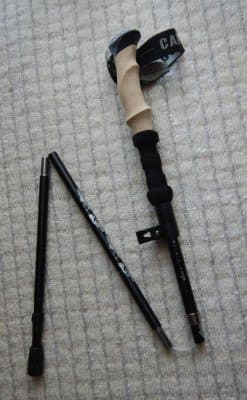

# 膝サポーターの調子が良かったので，ついついもう一つ買っちゃったけど…

📅 投稿日時: 2021-09-07 03:06:45

ってなことで．

スキー板をヘタらせる特殊電磁波を放射

しているSkier_Sです．

…どこかに，

私からの電磁波を浴びてもヘタらない板

がないかなぁ…

そんな板があれば，

物欲選手権に負けずに済むのに…！！←いや．板がヘタらなくてもあなたは物欲に負けるはず

ってなことで．

本題へ．

ここしばらく山登りレポートが続いていましたが．

そこで何度も出てきた膝サポーター．

実は，先月に山に登った時．

「膝が痛くないから快適～！！」

と，調子こいて飛ばしていたら．

今度は，サポーターをしていない左膝が

痛くなってしまいました(泣)←調子に乗りすぎた自業自得でしょ

しかし，いつも痛めていた右膝は全く痛く

無かったのに，サポーターをしてなかった

左ひざをやっちゃったってのは，やはり

サポーターの予防効果があるってこと

なんだろうなぁ…

ってなことで．

右足の片足だけだった，膝のサポーター．

ついに．

左足用も買ってしまいました～！！

で，このサポーター購入後に，

テストを兼ねて，両足サポーターで山を歩いて

きたわけですが…

しかし．この時．

一度痛くなった膝は，中2週間ほどの短い

インターバルでまた激しい山歩きを

した場合，

サポーターをしてても完全に膝の痛みは防げない

ということを学びました…

残念ながら，下山中にやはり痛みが再発（泣）

一旦膝を傷めたら，数か月くらい

休ませて完全回復させないと，

サポーターでも完全に痛みを

抑えることはできないようです…（涙）

前回膝を傷めてたのに，いきなり

コースタイム11時間は厳しかったかな…？

でも，昨年10月の編笠山の悲劇のように，

歩くのが辛いほど痛くなったりは

してないので，ある程度の予防効果は

あったはず…！！

とりあえず，今回も右膝は全く痛く

なっておらず．

昨年10月にひどく痛めた右膝も，

次の7月まで1シーズン休ませて，

それ以降サポーター着けて登ったら

全く痛みが無くなってたので．

左ひざも，中2週間ではなくてもう少し

長い期間休ませてあげれば，それ以降は

サポーターで完全に痛みは予防できるんじゃ

ないかな～…と思います．

でも．

一体何ヶ月休ませれば，膝の痛みが

完全に防げるのかなぁ？

できれば今年も，まだ行けるなら

山を歩きたいよなぁ…

…でも，痛めた左膝の負荷をなるべく

下げて歩きたいなぁ…

…

…

あれ？

なんだ，これは…？？

これは，もしや…

折り畳み式トレッキングポール？？

ってなことで．

膝の負担をかなり軽くしてくれるらしい

トレッキングポールが，なぜか我が家に

届きました…！←「なぜか」じゃなく，自分で通販で買ったんでしょ

いや．これは，

身体を護るためのやむを得ない購入であり．

決して物欲に負けたのではない

と，声を大にして言っておかねばなるまい…←負けてるから

## 💬 コメント一覧

### 💬 コメント by (northfox)
**タイトル**: Unknown
**投稿日**: 2021-09-07 08:59:03

今回は…物欲選手権のオープン戦ですね。^_^

トレッキングポール、私も買いました。閉店セールやっていたスキー/山屋さんで大安売りしていたので、つい。

ポール使うと下り道が楽ですね。

それにスキーのストック使っているみたいな気分になりますね。もっと早く買えば良かったです。

### 💬 コメント by (Skier_S)
**タイトル**: ＞Northfoxさま
**投稿日**: 2021-09-08 01:55:43

トレッキングポール，こちらも通販で激安の2本セット2800円でしたのでついつい…

初めてポール使ってみて，ここまで足の負荷が違うとは思いませんでした．

私も，もっと早く買っておけば良かった…と思いました．

### 💬 コメント by (ほっぽ)
**タイトル**: Unknown
**投稿日**: 2021-09-08 06:37:17

これは物欲選手権の予選、いや前哨戦でしょうか😅

決勝、本選は何時なのか、どれだけ大敗するのか❓️

今から楽しみに待ってます❗😅

### 💬 コメント by (ikkun)
**タイトル**: Unknown
**投稿日**: 2021-09-08 11:04:01

登山もスポーツ?だとしたら仕方ない事ですね

やはりパワー有りすぎ？( *´艸｀)

### 💬 コメント by (Skier_S)
**タイトル**: 登山はスキーのためのトレーニングです
**投稿日**: 2021-09-09 00:53:13

＞ほっぽさま

2022シーズンに向けた物欲選手権は，スキー板2セットとHEADブーツとヘルメットとゴーグルの

大敗をしているので，さらにまた2022シーズンインまでに物欲選手権をする予定はさすがにないです(笑)

＞ikkunさま

力がないから膝を痛めている気が…(涙）

