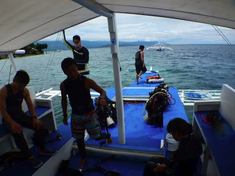
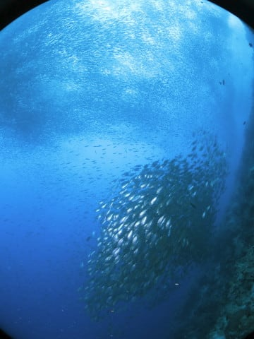

# 2018年8月，モアルボアルで小5の娘をダイバー化！その5…2本目は，定番のイワシポイント！

📅 投稿日時: 2019-07-11 04:42:17

…今日も帰宅がご無体時間（涙）

ということで．

また本日も，全滑走記録後半はお待ちください…

今日は書きためてあった，ダイビング日記です！

---

ってなことで．

ぺスカドール島の1本目のダイビングを終えて．

船はダイビングショップの方向へ戻ります…

で．ダイビングショップのそばまで

戻ってきましたが．

このショップでは，午前中は2本の

ダイビングが標準なので．

このままショップへは戻りません．

ここで2本目を潜ります．

モアルボアルで，このショップ前ということは…

そうです！

私の大好きな，イワシポイントです！

ワクワクしながら，エントリー！

するといきなり目の前に現れる，

イワシの巨大群れ…！

いや．

これだよ．

これがやっぱりモアルボアルの

醍醐味！

静止画では分かりにくいけど…

この群れが，ダイナミックに動きます

これだけの魚の集団が，まるで一つの

意志を持っているかのごとく，

ざざざ～っ！と動き続けるのを

見ているだけで，飽きません…

いや．

イワシだけで面白いのに．

巨大ウミガメまで登場するし…

いや．

このタイマイ，結構デカいよ…！

…そして．

あんまりダイバーを怖がりませんね…

むちゃくちゃ近づけます（笑）．

こんな中，上を見れば…

こんな感じのイワシの群れが，

頭上を覆い尽くしてます．

あぁ…

すごい．

すごいよ．

ホントに静止画だと分かりにくいですが．

動きが面白くて，見てて飽きません…

こんな巨大な群れが．

ダイビングショップの目の前から，

長さ300～400m位に渡って．

ずっと川のようにつながっているん

ですから…

それはそれはすごい見ごたえのある，

一大エンターテイメントです．

ダイビングをしない人は想像つかないだろうし．

ダイビングをやったことがある人でも．

そうそう滅多に見れるものではないと

思います…

いや．

このイワシだけでもすごいのに．

今日は巨大タイマイも出たし．

ここは，なんてゼイタクなポイントだろう…

と，思っていた時．

自分のダイビング人生でそんなことが

起ころうとは．

全く予想しえなかった出来事が

起きたのだった…っ！！

## 💬 コメント一覧

### 💬 コメント by (マルハバ)
**タイトル**: Unknown
**投稿日**: 2019-07-11 07:11:01

こんなにデカいタイマイ見たことないです・・（汗）

### 💬 コメント by (炎の北海道民)
**タイトル**: Unknown
**投稿日**: 2019-07-11 21:05:45

予想し得なかった出来事…

ズバリ、ウツボに噛まれた！！に100点

私も義理の兄が伊豆大島でスキューバダイビングの店をやっているので人生初のダイビングをしたのですが、海の中って静かなんですよね。地上とは別の世界だと実感しました。亀さんとウツボ君もいました。

### 💬 コメント by (Skier_S)
**タイトル**: モアルボアルはいいところ
**投稿日**: 2019-07-12 00:51:58

＞マルハバさま

そうなんですよ…

超巨大でしたし．

どうみても，アカウミガメでもアオウミガメでも

なかったので．

巨大タイマイだったのかな…と．

＞炎の北海道民さま

あら！！

ダイビングやられるんですね！

海の中もいいものですよ．

でも，ウツボではないです（笑）．

次をお楽しみに…

### 💬 コメント by (マルハバ)
**タイトル**: 予想し得なかった出来事…
**投稿日**: 2019-07-12 10:59:23

タイマイに抱き付かれた（笑）

### 💬 コメント by (Skier_S)
**タイトル**: ＞マルハバさま
**投稿日**: 2019-07-13 03:39:33

もっとずっと大きなものに追いかけられました（笑）．

