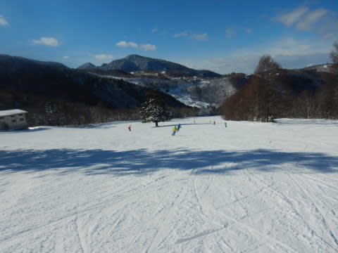
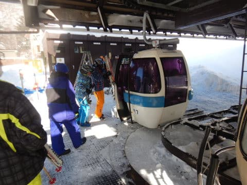
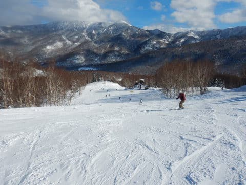
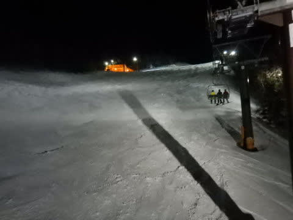

# 2022/1/9(日)，3連休中日の志賀高原スキー場は…曇り→晴れ→曇りと目まぐるしい天気，雪質最高！ちょっとだけ混んだよ

📅 投稿日時: 2022-01-10 00:05:16

🏷️ カテゴリ: [2022スキー滑走日記](cc9cb73e4320f6a97af6fccc37587a61a.md)

ってなことで．

3連休中日の今日も，志賀高原で滑ってたので．

いつも通りの志賀高原レポートです！

まず，今日も朝イチは焼額の第1ゴンドラから

スタートしますが…

3連休の中日と考えれば，営業開始前の

待ちはそんなに長くないですね…

で，朝イチゴンドラで山頂に上がると…

気温は-7℃．

　朝の気温は-5℃程度

という予想から2℃ほどずれたものの，

-10℃を下回っていた，昨日や正月休みと

比べると高めの気温ですね…

天気は…

薄日が射す曇り空．

すっきり晴天ではないのが残念ながらも…

でも，雪は冷え冷え！

そして…

うほほほほ！

今日もシマシマっ！

柔らかめながらも，昨日より締まり気味の

トップシーズン冷え冷え雪のシマシマ！

こういう日は，R27のGS板，出動だっ！

…これまでパウダーが多かったので，

このFISCHER GS Master 189cmはこれが初出動．

R=27って手ごわいかと思ったけど…

朝イチ焼額のシマシマバーンには最高！！

いい．

これはいいよ．

最高雪質のシマシマと相まって，

最高に楽しいよ！！

…と，気持ちよく午前9時過ぎまでは滑っていたけど．

さすが3連休の中日．

9時半を過ぎると，一の瀬方面から流れてくる

人でゲレンデの人口密度が上がっていき…

そして，10時になると…

うげげげげ（涙）

昨日は終日ガラガラだったイチゴン，10分待ちを

超えてきました(泣）

…実は．

焼額第1ゴンドラの待ち時間が10分を越えると

私の焼額の呪いが解けるという，知られざる

設定があるので．←いかにも適当に決めた設定っぽいな…

一の瀬方面へワープ！！

一の瀬ファミリーにやってくると，

朝は曇っていた天気が，すっきり晴れて

来ました！！

一の瀬ファミリーの正面バーンは，

しっかり冷えて固まった感じのエッジが食い込む

下地の上に，ところどころエッジで削られた雪の

凸凹があって…

ちょいと快感度は低い感じ(涙)

10時頃だと，リフト待ちはゲートの中に

収まってたし．

ゲレンデもそれ程混んでなかった感じ…

そして，リフト待ち搬器数台くらいの

ガラガラだった高天ヶ原を抜けて…

高天ヶ原のてっぺんから，東舘を降りて…

ブナ平を通っていきますが．

天気はもうすっかり晴天！

そして，標高が低いところにやってきても，

今日は雪質が最高だし…

昨日に引き続き，3連休中日の今日も，

天気よし，雪良しのいいコンディションに

なってきました…！！

ジャイアントは滑らずに通過しただけですが…

ここも雪質はよさそう！

スキーヤーの雪煙がきれいに上がってます！

いやー．

ホントにこの3連休，天気にも雪にも恵まれて

いるなぁ…

そして，昨日ナイターで滑ったサンバレーまで

はるばるやってきました…

サンバレーは，ガラガラ！

3連休中日でこんなのでいいの？

というガラガラ具合です！

が．

焼額の混雑を避けて，ここまでやって

来たというのに…

ここまでやってきた，12時時点で．

「焼額のゴンドラがら空きになりました～」

という連絡が！！

これは…わが住み家がガラガラなら，

サンバレーで滑ってる場合じゃない．

全力で焼額に戻らねば！！

…と．

今シーズンデビューのブナ平ゴンドラに

乗り，焼額へ戻ります…

うーん．

ブナ平ゴンドラ，クワッドリフトの時と

同じ運転速度なので，所要時間が

変わるわけじゃないし．

むしろクワッドの時より輸送能力が

落ちて待ち時間が長くなっているので…

今日みたいに天気がいい日は，クワッドの

方が良かったかも…

ってなことで．

午前10時半ごろに焼額を出て，サンバレーまで

行ってきたというのに．

午後1時前にまた焼額に戻ってきました～！！

焼額も晴天！

そして，昼を過ぎてもゲレンデはフラット！

いいよ！

やっぱり，混んでなければ焼額がいい！！

そして，ゴンドラも列はゲートの外まで

伸びておらず…

相乗りレーンなら，搬器数台の待ちで

乗れる感じ！

昼過ぎに，最高気温は0℃近くまで

上がったものの…

雪は全く緩まず，最高雪質のいい感じの

フラットバーンを滑れます！！

ただ…

なぜか夕方3時ごろ，ちょっと第1ゴンドラは

混むときもありましたが…

でも，リフトはそんなに待ちなく乗れたし．

午後3時過ぎから，山頂付近はちょっとガスが

かかったものの．

今日もいい天気，いい雪で滑れた，

満足の3連休中日を，16時のリフトストップ

まで，滑り続けたのでした…

いやーー

楽しかった．

今日は良かった．

まだまだ滑りたいよね…

滑り足りないよね…

…

そんなあなたに，ナイターがあります！

ということで．

本日もサンバレーナイターに参戦するのだ！！

サンバレーナイターは…

今日も冷え冷えのシマシマっ！！

昨日より人は多かったけど…

でも，好きなだけ傾き放題の，ハイスピード

快楽バーン！

うほほほーーー！

…と，喜んで滑っていたら．

最後の20分ほど，ガスって視界が…(涙)

でも，今日もしっかり，ナイターストップまで

滑り続けたのでした…

いやー，

満足．

今日は朝と夕方とナイターラスト，ちょっと曇ったり

ガスったりしたけど．

でも，この2日間，雪も天気もいいし…

そして，明日も朝から晴れそう！

明日は朝イチから晴天で，最高の締まったシマシマバーンを滑れそう…

この3連休，かなり満足度高いです！！

## 💬 コメント一覧

### 💬 コメント by (愛知のS)
**タイトル**: 本日はありがとうございました
**投稿日**: 2022-01-09 23:22:31

本日朝一番とPM2時前の１ゴンで、御一緒させて頂いた者です。本日はありがとうございました。

ようやく念願叶ってSkier_Sさん御本人にお会いすることができました。

私の正月志賀高原は本日で終了してしまいましたが、今後も月１回ぐらいで志賀高原出動を計画しているため、その際はまたよろしくお願い致します。

もちろん引き続きブログは楽しく読まさせて頂きます。

### 💬 コメント by (Unknown)
**タイトル**: Unknown
**投稿日**: 2022-01-09 23:30:49

あれ？私も10時過ぎから焼額の混雑を避けて一ノ瀬へ脱出、一ノ瀬〜寺小屋〜高天ヶ原〜東舘〜ブナ〜西舘〜高天ヶ原〜タンネ〜一ノ瀬と辿り、2時にはヤケビに戻ってたのですが、お会いしませんでしたね😓

明日こそ探してお声かけしますね

### 💬 コメント by (アツシ)
**タイトル**: Unknown
**投稿日**: 2022-01-09 23:31:26

名前入力漏れです。

### 💬 コメント by (レインボー74)
**タイトル**: Unknown
**投稿日**: 2022-01-10 15:05:55

月曜日の志賀高原情報

朝の上林-1℃　蓮池-5℃。爽やかな朝。

三連休なのに人が少ない。12時までやけびは快適バーンを維持してくれた。昼までダイヤのリフトが止まっていたこともあって、平日に近い空き具合。

これ程までに快適が維持されたことは、多分シーズンベスト。

明日の午後からずーっと雪予報なので、平日のパウダーはどうぞ私どもにお任せを！

### 💬 コメント by (Skier_S)
**タイトル**: 3連休を終え，無事帰宅
**投稿日**: 2022-01-11 01:45:46

＞愛知のSさま

コメントありがとうございます～！

あれ．今回が初めてお会いしたんですね．

朝イチゴンドラは，一緒に乗っている某氏のお知り合いかと思ってました…

今後も志賀に来られるとのこと．

また焼額でお会いしましょう！

＞アツシさま

ゲレンデでは会えませんでしたが，ラストに無事お会いできましたね…

今度はゲレンデでお会いしましょう！！

＞レインボー74さま

いや．私にとっては間違いなくシーズンベストな一日だったのですが，

平日に毎日滑っている方でもシーズンベストと思えるとは，

やはりよっぽどいい一日だったんですね…

とりあえず，この3連休は晴天シマシマをおなか一杯堪能できたので，

明日からのパウダーはお任せします！

…でも，そんなにドサドサつもらなさそうですが…

### 💬 コメント by (李)
**タイトル**: Unknown
**投稿日**: 2022-01-21 10:59:57

今週の土日１月22日と23はどのコースにいる予定ですか。志賀高原スキー場に行く予定です。Yetiでいろいろ教えていただきありがとうございます。

Line Idはrikuzen-line

### 💬 コメント by (Skier_S)
**タイトル**: ＞李さま
**投稿日**: 2022-01-21 23:40:19

22，23日は焼額第1ゴンドラをメインに滑ってます！

ただ，Yetiの時と違うウエア，板で滑ってる上ヘルメットまで被っているので

見つけにくいかも…

LINE登録してみますね

