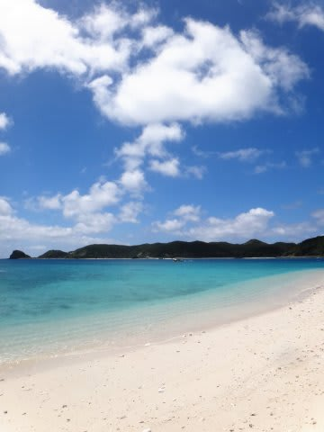
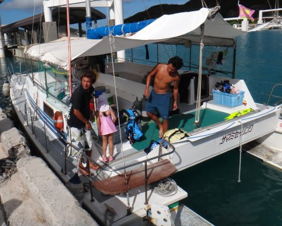
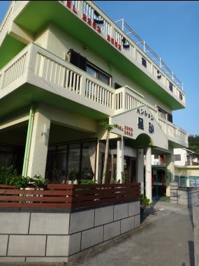

# 2013年7月　子連れ座間味ダイビング旅行記…プロローグ

📅 投稿日時: 2013-07-20 00:27:25

🏷️ カテゴリ: [ダイビング日記](ce3a7a8d424d112fce83ee85c81a0e344.md)

ってことで．

慶良間に行ってきたわけですが．

時はさかのぼって，5月．

「ただで飛行機に乗せてしんぜよう～」という，

大変ありがたい，マイレージなるものが．

なーんと，家族全員で沖縄往復できるくらいに

たまっているではありませんか．

…これは．

海の日3連休に，ダイビング遠征するしかあるまいっ…！

と．

予約開始日に速攻でマイレージ航空券を押さえたわけで．

んで．

どこに潜りに行きましょうかね～，

と考えると．

まず，マイレージ航空券でいけるのが那覇まで．

貧乏金なしなので，追加料金を払って石垣方面まで

足を伸ばすのはちと無理．

＃ホントは西表へ行きたかったのだけど…

那覇近辺で，どこにしようか…

ということになると．

本島は宿も高いし，ダイビングポイントもちょいとイマイチなので．

…

…ほぼ自動的に，慶良間になってしまうな…と．

そうなると，去年，おととしの2年間．

子連れダイバーに対する受け入れ態勢の完全さ，

ホスピタリティの素晴らしさを見せてくれた，

ザマミセーリングさんにまたお願いするのが

安心だよなぁ…

…だとすると．

泊まりは，1泊2食6000円という激安なのに，

食事がおいしく奥さんも優しく，すごく居心地が

よかったペンション星砂さんがいいよなぁ…

ということで．

またまた去年，おととしと同じ組み合わせで，

座間味に遠征することになったのでした．

＃ある意味，考えることを放棄した…ともいえる．

とりあえず．

今年は，娘も幼稚園年長さん．

去年乗ったダイビングボートも宿もしっかり覚えてるみたいで．

旅行に行くかなり前から，

「また，お船に乗ってシュノーケルで泳ぎたいっ！！！！！」

と．

それはそれは旅行を心待ちにしている様子．

ってことで．

…今年は，完全にあれですね．

親のダイビングに付き合うために船に乗ってもらうんじゃなく．

娘には，親と一緒に海を楽しむために乗ってもらう感じですね．

もう，ダイビング中以外は．

娘と一緒に，一日中シュノーケリングする気合満々です．

ってことなので．

なんだか，子連れって言っても，

旅行準備は大人と同じ感じになってきましたね．

子供用の暇つぶしのおもちゃだとか，

特別なものはほとんど持っていく必要が無くなり．

＃浮き輪すら持っていく必要が無い…

…その代わり．

マスク，フィン，シュノーケル，ウェットスーツ…と．

親と同じ道具が必要になってきました．

…さてさて．

幼稚園年長の娘は．

親の期待通り，ダイビングボートの上で過ごす1日を

楽しんでくれるのでしょうか？？

多少の不安と大きな期待の中，出発当日を迎えたのでした…
