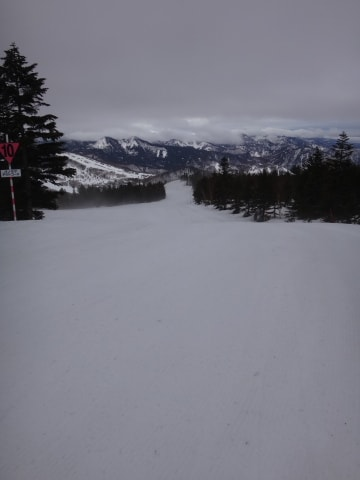
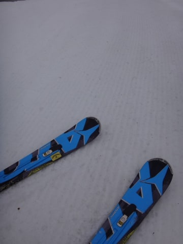
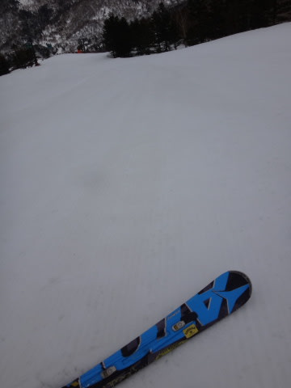
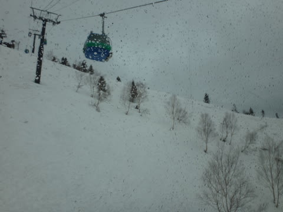
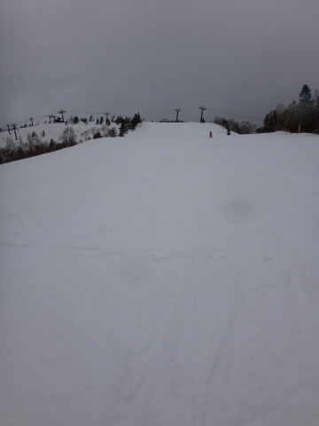
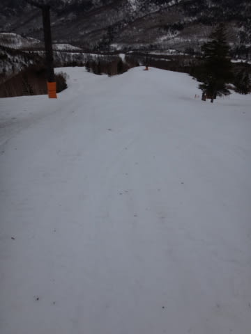
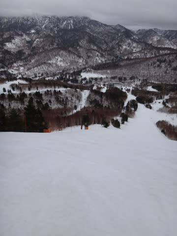

# 4月5日の志賀高原，速報モード…雨は降ったけど，それほどひどくなかったよ

📅 投稿日時: 2015-04-05 23:33:27

🏷️ カテゴリ: [2015スキー滑走日記](c09ea645cfc085f86dfcd80f49599dd89.md)

えー．

本日も当然のように，営業終了時間まで滑ってきたので．

帰宅が遅めで．

…さらに，早朝営業開始から滑っていたので，

たいへん眠い本日なわけなので．

日曜夜定番の，速報モードで…

あー．

本日は，明け方に雨が降ったようですが…

早朝営業開始の6:30段階では，雨は降っておらず，

ラッキー！

とりあえず，曇り空で始まった早朝営業でしたが…

朝イチから気温は以上に高く，早朝営業開始時で

もうかなり柔らかめの雪です…（涙）．

柔らかいとはいえ，きれいなシマシマバーンで．

人が少なかったので，シマシマなまま

9時半ごろまで続き…

いや，このまま雨が降らないでいてくれたら，

結構楽しめるかも？？

…と，思っていたところ．

9時半ごろに，来ました．

やっぱり．

雨が…（泣）．

この雨は，11時過ぎごろまでパラパラって感じで

降ったりやんだりでしたが…

11時過ぎに止んだ後は，午後3時頃まで，

ほとんど雨が降らずにいてくれました！

でも，ゲレンデは．

午前中の雨で退散した人が多かったらしく…

誰もいない！

貸し切り！

午後3時ごろから，また時折ぽつぽつ降り始めたけど．

むしろ，雨のおかげで人がほとんどいなくなり，

リフトストップまでこんな感じの，

全くホントに完全フラットバーンで．

（ホントに誰もいなかったゲレンデ）

意外と楽しく滑れたのでした…

詳細は，また明日…

## 💬 コメント一覧

### 💬 コメント by (いか)
**タイトル**: Unknown
**投稿日**: 2015-04-06 11:18:31

いやー、白馬は一日中あめでした…ずぶ濡れです(ー ー;)

人がまったく居なかったのが救いです笑

### 💬 コメント by (Skier_S)
**タイトル**: いかさま
**投稿日**: 2015-04-07 00:07:30

あら？

八方は一日雨だったんですね…

まぁ，南西の風だったので，志賀高原は

他に比べて降水量が少なくなりそうなパターン

ではあったのですが…

人が全くいなかったんですね…

いたのは，スキーに憑りつかれた，

人じゃない何かしかいなかったと…（笑）．

