# いまさらだけど…3月5日（日）の志賀高原，詳細レポート！

📅 投稿日時: 2017-03-08 01:56:51

というわけで．

昨日はかなりご無体時間の帰宅で．

記事を書くパワーも無く．

とりあえず2時間だけ寝て仕事に行ったわけですが…

本日はいつも通りの時間に帰って来れたので．

…2時間睡眠だった本日，たいへん眠いのですが．

いまさらながらの感がすごくあふれる，

日曜の詳細レポートです…

えー．

日曜の，朝．

ふはははは！

土曜日に続き，この日もすっきり晴天っ！！

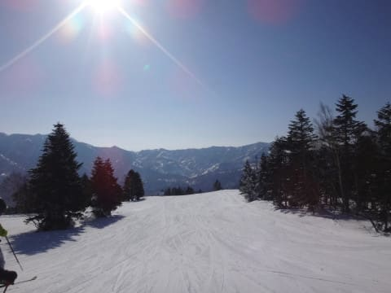

で，

山頂の気温は…-6℃ですか．

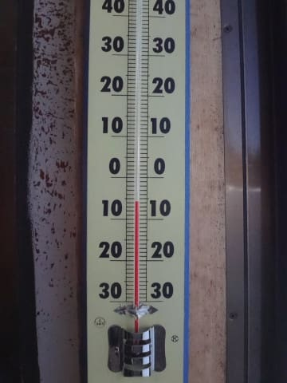

…2月の-10℃クラスの冷えに比べれば，

春っぽくなってきましたね～（ちょっと寂しい）

でも，雪質的には文句ない気温です．

で．

朝イチのゲレンデに飛び出すと…

当然，シマシマっ！！！

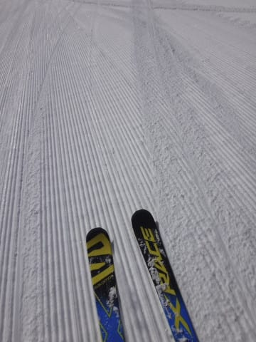

そう，シマシマっ！

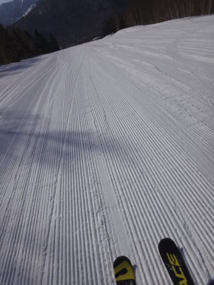

土曜ほどは柔らかすぎないけど，

比較的柔らかめのシマシマ圧雪！！

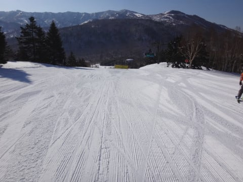

朝の4本ほど，最高の状況を滑れました～！

オリンピックコースもすごくフラットで…

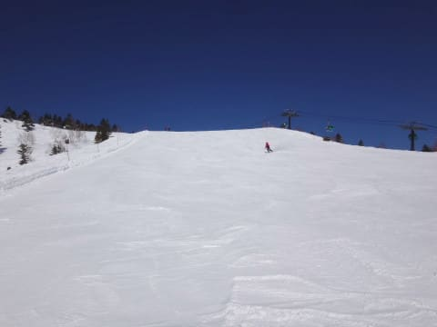

朝からちょいと固めのバーンが出てましたが．

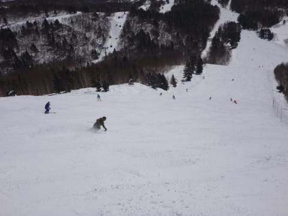

朝のうちは，かなりいいハイスピードバーン！！

いやーーー．

気持ちいいねぇ…

と，思っていたら．

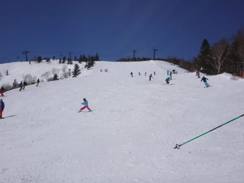

ありゃりゃ？

午前10時ごろにはやっぱり人が増え始め…

…そして，午前10時過ぎには，ゴンドラ待ちも発生（涙）．

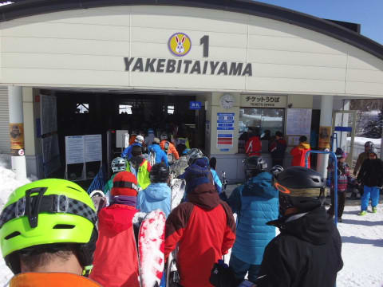

でも．列はゲートからわずかに出る程度，

おひとりさま優先レーンなら，最大で3分も待たないレベルで．

で．

11時前には…

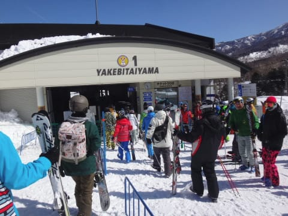

列はゲート内まで短くなってたので．

まぁ，この日はそれほどひどい待ちは

無くて，良かったかな～．

でも．

ゲレンデの人は多めで…

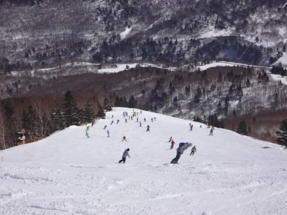

そして．

多くの人で削られたゲレンデは…

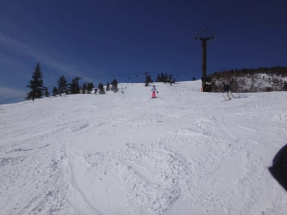

あり？

ちょっと凸凹になり始めました…

…でも，昼間も最高気温はマイナスのままで．

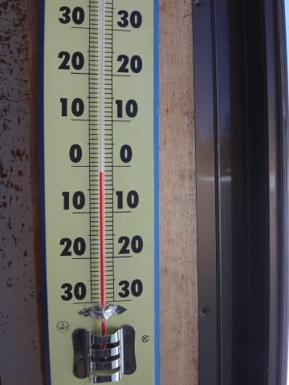

雪質は比較的いいし．

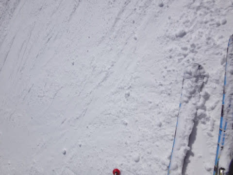

天気もいいから，まぁ，快適かなっ！！

そうそう，

この日は珍しく，お昼ご飯を食べに，

昼に一の瀬方面へ遠征してみたのですが…

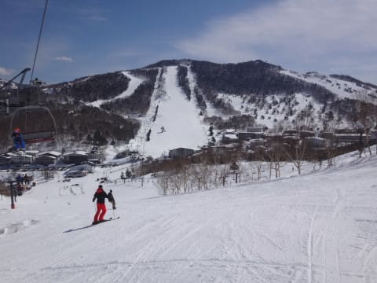

昼になっても，一の瀬ファミリーは結構

フラットバーンですね～

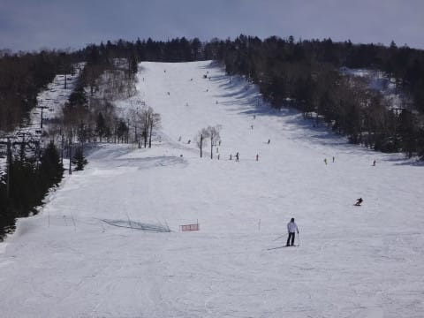

一の瀬ファミリー正面バーンのゲレンデは．

固めの下地の上に，うっすらと削れた氷の粉末が

乗った感じの雪質で…

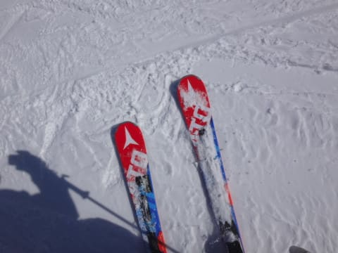

ちょっと固めではあったものの．

人も少なめで，板のエッジさえ立ててあれば

気持ちよく滑れる結構いい斜面だったかな～．

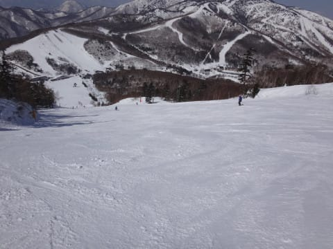

…しかし．

普段は焼額を滑っている私．

一の瀬を滑っていると…

まるで，北極海で熱帯魚を見つけてしまったかの如く，

「珍しいっ！どうしてこんなところに！？？」

と．

みんなに驚かれるのはなぜだろう…

ってことで．

お昼ご飯タイムを終えたら，わが生息地焼額へ

戻るわけですが…

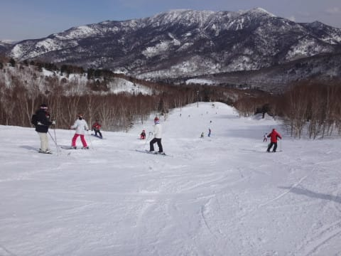

南斜面の焼額．

ごく一部ですが，ちょっと雪がしっとりしてきましたか…

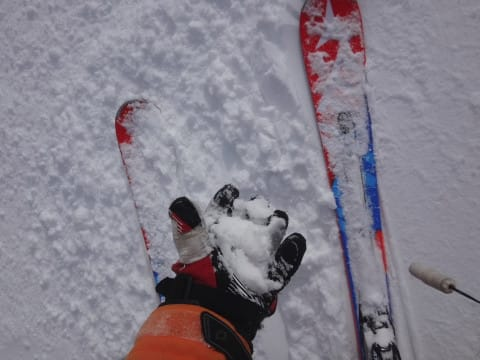

そして．

この日も，午後はちと奥志賀へ1時間ほど遠征…

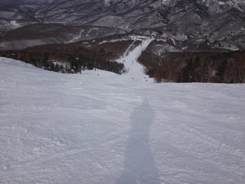

＃この日も[キレキレターン少女](https://www.youtube.com/watch?v=8gFiea95xRk)を探しに行ったのですが…

＃本人の滑りはリフト上から拝ませてもらいましたけど，お父さんを発見できず（涙）．

エキスパートは，ちょっとコブ＆固めバーンで

手ごわかったけど．

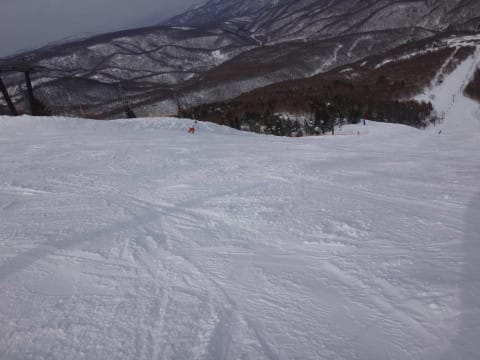

でも，南斜面の焼額より，雪は良かったかな？？

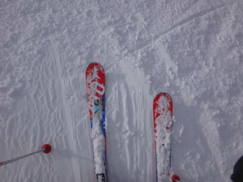

午後3時過ぎ，焼額に戻ってくると…

GSコースは，もう無人バーンと化してますね（笑）

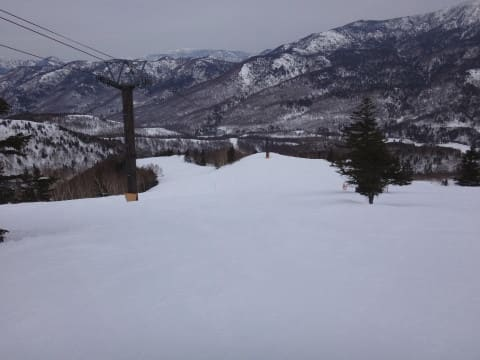

オリンピックコースの方は…

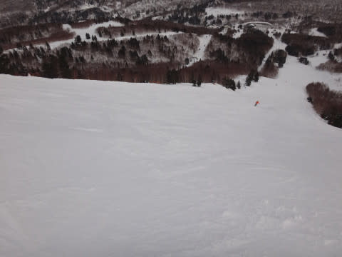

ザラッとした感じに固まった下地の上に，

雪が溜まったコブがまばらにできている感じ…

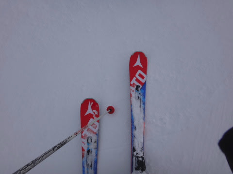

下地は，ちょいと固いよ！！

でも．

人が少なく，貸し切り状態だったので，

焼額も気持ちよく滑れたかな～．

ってことで．

この日もいつも通り，焼額のリフトストップ．

16:30までしっかり滑ったのでした～！

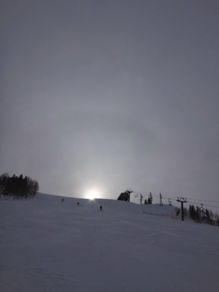

まぁ．

とりあえず．

この週末．

土日とも天気よく．

雪は午後にちょっと下地の固いのが出てはきたものの．

逆にゲレンデが固いおかげで，ひどいコブコブ化せず．

…今週も楽しめたかな～！！！

今週末も，多分土日とも冷えて晴れそうなので．

この週末とほぼ同じ感じで過ごせそう！

今シーズンの志賀高原，1月以降は結構恵まれてる感じ…

PS.

…しかし．

奥志賀へ行って思ったけど．

焼額は8:30営業開始のところが，奥志賀は8時からだし．

焼額は16:15ゴンドラ営業終了のところが，奥志賀は16:45まで

ゴンドラやってるし．

ゴンドラ営業時間，1時間も違うんだな～…

＃今後，奥志賀スタートにしようかと心が揺らぐところ

## 💬 コメント一覧

### 💬 コメント by (yama)
**タイトル**: 奥志賀高原
**投稿日**: 2017-03-08 06:33:56

日曜日は、日帰りだったので８時に奥志賀高原スタートでした。9時半からゴンドラが混んできたのでエキスパート、焼額、一の瀬と移動して20000メートル達成しました。今週末はS様が日帰りですね。車の運転気をつけてください。

### 💬 コメント by (Goku)
**タイトル**: 考え中
**投稿日**: 2017-03-08 19:22:48

最近は奥志賀も混み始めるのが早くなってきたので私も奥志賀スタートを考え中です。

朝一のエキスパも気持ちよさそうだし・・・

### 💬 コメント by (Skier_S)
**タイトル**: 死んでたのでコメント回答遅れました
**投稿日**: 2017-03-10 05:13:14

＞yamaさま

うはー．

今シーズン3回目の昼間20000m越えですね…

凄すぎます…

＞Gokuさま

やっぱり，奥志賀スタート考えますよね…

私の場合，交換用の板をどこに置いておくかが

大きな問題です…

板を換えに奥志賀まで戻るのもめんどくさいですし．

