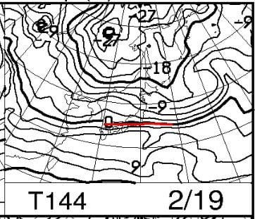
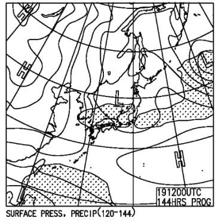

# 今日，2月14日の志賀高原は雪降り，積雪10～20cm．週末の志賀高原はまた気温が上がって，来週前半は冷えるよ！

📅 投稿日時: 2023-02-15 01:38:10

🏷️ カテゴリ: [日記](cc4b5682fb7b8b144980957a978653fb0.md)

えー．

今日もあまりゆっくり記事を更新している

時間がないので，手短に…←と言いながら，十分長い記事になってるよ…

で．

本日の志賀高原ですが．

特派員によると…

予想通り雪降りの一日だったみたいです！

あさイチの気温は-11℃と，思ったよりは

冷え込まなかったみたいですが．

それでもここ数日から考えれば，

十分な冷え込み！！

…ただ．

積雪はそこまで多くないだろう…という

残念な予想も当たったようで．

あさイチの積雪は予想通り10cm程度．

雪は軽かったので，オリンピックコースとかは

完全に底付きの10~15cmの新雪で，ブーツ～

脛パフだったみたいです…

昼間も結構降り続いたみたいなので．

昼間だけでも10cmほど積もった感じ

でしょうか…

そして．

この雪は，今もまだ降り続いているようで…

蓮池の気温，-14度近くとかなり冷えてます！

（[北信建設事務所道路気象状況カメラ](http://hokushin.pref-nagano-roadcamera.jp/)より）

この雪は明日，15日(水)まで降り続けます…

明日の朝までに，また冷え冷え雪が

10～15cmくらい積もってるかな．

そして，15日も終日冷え冷え雪降りの

一日です！

で．

16日，17日の木・金は…

晴れそうですね．

14，15日で積もった雪が圧雪されて，

冷え冷えで晴れの絶好のスキー日和に

なりそうです！！

うーん．

16日の朝は雲が残りそうだけど…

16，17日はねらい目！

で．

18日から…また気温が上がりそう(涙)

肝心な週末というのに…

まぁ，とはいえ．

土曜の18日は赤い0℃線は志賀よりわずか南．

日差しが強い南斜面がちょっと緩む

程度かな…

それよりヤバいのは，19日の日曜．

この日も0℃線は志賀に結構近く，

2月にしては北すぎます…（涙）

そして，この日は降水域がギリギリ

志賀にかかってるので…

もしかすると，この日はかなり湿った

重い雪が降るかも…？

で．

週末は気温が上がるのに．

その翌日，20，21日と冷えて．

また21日は，水色の-12℃線が志賀に

近づくという激冷えになります．

20～21日も，今日明日のような

冷え冷え雪降りになりそう…

うーん．

なぜ，週末を狙ったように高温になって，

週末を外して冷え冷えパウダーが

降るかなぁ…（涙）

まぁ，18日はまだ晴れそうだからいいけど…

とりあえず．

また週末の天気は明日詳細予想します！

## 💬 コメント一覧

### 💬 コメント by (レインボー75)
**タイトル**: Unknown
**投稿日**: 2023-02-15 16:36:29

水曜日の志賀高原情報

朝の湯田中は車に20cm新雪。上林-7℃　蓮池-12℃。昨日よりも重い雪が降り続く一日、すごい冷え込みだけど、慣れてきちゃった。

まずはスーパー。雪はたっぷりあるけど浮遊感を得られない。ただ降りただけって感じ。雪掻きで膝を傷めてから厳しいコースは避けているツケが。

頼みのGSサイドが朝圧雪されていて拍子抜け。雪が深々と降り続いてるので、GSもぼこぼこして疲れる。

こんな時はダイヤモンド。新雪食べ放題。距離が短いので老人向き。だんだんわかってきたところで、所用で終了。やっぱり太板は楽しいです。私のように腕がなくてもそれなりにですけど滑れちゃいますね。

### 💬 コメント by (Skier_S)
**タイトル**: ＞レインボー75さま
**投稿日**: 2023-02-16 02:37:31

意外と今日は積もったみたいですね～！！

でも，新雪はちょっと重かったみたいですね．

明日は晴れて最高のコンディションですよ！！

