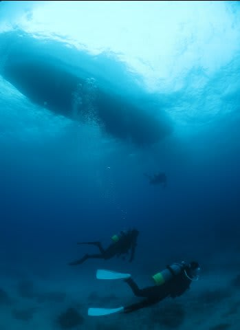

# 9月連休石垣島ダイビングレポート　その4

📅 投稿日時: 2011-10-19 00:30:52

そして．ダイビング最終日の3日目ですが．

…曇ってるよ．今日も．

天気悪いよ(涙）．

＃妻子を置いてきたのろい，という説もある

しかし．

曇ってはいるものの．

波は昨日より低くなったようなので．

今日は何とか，竹富島＆黒島方面へ出かけられそうです．

…3日とも，南エリアだったらどうしようと思ったけど．

とりあえず一安心．

ボートは曇った海を進んで，1本目のポイントへ向かいます．

1本目のポイントは「竹富ミドルブック」

砂地に，スカシテンジクダイ(ダイバーは「スカテン」と呼ぶ）と

ヨスジフエダイ子供の群れ，アザハタが数匹居ついている小さな

根がある，ゆっくり癒し系ポイント．

珊瑚の死骸を見ずに済む，砂地はいいですな．

砂地には，ヒバシヨウジや…

ヒメダテハゼ．

こいつも顔の周りがキラキラしてキレイですね…

ヤシャハゼもいたけど，写真撮りそびれた…

とりあえず，ハゼ撮り放題のハゼ天国．

で．ハゼ撮影タイムの後は，

スカテンがついている根へ．

根の周りを，アザハタがぐるぐる回ってます

ああー．

やっぱり，こういうのだよな．

こういうのが，癒されるダイビングだよな…

…欲を言うと．もっとごっちゃり魚がついてると写真栄えするんだけどなぁ…

しかし．

竹富＆黒島方面に出て来れて良かった…

と，満たされた感じでエグジット．

水面休憩後，午前の2本目です．

2本目は，黒島近辺へ移動して．

ポイントは，「黒島V字」

今度は，砂地ではなく地形ポイント．

うーむ．

さっきのポイント，砂地なんで気にならなかったけど．

今度は，かつてそこそこ珊瑚があったエリアのはず．

このエリアの珊瑚は無事なんだろうか…

エントリーすると…

うーむ．やはり，被害なしとは行かないか…

結構被害を受けているけど．

何とか一部，ハードコーラルも残ってますね…

島の南側エリアよりはましですな．

透明度もいいなぁ．30m以上は抜けてる！

そこらじゅうにいるクレナイニセスズメやら

ミヤケテグリ（セゾコテグリか？）

こいつは正面の顔がキュートですな．

そしてハナゴンベも正面から

で，これはオランウータンクラブ．

毛むくじゃらでオランウータンみたいです．

そのほかいろいろ見て…

2本目終了．

うーむ．

透明度が良かったから，天気さえ良くて日が射したら

良い感じだったかも…

とりあえず．

最終日の午前の2本は，昨日までとは違って，ちょっと心癒される感じの

ダイビングでした．
