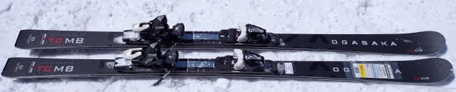

# 2024シーズンモデルのスキー板，試乗レポートその30…OGASAKA TC-MB + SR585

📅 投稿日時: 2023-07-21 01:30:08

🏷️ カテゴリ: [スキー板試乗](c0bd8048615710cee890e403a36cc9a2b.md)

ってなことで．

今日までに絶対に仕上げないと

いろんなところが爆発炎上して死ぬという

恐ろしい資料があったので，←どんな資料だ…

昨晩から今朝にかけて，徹夜で資料を

仕上げていたのですが…

ただ，あまりものご無体さに，途中で

「やってられるか～！！！」

と，現実逃避に走って，昨日のBlog記事を

書いていたので…

昨日の記事は，ある程度途中までは書いて

あったとはいうものの，徹夜中の現実逃避で

書き上げた，悲しい舞台裏がある記事でした…

なので，昨日の記事を読むと，ちょっと涙の

香りがします(嘘)

でも．途中で現実逃避したにもかかわらず，

今朝8時半には何とか仕上がって，

間に合ってよかった…←現実逃避してなければ，もう1-2時間早く仕上がって

明け方ちょっとだけ寝れたのでは？

ということで．

今日はすごい眠いので．

急ぎ記事を書き上げて寝ます…

1時過ぎという早い時間に寝られるなんて，

どれだけぶりか…

とりあえず．

今日の本題は，2024シーズンモデルの

スキー板の試乗レポート．

そろそろ終わりが近づいて，あとこの板を

含めて残り4種類ほどかな…？

今回はオガサカ編です．

では，どうぞ～！

〇OGASAKA TC-MB + SR585 167cm

基礎中回り

来年はTCシリーズの小回りモデルがSB，

中回りモデルがMB，大回りモデルがLBな

わけですが．

こいつは中回りモデルのMB．

今回試乗したのは，中回り用としては

短めの167㎝ですが…

R=15mと，ラディウスは大きめ．

一番強めのSRプレート，

中くらいのFMプレート，

プレートなし

の3種類で，一番強いSRプレート付きに

なります．

滑ってみると…

R=15mというラディウスもあり，SBよりは

確かに回転半径は大きめであるものの，

167㎝という長さもあり，この長さだと

ミドル～ショート目のターンを得意とする感じ．

ロングもしたいなら…

もう一つ長めの172㎝のチョイスをおススメ

します．

そして，この板を試乗した日は2日目の

日曜日．

日曜は，荒れ荒れの土曜と違って，

朝イチは強烈に冷え込んでしっかり締まった

かなり固めのフラットバーンだったせいか…

カツンとエッジがきいて，しっかりグリップして

板がたわんでミドル～ショート目のターンを

していくというよりも．

硬めの表面の上を，切り替えで山側の板に荷重して，

板を動かしながら谷回りを作っていく…

というパターンの板．

ものすごい基本に忠実な動作をして滑る

感じで，がっつり食いついて吹っ飛ばされる

リスクもなければ，返りもそんなに早くない

ので，比較的自分で動いて切り替えを

作っていけて，自らの動きを見せられる板．

硬い斜面ではキレキレで板が勝手に切れていく

というより，谷回りでしっかり圧をかけながら

板を動かしていってターンする…

という，板を動かしていく必要があります．

山回りでは切っていくこともできますが，

がっつりグリップして板が勝手にキーンと

切れていく，脳内麻薬系の板ではありません．

ズレと切れの出し入れの自由度がかなり

高い感じの，リスクが低く，動かしやすい板．

ズレといっても，グリップが抜けてずれていく

のではなく，足場の圧を受けながら旋回性を

受けていくズレなので，ズレのコントロール

性は極めて高いです．

かなり硬い斜面だったからか，たわみ量で弧を

制御していくというより，ズレ量と迎え角で

弧を作っていく板に感じました…

雪質がもう少し柔らかければもう少し

違う評価になったのかもしれませんが，

この板は脳内麻薬が出るまま気持ちよく

キレキレターンをしていくというより，

指導者が正しい板の動きを見せたり

演じたりするのに向く板かな～…

と，感じました．

うーん．

この日は雪が硬すぎたかな？

私はもう少しキレキレの板が好きなので，

ちょっと評価が低めになっちゃってるかも…
