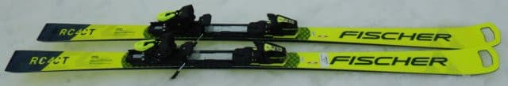
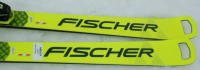
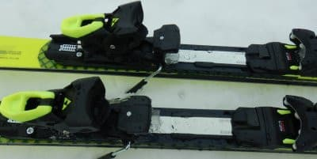
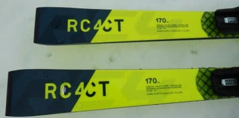

# 2022シーズンモデルのスキー板，試乗レポートその6…FISCHER RC4 Worldcup CT

📅 投稿日時: 2021-06-06 02:03:43

えー．

私は今シーズン，これからもまだ月山へ

滑りに行く予定なので．

このBlog…

…というより，私自身が，

まだ夏モードに入っておらず，

冬モードのままなんですが…

6月に入り，特派員情報も無くなって

きたので．

私の生命維持に必要な睡眠時間確保のため．

このBlog，夏モードと同じく，

土日のどちらかは更新は休みとさせてください…

いや．ホントにちょっと最近，ご無体が

いろいろヤバいので…（涙）

ここしばらく，ずっと在宅勤務なのに，

食事の時間がとれずに，カロリーメイト

かじるとか，食事抜くとか，そういう

レベルです（泣）

在宅勤務の最初のころの，

「毎晩夕食が家の食卓で食べられるとは…！」

という喜びは，今でははるか遠い過去の

思い出ですね…（遠い過去を見る目）

先週の平日5日とも在宅だったのに，食卓で夕食食べれたのは0回(泣）

おかげで．

[スキーダイエット](edd0452732278bcfc87b9419cd5bf3f1e.md)ならぬ，

仕事ダイエット

が絶賛進行中！

ダイエット法に悩んでいる皆さん，

ぜひ一度，お仕事ダイエットにチャレンジして

みてくださいね♡←いや，♡とか書いてる場合じゃないから．ヘタすると命縮めるから…！！

ってなところで．

本題へ．

今日もスキー試乗レポート．

3日連続のフィッシャー編．

フィッシャーはこれでとりあえず一区切り

かな…

では，どうぞ～！！

○FISCHER RC4 Worldcup CT　170cm

基礎オールラウンド

この板も，2022シーズンモデルは2021シーズンと

ほぼ一緒の仕様のようです…

ただ，この試乗板はトップ部分の穴が開いたまま

ですが，2022シーズンモデルのCTは，SCや

RCと同様に，トップの穴が透明プラスチック

プレートで埋められるようです…

滑ってみたところ…

厚いメタルが入った，どっしりと重い感じが

します．

固い金属ばねを履いたような，張りの強さを

感じます．

芯材が硬くて突っ張っているというより，

硬めのばねのような強い張り．

硬いバネ感があるので，スピードを出して

板に強い圧が溜まっていくと，硬いバネを

ググッと曲げて解放した時のように，

切り替えに向かって強い反動が

やってきます．

しっとりした返りではなく，ビョン！

という感じの，強い早い返りが来ます．

この早い返りを上手く使って，

切り替えで圧をテールに抜いて行ってやると，

R=15 というよりは小さく感じるターンが

できます．

かなりテールの張りが強く，

そしてグリップもガッツリと強く，

ずれをみじんも感じさせない板です．

ずらしの操作性はそんなに高くなく，

ずらして滑ろうとはあまり思わない

板です．

強いグリップに任せてひたすらカービング

していく板です．

ただ，そこでスピードが上がっていくと…

強い圧の溜まりと，強い解放がビュンビュン

やってくる，かなり激しい感じの板ですね…．

Rも小さめで，返りも早いので．

ロングターンでクルーズするというより，

スピードを出すと，ミドルっぽい深回りに

なっていきます．

グリップも強く，板が動かしにくいし．

170cmの長さだと，ショートの板よりは

Rも大きめなので，急斜面を滑るには

ちょっと手ごわいな，と思いましたが…

うん．

私レベルだと，この板でコブに入るのも

ちょっと無理かな．

…でも，フラットな中斜面は，鬼のような

グリップと吹っ飛ぶような早い返りで，

かなりアグレッシブな滑りができる

板です！

…ただ，板のイメージから得られる

ロング板っぽい特性ではなく．

比較的Rが小さめで，返りも早いので，

ミドルからショート寄りに板が動きます．

…この板の特性が活かせるほどのスピードが

出せず，たまった圧の返りがもらえるほどに

たわみを出せなかった場合は，縦目に

落ちていくように感じるかもしれませんが…

ってなことで．

どこでも行けて，気楽に履けるオール

ラウンドという板ではなく，かなり滑り手に

求める体力＆スピードは高めですが．

ピシッと整地された中斜面を，

ガッツリカービングさせて．

かなりのハイスピードでアグレッシブに

ミドルターンすると，ビンビン回っていく

楽しい板です．

## 💬 コメント一覧

### 💬 コメント by (ikkun)
**タイトル**: Unknown
**投稿日**: 2021-06-06 16:27:43

デモのカテゴリーがなかった頃(ｼﾞｼﾞｲですね(・・;)) GSに乗っていました？ 覚えているのは紅色のフォルクルのGSでした……あの頃K2の黒ベースの跳んだり跳ねたりするmodelが出始め今はなきｽｷｰﾔｰさんから そのK2を懸賞でいただくというラッキーもあり そのフォルクルの印象は残らなかったと言うお粗末です(笑)   「SLは無理だよ」と云われた記憶が頭の奥底にありました   今のスキーは性能いいですね

### 💬 コメント by (Skier_S)
**タイトル**: ＞ikkunさま
**投稿日**: 2021-06-07 02:20:00

デモのカテゴリーが無かった時代ですか…

私が本格的にスキーを始めた時は，すでにデモモデルが

あったので，そんな時代があったのかと驚きですが．

この板は，かなり競技用SL板に近いグリップと張りの強さです．

結構手ごわい板です．

むしろ，今のVOLKL Racetiger SL（WorldCupじゃないほう）

のほうが優しいかも…

