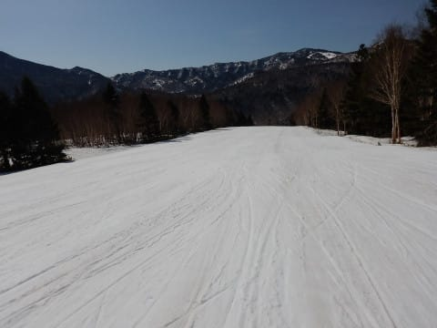
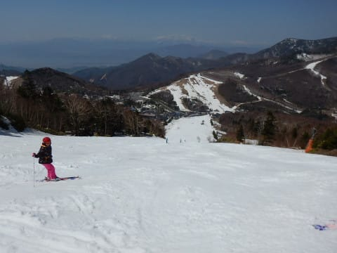
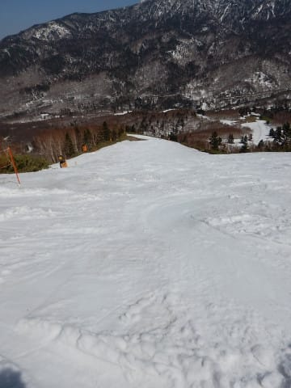

# 4月21日（土）の志賀高原は…晴天なれど，超高温，夏か？？って一日

📅 投稿日時: 2018-04-22 00:28:38

🏷️ カテゴリ: [2018スキー滑走日記](c11b88dc181f34079ab41db74a3587646.md)

ってなわけで．

本日の志賀高原．

すげー暑かったです（涙）

志賀高原のスキーシーズン史上最高気温だったかも…

とりあえず．

今日は草津越えで志賀入りしましたが．

…雪の壁，例年より低いね…（涙）

そして．

通常営業開始の朝8時半に，

焼額ゴンドラに乗ると…

雪，減りましたね（泣）．

で．

朝8時半の山頂の気温は…

なんだ，こりゃーーーっ！！！

やっぱり予想通り．志賀高原未体験ゾーンの

朝イチ10℃越え…（激涙）

こんな当たらなくていい予想は当たるんだなぁ…

本日滑れるのは，

・パノラマOrビギナーズ→サウス

・GSコース

の2本．

先週滑れた第2高速沿いの唐松コースは

終わってしまい．

第2高速は営業終了．

本日動いてるのは1ゴンと4ロマのみになります．

で．

朝イチから山頂はすっきり晴天で．

雪も朝イチから緩み気味…

でも，早朝は結構締まっていたらしく．

壊滅的ドボドボじゃなかったのが救いかな…

とりあえず，GSコースを滑ってみると…

うむ？？？

うむむむむ？

かなり残念なことに，コース真ん中に穴が

あき始めてますね…（涙）

コースが行きどまって右に曲がる部分．

ここもコース幅がかなり狭くなってます…

うーむ．

この一週間で，かなり雪が消えちゃったなぁ…（泣）．

ヤバい部分以外は，まだ幅いっぱい雪があるんですが．

GSコースのヤバい部分，ぎりぎりもってGW前半．

後半は絶対無理な感じ…（涙）

でも．

パノラマ-サウスコースは．

早朝はオープンしておらず．

さらに滑る人も少なく，

9時の段階ではまだシマシマ！

朝の締まっていた雪がクリーミーに

なり始めた程度で．

ガラガラで，これは結構いいよ！！

ってな感じで．

GSコースに多少土が出てきているものの．

コース自体は人も少なくフラットな焼額．

午前中は結構良かったなぁ…

しかし，日差しが強かった本日．

さすがに11時ごろには，結構雪の滑りが

悪くなってきました…（涙）

だもんで．

ちょいと一の瀬ものぞいてみましたが…

正面バーン，12時ごろにはもうかなり荒れてました（涙）

ところどころブッシュや…

雪の薄いところもあり．

一見真っ白でよさそうだけど．

あと1週間後には，かなりやばい状況に

なりそうなバーン状況…（涙）．

だもんで．

午後2時ごろ，人が滑ってなくて

荒れてない焼額に復活！

焼額は，ホントに人が滑ってません．

超ガラガラです．

ゴーストタウンです．

週末でこれでいいのか？？

だもんで．

多少雪は汚れてますが．

雪の滑りは多少悪くなってますが．

でも，夕方までそれほどひどく荒れず，

結構滑りいい状況でしたね～！！

ホントに人が写ってない…

でも．

午後の気温は，

なんということか…＋20℃っ！！！！！

これは…

これは，私が志賀で体験した，最高気温かも？？？（激涙）

この高温のおかげで．

午後3時を過ぎると，さすがに荒れてきたけど…

でも，人がいないので，まだ壊滅的

凸凹にならず．

かなりやわらかい雪質でこの程度の荒れ具合

だったので．

まあマシな方だったかな…

ってなわけで．

本日も日が傾くラストゴンドラまで

滑り続けたのでした…

しかし．

今日は暑かった．

ホントに暑かった．

半そでTシャツで十分なくらい．

7月の月山か？？？

ってくらい暑かったです．

うーん．

GSコースは来週はヤバそう．

滑れたとしても，コース幅はかなり

狭い感じか…

まぁ，パノラマ～サウスはGW前半までは行けるでしょう．

一の瀬ファミリーは，正面バーン上部は

GW前半もぎりぎりヤバそう．

GW前半3連休以降まではもたないでしょう…

うーむ．

GW前半は何とか滑れそうだけど．

後半はすごいことになりそうな予感…

明日も厚くなりそうなんだよなぁ…（涙）

## 💬 コメント一覧

### 💬 コメント by (ほっぽ)
**タイトル**: 一の瀬
**投稿日**: 2018-04-22 00:57:00

Ｓさん

今日は試乗会でバッタリお会いできました。

今日はいらっしゃらないかと思っていました。

私も試乗会は１２時で切り上げて高天ヶ原へ移動しましたが、１５時半に戻ってきたら、ファミリー上部は凄いことになっていました。

あれだと、ＧＷ前半も厳しい感じに見えてしまいました。

私も明日は試乗会は止めて、朝一からヤケビ＆奥志賀で過ごそうと思います。

### 💬 コメント by (Seeker.NT)
**タイトル**: ラスト？
**投稿日**: 2018-04-22 07:52:17

金曜から４日間の予定が、やんどころなき事由が発生し金土の２日間に短縮。

相変わらず奥志賀メインですが、金曜は人も少なく、それほど気温も上がらなかったので、リフトストップまでかなり良い状態をキープしてました。うん、板に張り付く感じもなかったです。

ところが、土曜は巷で予測されていた通りの暑さで、雪もザブザブに近い状態ですが、ブーツが埋まるほどではなかったです。

ちなみに、奥志賀のアーリーバードという早朝スキーは先週で終了していたのですが、本日なんと７時にはリフトを動かしてくれました！

それも通常のリフト券で乗車できました！

(もっと早い時間から営業していたのかは聞いていませんが・・・)

おかげさまで、かなり長時間連続で堪能でき、結局リフトストップまで滑る事ができました。

なんか、私自身、今シーズンラストになるかも知れなかったので、いつになく執着して滑り倒しました。

＊金曜未明に関越のトラック多重事故で本庄児玉～藤岡JCTが通行止めで迂回させられましたし、土曜の夜は嵐山小川IC～東松山IC間で４台の多重事故の影響で、すんなり帰宅できる予想に反して結構時間がかかりました。移動はトホホの状態でした。

### 💬 コメント by (筋 肥大)
**タイトル**: Unknown
**投稿日**: 2018-04-22 07:58:08

Skier_S様

おはようございます。

今朝、志賀高原ルートが草津～万座温泉入り口までの間、火山活動活発の為通行上となりました。

私も知らずに規制解除の時間に合わせて向かったところ、殺生にて引き返すという(涙)事になってしまいました。

尚、万座スキー場からは志賀へ行けるようです。そんなわけで今週は焼額は断念です。

### 💬 コメント by (いさ)
**タイトル**: 暑い！
**投稿日**: 2018-04-22 23:59:29

S様

土曜はありがたいお札を授与いただき、ありがとうございました。お礼もそこそこで申し訳ありませんでしたが、今後私もこの倶楽部の布教活動のお手伝いができたらと（笑）。まずは冷え冷え踊り覚えることがらでしょうか？

しかし、今週暑かった。この時期滑るのは久しぶりだったのですが、こんなに暑かったっけ？？？その割に、朝のヤケビは超気持ちよく滑れました。GWまでもってほしいところですね。

### 💬 コメント by (Skier_S)
**タイトル**: 今日も帰宅が遅くて眠い…
**投稿日**: 2018-04-23 01:53:55

＞ほっぽさま

試乗会に参加しているとは思わず…

意外なところでお会いしましたね(笑)．

あの試乗会は，知っている人に次々声をかけられ，

「あ，みんな来ているのね」って感じでした．

なにかお気に入りの板は見つかりましたでしょうか？

＞Seeker．NTさま

あら…

日程短縮になっちゃったんですか．

残念でしたね…

GWも，奥志賀は雪がもつのではないでしょうか？

これでシーズン終了と言わずとも，

まだまだ滑れますよ！(笑)

＞筋 肥大さま

私も，今日の午前に情報を得て

通行止めになったのを知り，ちょっと

びっくりしました…

突然の通行止め，ちょっと残念な感じ

でしたね…

今週は焼額でお会いできず残念です．

まだGWもありますので，ぜひお会いしましょう！

＞いささま

金のお札，やっとお渡しできて一安心です．

ぜひ目立つところに貼ってください(笑)．

また，今後の布教活動（？）もよろしくお願いします．

しかし，この2日間の気温は異常でした．

平年比+10℃くらいの，異常高温でした．

普段はこの時期こんなに暑くないですよ…(;_；)

これから冷え冷え踊りをおどっていただければ，

GWもいいコンディションになるかと…

ぜひ踊り続けてください(笑)．

そして，またGWにお会いしましょう！

