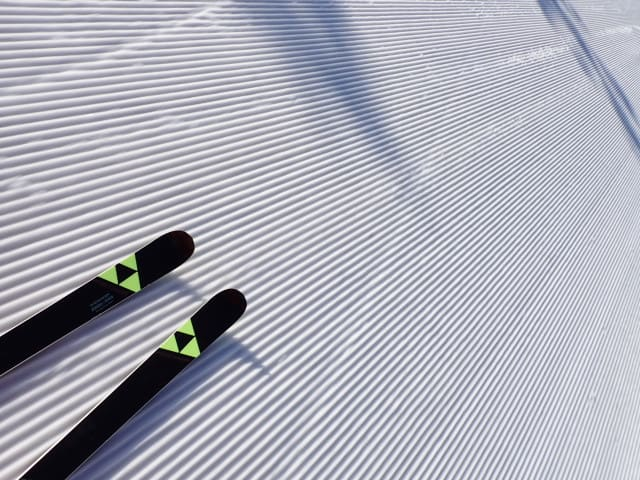

# 2025/4/30(水)，GWの谷間の志賀高原スキー場は…終日晴れだけどかなりの冷え込み！朝は最高，午後は荒れたけど板は滑ったよ！

📅 投稿日時: 2025-04-30 21:36:08

🏷️ カテゴリ: [2025スキー滑走日記](cacd3fbf84d4a679ee61a5894c3f95e14.md)

ということで．

GWの谷間の平日ですが…

かなり強引に休みを取って．

休みということにして，志賀高原で

滑ってました～！

…ホントに今日休んでて大丈夫だったのか，

今から職場のメールを開くのが怖い…

とりあえず，職場のメールを開く前に，

今日の志賀高原レポートです！！

まず．

朝，いつもの早朝6時に間に合うように志賀高原を

登ってきますが…

登ってくる途中ですでに気温はマイナス！！

今日のゲレンデは，かなり冷え込んでそう！！

…でも，路面凍結などはなく，普通タイヤで

十分上がってこれる路面状況で．

…そして，朝6時前の焼額第1ゴンドラ前は…

平日なので，待っている人はそんなに多くなく．

20人強くらいの人数かな？？

で．

朝イチのゴンドラで山頂に上がると…

山頂の気温は-4℃！！

この時期としては，十分な冷え込みですよ！

天気は朝からもう最高の気持ちいい晴天！！

…正直言えば，冷えてくれたので日が

射さないでいてくれたら，雪が緩まないので

晴れないほうがいいんだけど…

でも，

晴れの放射冷却でいい感じに冷え込んだので．

朝イチはいい感じに締まったシマシマ！

しっかり冷えて固まってるけど，

ザラメが固まった感じで，表面がざらざら

しているので，しっかりエッジが引っかかって

くれる，スピードに乗せてがっつりカービング

できるシアワセバーンだぁ！！！

硬いバーンが嫌いな人はだめかもしれないけど…

ザブザブ雪に比べれば，フラットでスピードが

乗る，晴天最高シマシマバーンを思う存分

堪能できる，この早朝のシアワセさときたら…

…見よ！！このバーンを…！！

良かった．

早朝から滑れてよかった…

志賀の全山シーズン券を持っているのに，

焼額セカンドシーズン券を買った甲斐が

あろうというもの…

で．

今日は晴天なのに気温がかなり低めだったので…

朝7時半を過ぎても，バーンはまだ十分

締まってるし．

むしろ表面がちょっと緩んで，エッジがさらに

噛むようになってくれたので．8時を過ぎた

くらいが，普通の人は一番滑りやすかった

のかも…

しかし…今日は晴れてるのに，かなり気温が

低めだったので．

朝8時の通常営業開始時間でも，バーンは十分

締まってたし…

それでいてGWの谷間の平日で人は少なく．

通常営業開始時間になっても，

すごいガラガラなんですが…！？？

この時期の晴天で8時を過ぎて，こんな

いいバーンを貸し切りで滑れるとは…！！

GSコースの迂回コースの緩斜面は，

朝8時を過ぎてもまだシマシマが残って

ました…

しかしさすが，明日からもう5月になる，

4月の最終日．

いくら気温が低めとはいえ，強い日差しが

降り注ぐ晴天のため，9時ごろにはそろそろ

雪が緩み始め…

日差しが強いバーンは，9時半ごろにはかなり

しっとりした感じになってきましたが．

それでもまだ10時ごろまでは下地まで

ザブザブになってない感じで．

妖怪板つかみが出てくる気配もないし，

10時までは大回り板で滑れましたよ～！！

そして．

10時になると，朝6時からの4時間券が

切れるため．

ただでさえ少なかったゴンドラ待ちは

影も形もなくなり，ほぼ毎回飛び乗りに

なってくるくらいのガラガラ具合だったので．

10時には雪が結構緩んだけど，

人が滑らないのでなかなか荒れてきません

よ…！！

11時になっても，雪の荒れはせいぜい

この程度．

バーン全面，緩斜面も雪の滑りが悪い

ところは全くなく，板が良く滑るいい雪

ですね…！！

12時になっても，気温はせいぜい+3℃

程度までしか上がらず，晴れているのに風は

肌寒いくらいだったので．

雪は荒れ始めてはいるものの，12時でも

せいぜい荒れはこの程度．

12時半ごろに，やっとバーンがかなり

荒れた感じになり，緩斜面の板の滑りが

悪くなってくる感じで…

午前中いっぱいは，普通のGWに比べれば

かなり恵まれた感じでした…！！

…さすが，午後2時ごろには気温がさらに

上がって，バーンも全面かなりのボコボコに

なってきたし…

雪も汚れが浮いてきて，緩斜面の滑りは

悪くなってきたけど．

…それでも気温自体が低いので，

日陰部分は雪が硬くなって板が走る

感じ！！

ってな感じで．

午後のボコボコバーンになってから，

さらにゲレンデを滑る人は少なく

なってきたけど…

私としては，まだこのくらいなら全然

大回り可能で楽しめるレベル！！←一般的にはかなり厳しいと思う

さらに，今日もパノラマコースの公認

コブは残されていて…

このコブライン，ベビードラゴンって名前

なのか…

でも，なぜ小籠包？？？

午後になると，このコブは誰も滑って

なくて．

貸し切りで好きなだけコブを滑れますよ～！！

…いや…

しかし，GW谷間ってこともあり．

ホントに誰も滑ってないな…

ということで．

さすが気温が冷えていた本日も，

終日晴天で強い日差しが降り注いだため，

ラストの15時半にはかなりのボコボコバーン

だったけど…

それでも緩斜面の一部を除いて，かなり

板が走るいい雪だったので．

この時期としてはかなり恵まれた

いい一日を，いつも通り営業終了まで

滑り続けてきたのでした…

いやーー．

今日は晴天なのに冷えて雪が滑って，

9～10時ごろまで締まり気味のバーンを

楽しめて．

その後は雪は緩んだけど，昼頃までは

そこまで荒れないバーンを滑れた，

いい一日でした…！！！

…ただ，明日も晴れそうだけど…

明日は朝から気温が高そう．

そして，明後日の5月2日は，朝はいいけど

昼頃からかなりの雨が降りそうな予感…

2日の雨はかなり本格的な雨なので．

4日以降の4連休，バーン状況が悪化

しなければいいんだけど…

とりあえず．

明日も志賀高原で滑ってます～！！

## 💬 コメント一覧

### 💬 コメント by (副院長)
**タイトル**: Unknown
**投稿日**: 2025-05-01 08:57:35

夏タイヤでも上がれる、夏タイヤでも上がれる！板がよく走る！。ダメダメ、雪が多いと行きたくなるのですが、もう車にはゴルフバックとチャリ載せセット完了。しまなみの宿も取ったし。白い雪と、白いゲレンデと、青い空と、目の毒です。ブログは見ないでおこうと思いながら、毎朝見てしまいます。重たい雪でお怪我の無いように！

### 💬 コメント by (アツシ)
**タイトル**: Unknown
**投稿日**: 2025-05-01 17:26:12

GW後半、5/3〜6の天気はどうなりますか？

### 💬 コメント by (Skier_S)
**タイトル**: Unknown
**投稿日**: 2025-05-01 21:46:34

〉副院長さま

今年のGWは雪もいっぱいあっていいですよ〜！

早朝は最高！！

まだまだ滑れますよ！（悪魔の誘い）

〉アツシさま

GW天気予想、記事に書きました〜！！

