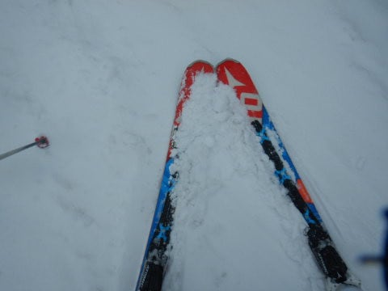
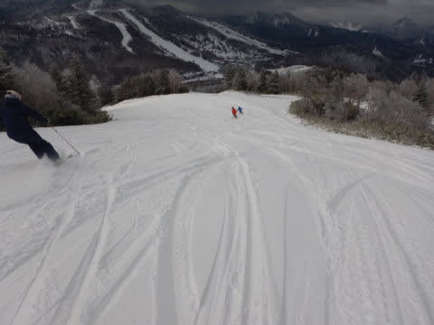
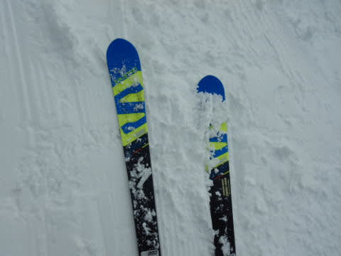
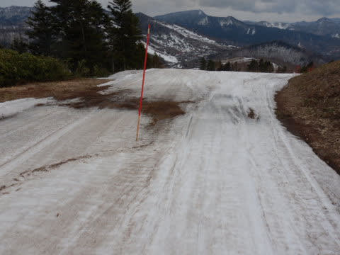
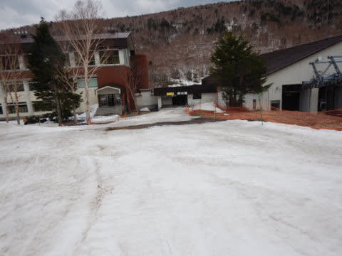

# このGWを振り返って…そして2021/5/7(金)の志賀高原熊の湯スキー場特派員情報！

📅 投稿日時: 2021-05-08 03:39:55

えー．

本日も，志賀高原特派員から，

熊の湯スキー場の状況が送られてきました！

（熊の顔におこみんが…)

本日は曇り空ながら，気温は高かったようで…

結構なザブザブ雪だったようですが．

昨日の高温で，一気に雪が減ってます…！！

営業してない第1ペア沿いに雪が無いのは

まぁ仕方ないとして．

第3緩斜面，もうダメっぽい感じですね(涙)

でも，人工雪をつけてある第2緩斜面は

まだまだ行けそう！

ちなみに，午前中でゲレンデには10人

ほどしかいなかったようです…

バーンはほぼ貸切ですね！

うーん．

これならあと1週間ちょい，16日まで

もってくれるかな…

という特派員レポートのあとは，

本題へ．

えー．

これまでレポートしてきたように，このGWは

6泊7日で志賀高原に滞在していたわけですが．

実はこれ，

私の志賀高原連続滞在日数の最長記録

だったりします…

いや，かつて．

GWの10日中9日滑った

とかいう記録はあるものの．

それは途中で1回帰宅していて，

7日間連続滞在は最長記録なんですね…

そして．

この7日間．

初日の夕方にブーツの当たり出しに行くため

営業終了1時間半前の14時に切り上げた以外，

雨が降ろうが吹雪こうが，

通常営業開始から終了まで滑り続けており．

うち3日間は早朝も滑っていたんわけで…

この7日間，全てを焼額で滑り続け．

焼額以外では全く滑らなかったという．

…この焼額への忠誠心の高さ！！

我ながら素晴らしい…！！←そこ，感動するところじゃなくて，あきれるところだよ…

でも，この7日間で，

第2ゴンドラ乗車回数，140回

第4ロマンス乗車回数，55回

しか滑ってない…

うーん．

一の瀬ファミリーを一日70本近く

滑ってしまう人もいると考えると．

7日間での滑走本数，意外と少ない…

まぁ，お客さんが少なくて，強風の時も多くて

ゴンドラの運転速度が遅かったのと．

雪が滑らない時は，1本滑る時間がかなり

かかったからかな．

まぁ，しかし．

この7日間の通常営業時間の間で

4月29日の夕方1時間半と，

5月4日午後に1時間ちょい昼休みを

とった，2時間半以外．

ずっと焼額を滑り続けていたのを．

焼額愛と言わず，なんと言おうか…←バカって言うんじゃないの？（極めて正当なツッコミ）

ってな感じの，焼額愛にあふれる

GWだったわけですが．

初日と最終日は雨にたたられたものの…

5月1日は朝にうっすら積雪

5月2日はまさかの吹雪

そして午後はゲレンデに新雪が積もり…

5月3日の朝は積雪5~10cm！！

終日雪がぱらつく激冷えで，夕方まで

5月としては最高のコンディション！！

おかげで，29日の雨の日には，

「GW最終日まで無理だよね…」

と思わせたゲレンデだったのに．

(初日4月29日)

１，２，3日の奇跡の冷え込みと

スタッフのコース整備の尽力で，

GW最終日までコースいっぱい雪がある，

いいコンディションで滑ることが

できました～！！

(最終5月5日)

雪がたっぷりあって全面滑れても，

毎日ストップ雪で楽しくないGWも

あったことを考えれば．

…振り返ってみると，今年のGWは

かなり良かったんじゃないかな～！！

…とりあえず．

これで今シーズンの焼額も営業が

終わってしまいましたが．

来シーズンもGW最後まで楽しめる

いいシーズンになるといいな…

と強く願う，Skier_Sなのでした…

## 💬 コメント一覧

### 💬 コメント by (ikkun)
**タイトル**: Unknown
**投稿日**: 2021-05-08 14:05:02

改めてお疲れ様でした  ………えーだけしかって？(笑)   しかし焼額山だけでと考えたらすごいですゃん( *´艸｀)  遡れたら分かる？のでしょうが……全国各地から集まる志賀高原でなぜ 焼額山だったのか？知りたいなあ😅  ちなみに私しは地元にゲレンデがある事から始まっている？って…ラベル?レベルが違いますね🎵最初から(笑)

### 💬 コメント by (しんちゃん)
**タイトル**: 来シーズンも･･･
**投稿日**: 2021-05-09 00:12:19

ヤケビシーズン終了お疲れさまでした。

ＧＷは前半勝負と思って、4/25～27までヤケビにいましたが、後半5/1～3にゲレンデ真っ白という、劇的な冷え冷えドラマが待っていましたね。Ｓ様の執念かと思ってしまいました(笑)

来シーズンもＧＷまで滑れるようになるといいなと願っています。

シーズンオフは、ニューモデル板の試乗記・車の試乗記を楽しみにしています。

### 💬 コメント by (Skier_S)
**タイトル**: コメント遅くなった…
**投稿日**: 2021-05-09 12:19:40

＞ikkunさま

なぜ志賀高原か．それも焼額か．

昔，志賀高原にシーズン券が無かった時代．

北海道から関西まで，全国130カ所を超えるスキー場を

巡り続けてましたが．

規模，雪質を考えると，やはり志賀高原が一番だなぁ，と．

そして，ロングコースが好きなのでだんだん焼額一択になってきました．

というか．焼額オープン2年目に初めて行って，ガラガラだったし

当時としては珍しいロングコース主体のスキー場で，それ以来焼額がお気に入りです．

＞しんちゃんさま

25，26日も悪くなかったですが…

やっぱり5月3日が，ヘタすると3月よりいいのでは？？

というコンディションで良かったです…

来シーズンもGWラストまで雪がもってほしいですね！

### 💬 コメント by (ikkun)
**タイトル**: Unknown
**投稿日**: 2021-05-09 20:33:38

130？ なんとまあ(・・;) そりゃすごい……確かにlongはいいですよね        お答えありがとうございました❗m(__)m

### 💬 コメント by (Skier_S)
**タイトル**: ＞ikkunさま
**投稿日**: 2021-05-10 00:29:53

有名スキー場は大体行きつくした感じがあります…

お気に入りは，ニセコひらふ・富良野（ロープウェーじゃなくて，富良野ゴンドラがあったころ)・

安比・志賀焼額でしょうか…

やっぱりロングコースのスキー場ばかりですね(笑)

### 💬 コメント by (ikkun)
**タイトル**: Unknown
**投稿日**: 2021-05-10 20:39:04

あーニセコは

新潟から飛行機でツアー参加しかけまして

怪我をしてcancel料金払い

止めた痛い記憶があります(泣)

### 💬 コメント by (Skier_S)
**タイトル**: ＞ikkunさま
**投稿日**: 2021-05-11 00:36:00

それは寂しい思い出ですね…

