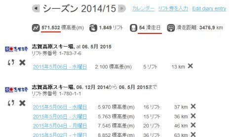
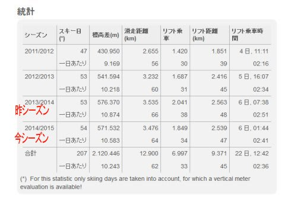
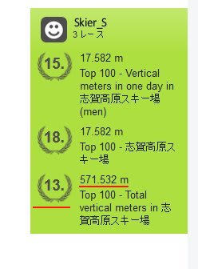
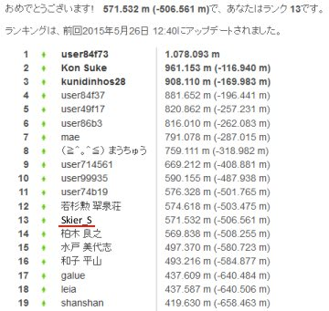
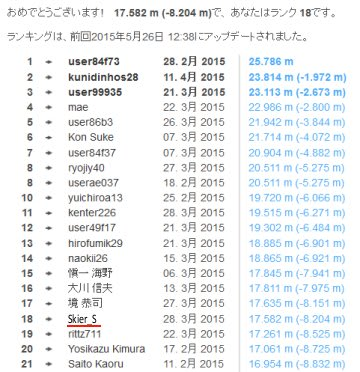
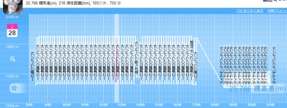
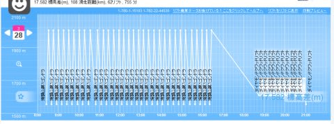

# 2015シーズン，志賀高原でどれだけ滑ったのかな…Skilineのデータを見てみた

📅 投稿日時: 2015-05-28 00:53:57

ということで．

スキーシーズンはまだ終わってませんが．

そうです．

まだスキーシーズンは終わってませんけれども．

…残念ながら，もう，志賀高原の今シーズンの営業が

終わってしまったので（涙）．

今シーズン，志賀高原でどれくらい滑ったのか．

Skilineの結果でも，振り返ってみましょうか…

ってことで．

今シーズンのデータを見てみると，だ．

…ふーーーむ．

滑走日数は54日とな…

志賀高原だけで，54日滑りましたか．

一年の1/7以上，約2か月弱，志賀高原で過ごしたことになるわけですね．

で．滑走標高差は571,532mですか…

57万m…つまり，570kmですね．

570kmというと．

まぁ，東京-岡山くらいの距離を縦にして．

それを滑り降りたようなもんですか…

1シーズンかけてそれだけって．

多いのか，少ないのか？？

これを昨シーズンと比べてみると，だ．

うーむ．

昨シーズンは，滑走日数53日で576,370m…

今シーズンは滑走日数が一日多いというのに，

滑走標高差は，昨シーズンから，約5000m減ってしまっているなぁ．

減った原因は，分かってるんですけどね．

今シーズンは焼額第1ゴンドラがトップスピード運転してくれなかった．

…これに尽きます（悲）．

経費削減なのか，最高速度毎秒6mの第1ゴンドラ．

シーズン中ずっと，よっぽど混雑した時をのぞいて，

毎秒5mでしか運転してくれなかったのが，

痛い…（残念）．

＃せめてトップシーズンくらいは，焼額第1ゴンドラのトップスピード運転を切に願う…

そして．

今シーズンの滑走距離は3476kmですか…

これも，昨シーズンとほぼ同じ．

大体，稚内から与那国島まで．

あるいは，成田からパラオくらいまでの距離を，

1シーズンで滑りきっているわけで．

…これは．

やっぱり，あれですね．

1シーズンで板が激しくマイルド化するのは仕方がないですね．

で．

今シーズンのトータル滑走標高差のランキングですけど．

去年の6位から，かなり落として…

なんと．

なんと！

13位！（ちょっとショック）

去年と滑走標高差がそんなに変わってないのに…

一気に順位を落としましたね～．

上位ランカーの滑走標高差をみてみると…

トップは100万m越え？？？？？

私の倍近く滑ってるの？？

そして，6位までが80万m以上？？？

ヒトケタ順位は，70万mクラス…

47万mで10位に入れた去年に比べて，

一気にレベルが上がってるんですが…？？

こーゆーランキングに命を懸けている人が

集まってきたのかな…？

とりあえず．

私の57万m程度の滑走標高差は，

平凡な記録…ということですね．

うむ．

世の中，おかしな人すごい人もいっぱいいるんだなぁ…

さらに，その思いを強くしたのが．

こちらの，一日滑走標高差ランキング．

…自分が18位，ってのはいい．

今更驚かない．

しかし，トップの2万5000m以上って…

人間，一日でこんなに滑れるのか！？？？

この人は一体，どんな感じで滑ってるんだ？？

と，この最高記録のSkilineのログを眺めてみると…

うむ．

この人．

昼休みどころか，トイレすら行ってませんね（笑）．

そして，さらにナイターまで…

…これは，間違いない．

スキー用に改造された，サイボーグに違いありません．

ちなみに，私の最高記録のログは，こんな感じで…

これでも，焼額第1ゴンドラを使った場合の限界まで攻めてると思う…

＃食事は抜いたけど，10時半過ぎくらいにトイレに行っているところに

＃まだ人間らしさがある（笑）．

とりあえず．

今回．

今シーズンのSkilineを振り返ってみて．

自分はこのくらい滑ったんだなぁ…という思いより．

志賀高原には，

スキーのために改造されたサイボーグがいっぱい滑っている

…という事実を，改めて痛感したSkier_Sなのでした…
