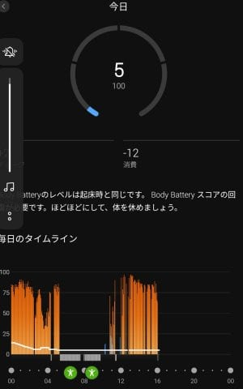

# 新しいスマートウォッチ，Garmin Fenix7Xを買ったよ！その8…スマホアプリ，Garmin Connectを使ってみる：その2

📅 投稿日時: 2022-08-24 00:32:04

🏷️ カテゴリ: [PC,カメラ&小物](c0d8caed13e597efe97b661a8ae56bed0.md)

（Garmin Fenix7Xのレポート全16回のもくじ

機能説明，登山用地図の作り方，登山で使ってみた…など

は[ここをクリック](e516b23a4874189de2e9208be87fa5184.md)）

さてさて．

まだ続く，Garmin Fenix7Xの紹介記事．

前回に引き続き，スマホアプリの説明

なんですが…

[前回](e3f857c03089ac986123094b43ccc4c89.md)．

このFenix7Xで一番面白いと思ったのが

このボディーバッテリーだとお話し

しましたが…

これがねー．

面白いんですよ…

一体これは何かというと…

ストレスの高い・低い，睡眠，運動のデータから，

身体にどのくらいの利用可能エネルギーが溜まっているか

を示すもだということなんですよ…

ってなことで．

グラフを見てみると…

寝てる間，0～8時頃はストレスが低いので

(棒グラフが青で低め)，

ボディーバッテリー(白折れ線)が回復し，

8時以降に仕事を開始して，

昼間の仕事でストレスが高まると

(棒グラフが赤で高め)，

ボディーバッテリーがグングン減っていく

のが分かります…

この日は，前日が休日だったこともあり，

私にしてはすごく早く寝たので

ボディーバッテリーがすごい回復してます．

そして，昼間（というか夜中まで…（涙））

ずっと机に向かって仕事していただけで，

ひとつも運動してないんですが．

精神的ストレスで交感神経を使い続けると，

ボディーバッテリーが減っていくようです…

この，ボディーバッテリーの値を見て，

ゆっくり休んだ日は減りも低いので，

「あ，今まだ71も溜まってるから

激しい運動しても大丈夫だな…」

とか．

ほとんど寝ずに，そのまま登山に行っちゃった

ような日は，ボディーバッテリーが

めちゃくちゃ減っちゃうので

「今日はもう動かずに休んだ方がいいな…」

とかの目安になります！

ちなみに，運動中（歩いている，走っているなどと

時計が自動で判定した場合）や，

ウォッチで登山やスキー，ランなどといった

アクティビティのログ記録をしている間は，

こんな感じでストレス測定は停止します．

青や赤の棒グラフが示されてなくて，

下にグレーのバーが出てる時間が，

運動をしている時間を表します．

運動中はストレスじゃなく運動量によって

ボディーバッテリーが減るので，

ストレス表示がない運動中も白線が

下がっていくのですが…

だいたい山に行く日は睡眠時間が短く，

朝2時とか3時に起きて活動するので…

ボディーバッテリーが十分回復してない

状態で登り始めるので．

この日も，登山途中でボディーバッテリーを

使い切ってますね（涙）

うーん．これらのデータを見ると．

やはり私の山登りは，

体中の筋肉に乳酸が溜まりまくっても

最後の最後まで滑り続ける

という，冬の間の謎トレーニングのせいで

疲れに鈍感になって，

ホントはバテてるのに根性で動き続け

られるように精神が麻痺している

[という説](e5ac1bba75a5c8a92fd0db6e27e641796.md)が信ぴょう性を増してきますね…←だからそれはヤバいトレーニングのやり方だから

これ，もっと休息してボディーバッテリーが

十分な状態でスタートすれば，まだまだ

身体を追い込めるのかな？？←いや，それは危険な発想だ…

この日なんか，完璧にダメですね．

完全に徹夜で山登りに行ってるので．

山登りスタート時点で，すでに

ボディーバッテリーが最低に落ちた

ところからスタートしてます…

ちなみにボディーバッテリーは最低値が5で，これ以下には減らない

…このスタミナ0の状態でスタートしても，

丹沢山往復4時間半で戻ってこれてるので…

もしかしたら，ボディーバッテリーの値は

参考にならないのかも？？←いや．あなたが特殊事例なだけでは…？

…でも．

スキーのときも大体睡眠不足で車で移動して，

それで一日活動を続けてるので…

やっぱり自分は身体が鍛えられている

というより，

疲労でヘロヘロになっても気づかないように

鍛えられている

という方が正解なのかも…？？

そもそも，普段を振り返って見ても．

平日もこんな感じで…

睡眠時間が短いからかなんなのか，

ボディーバッテリーが十分回復してない

日が多く．

毎日ボディーバッテリーの値は

低空飛行を続けてて．

ほぼ毎日，ボディーバッテリーを

使い切っちゃってます…（泣）

比較的ゆっくり夜に寝られて，

ちょっと回復気味の日もありますが…

この日もボディーバッテリー，

完全に使い切って，夜には5まで

減ってますね（涙）

そして，ほぼ毎日

「避けられないことはありますが，

　このような日があると疲れ切って

　しまう可能性が」

とか，

「Body Batteryをほぼ使い切って

　しまいました」

とか怒られてますね…（ちょい涙）

とりあえず．

このボディーバッテリーを見て．

自分の普段の生活がかなりストレス高め

というのが．

改めて客観的に確認できた，Skier_Sだったのでした…

（まだ続く）

## 💬 コメント一覧

### 💬 コメント by (Seeker.NT)
**タイトル**: サイボーグ強化ツール
**投稿日**: 2022-08-24 07:56:29

ついに心拍変動数HRVに到達してしまったのですね。

GARMINユーザーのみならず最近のSmart watchに実装されている測定機能ですよね。

結構論文も出ていて海外の論文を引用して掘り下げられているGARMINユーザー方もいらっしゃり、自分だけじゃなくて良かったと安堵しています。

先日、取り上げられていたVAAMもそうなんですが、ポテンシャルを引き出し、更に向上させていこうとするとこれらの科学的な知識と実践方法の確立が必須ですね。なんか、理系にありがちな行動原理なのかもしれませんがモチベーション上げる強化ツールと考えれば良いでね。

ちなみに、VAAMは水無しで飲めるVAAM ATHLETE顆粒を初代から使っています。携行にも便利ですよ。

これにビタミンB1があれば。。。カロリーメイトと合わせると、なんかサイボーグ食ですね。。。。

### 💬 コメント by (yama)
**タイトル**: Unknown
**投稿日**: 2022-08-24 16:37:19

25日26日は志賀高原に行く予定です。S田夫妻ラインを確認して下さい。掲示板代わりにしてすみません😢⤵️⤵️連絡取れないので❗

### 💬 コメント by (Skier_S)
**タイトル**: サイボーグ化進行中（？）
**投稿日**: 2022-08-25 02:33:04

＞Seeker.NTさま

HRVに到達しました…Garmin ConnectからHELPをたたくと出てくる「FIRSTBEAT」ページを読み込んでしまいました（笑）．

Garmin，面白すぎます．

そして，VAAMも論文やらテキスト的な参考文献をかなり読み込みました．

アミノ酸代謝周りの濃厚な記事を今後書く予定…（やっぱり理系なので）

いや．生体で進む化学反応のすごさに感動！

私の山登りはVAAMとカロリーメイト，そしてアミノバイタルの組合せなので…

既にサイボーグ食かも（笑）

＞yamaさま

掲示板代わりにどんどん使ってやってください～！

でも，S田さん，夏にここ見てるのかな…

