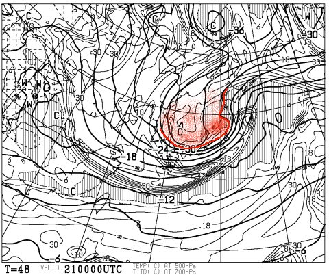

# 定例！この週末の志賀高原の天気は…うむ．まーまー良さそうだな…

📅 投稿日時: 2014-03-20 02:15:44

この週末．

3連休なわけですが．

この3連休，志賀高原へ出撃する人も多いかと思うので．

いつもの，志賀高原の天気予想をば…

えーー．

ふむふむ．

…

…

…うむむ？？？

…

…なんだか．

3連休の前日，雨っぽいですね（涙）．

850hpa図の0℃線が…

こーんな感じで志賀高原より北側に（泣）．

ってことで．

3連休前日は，昼間は雨～みぞれで，雪が溶けちゃいます…

夕方からは気温が冷えて雪に変わるかな～．

でも．

21日，3連休初日は…

なんと．気温が平年より6度ほど低め！

当然，850hpaの0℃線も南に下がり…

日本よりはるか南に！

で，さらに，なんと！

500hpaの-30度の寒気が，志賀高原まで下がってきてるじゃ

あーりませんかっ！

こんな真冬並みの寒気が下りてくるとは…！

…これは，3連休の前日の夜から初日の21日にかけて．

降りますね～．

雪がっ！

…

でも．

地上天気図は，見事な冬型なのはいいんだけど…

…低気圧が発達しすぎて，風が強そうなんですが…

3連休初日，ゴンドラ，動いてくれるといいなぁ…

そして．

3連休2日目も…

850hpaの0度線は，日本のはるか南！

志賀高原には，-6度線がかかっているので．

うーん．

朝はマイナス10℃近くまで冷え込みますね．

そして，地上天気図を見ると…

うーむ．冬型は緩み始めるので．

朝のうちまで，雪がちらつきそうだけど．

…これ，昼頃には基本的に晴れますね～．

でも，気温がそれほど高くないという．

もしかすると，3連休2日目は．

冷え冷え，晴れの最高コンディションかも！！

そして，3連休3日目の23日は…

ふむ．高気圧に覆われて，晴れそうですね．

さらに，850hpaの0度線が志賀高原より南にあるので…

この日も，気温はマイナスのまま行ってくれるかな～

22日より気温が上がるので，日が当たるところの雪は，

昼間は緩んじゃうけど…

まぁ，晴れて結構恵まれたスキー日和になるかな…

ってことで．

まとめると．

21日金曜：前日の夜から雪が降り続け，朝は

　　アイスバーンの上にもさもさ重い新雪．

　　終日雪が降り続く．…ってより，風が強く，吹雪と言った

　　方がいいかな…？？

　　ゴンドラは減速運転，ヘタすると，動かないかも…

　　気温は冷え冷え．寒いよ！

　　なので，この日の昼間は結構いい雪が積もってくれて，下地の

　　アイスバーンを隠してくれることを期待…．

22日土曜：前日から，朝まで雪が降りそうなので…朝はパウダー．

　　朝のうちは気温が-10℃近くまで下がるので，3月下旬にしては

　　かなりよさげなパウダーが10～20cmほど積もってるかな～．

　　午前中から晴れだし，そのまま晴れの天気が続く．

　　気温は低めで，晴れても雪はそんなに緩まない．

　　雪質は良さそう．

　　最高のスキー日和になるかも？？

23日日曜：朝からすっきり晴れ！！朝のうちは気温も低く，

　　冷えた圧雪＆晴れという，絶好の大回り日和！

　　昼に向かって，日が射すゲレンデは雪が重くなっていきそう．

　　でも，昼も0℃をちょいと超えるくらいまでしか気温は上がらず，

　　どぼどぼの春雪になるほどではないかな．

　　3月と考えれば，いいコンディションでしょう．

ってことで．

初日は微妙だけど．

3連休，結構良さそうな感じだな～．

## 💬 コメント一覧

### 💬 コメント by (aqura)
**タイトル**: Unknown
**投稿日**: 2014-03-20 13:03:29

待ってました、天気予報！

そうですか、金曜日は厳しいですか？

仕事を放り投げて、今晩からいくか？

明日からいくか？

悩みどころです。

### 💬 コメント by (Skier_S)
**タイトル**: aquraさま
**投稿日**: 2014-03-20 23:37:48

金曜は，やっぱり荒れ荒れの天気に

なりそうです…

終日雪が降り続けそう．

風も結構あるかな～．

でも，私は金曜もひたすら朝から焼額第1ゴンドラを

滑ってると思います！

＃ゴンドラが動いていれば…ですが

