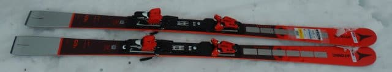
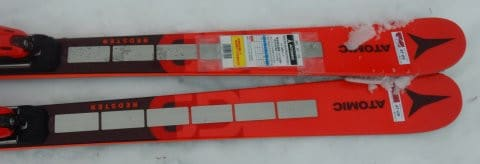
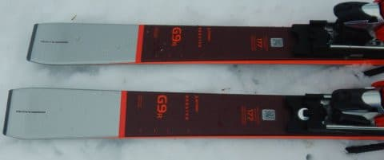
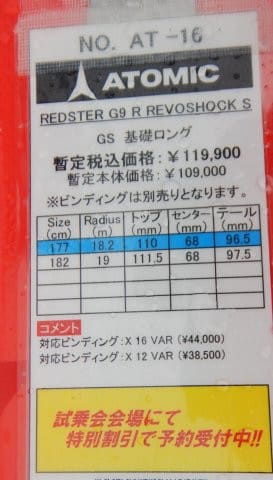
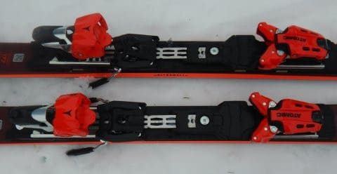

# 2023シーズンモデルのスキー板，試乗レポートその18…ATOMIC REDSTER G9 R REVOSHOCK

📅 投稿日時: 2022-06-25 01:47:43

スキーシーズンは終わったけど．

まだこのBlogを書いている人間の頭の中は

スキーモードのままなので．

このBlogは，まだまだスキーネタが

続くのだ！

今日も2023シーズンモデルのスキー板の試乗レポート．

今回はアトミック編です．

大回り板ですが，結構良かったですよ～！！

○ATOMIC REDSTER G9 R REVOSHOCK 177cm

GS競技用，基礎大回り用

来シーズンのATOMICの大回り用は，

SALOMONと同じく基礎用と競技用の

区別がなくて，

上のモデルから

REDSTER G9 FIS　（FIS規定順競技用，R＞30）

REDSTER G9 RS　（R=24くらい，むちゃくちゃ強めのICONビンディング推奨）

REDSTER G9 R　（R=18くらい，強めのVARビンディング推奨）

REDSTER G9　（R=17くらい，優し目のX12ビンディング推奨）

と4種類になります…

昔あった，G9iは無くなったみたいですね．

今回試乗したのは，G9R．

177cmでR=18m，ビンディングは金属バーが入って

板のフレックスが強く感じるVARビンディングが

ついてます．

滑ってみると…

すごく扱いやすい！

弱いとかそういうネガティブな意味じゃなく，

ポジティブに扱いやすい！

R=18mってのも，ゲレンデの純粋大回り用として

ちょうどいい感じのサイドカーブだし，

メタルの適度な張りがあった中で，

すごいきれいにたわんで行く板です！

強めのVARビンディングが入っている

板ってのもあって．

エッジグリップは比較的しっかりしていて，

踏んだ感じに粘りがあり，踏んだ量だけ

たわみが出ます．

私の好きな，たわみに沿ってきれいに

まわって行く板です！

板のばね感も強く，返りは大回り板としては

比較的早く，強めに出ます．

それが切り替えを楽にしてくれて，

結構オートマチックに切り替わる感じが

ありますね～．

返りが早めなので，R=18というより

早いリズムで回ることができて，

脚力があれば，ちょっとズラシを

入れながらの小回りも決められます！

たわませる量で，大回りから中回りまで

自由に作れるし，

それでいてズラした時もコントロール性があって，

早い返りとズラシを上手く組み合わせて

小回りまでもっていくことができるという，

適用幅がかなり広い板．

さらに，これがREVOSHOCK効果なのか…

荒れた斜面でスピードを出しても板が叩かれたり

跳ねたりすることがなく，なめらかに安定して

滑っていけます．

スピードを出しても安定感抜群！

それなのに，大回りから小回りまで

かなり幅広いターン弧に対応して，

キレキレのグリップが強い板なのに，

ズラシでのコントロール性もあるという．

これ，結構いい板ですね…！！

R=18mなら，大回りメインオールラウンドとして

ちょうどいい感じだし．

自分は最近大回り板をメイン板にしたってのも

あって，この板はかなり気に入りました…！

競技用というより，そこそこのスピードを出す人が

大回りベースのオールラウンド板として使うには

かなりいい感じの板です！

## 💬 コメント一覧

### 💬 コメント by (ikkun)
**タイトル**: Unknown
**投稿日**: 2022-06-25 15:40:38

意外に？そうゆう感覚も やはりGSは乗りやすいですかね？ちなみにS8なかなか面白いですよ❗軽い中でもなかなか行ける感じでした❗

### 💬 コメント by (Skier_S)
**タイトル**: ＞ikkunさま
**投稿日**: 2022-06-26 21:31:03

あら．S8は試乗していないです…

S9iでも，Proじゃないやつはちょっと弱かったので，それより弱いだろう…と思ったS8は乗らずじまいでした．

