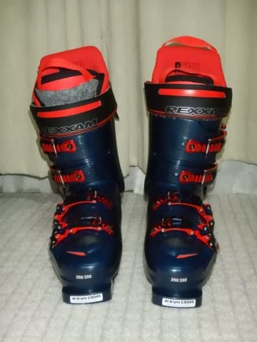
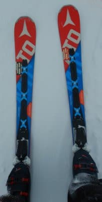

# 長岡のエキップさんで，ニューブーツ・’21モデルREXXAM R-EVO 130Mを作ってみた…滑ってみたインプレッション

📅 投稿日時: 2021-01-31 05:08:18

えー．

本日も，特派員から志賀高原の情報が

送られてきましたが…

なんと．

本日の朝，20cmを超えるほどの新雪が

積もったようです！！

(今日も比較対象はおこみん人形…）

そして，-12℃と予想していた朝の気温は，

予想よりはるかに下回り，なんと-15℃！！

スゲー冷え込みました！

あさは激冷えの柔らか圧雪でスタート

だったようですが．

特派員曰く，圧雪コースは良かったけど，

新雪バーンは下地がカリカリで手ごわかった

ようです…

焼額の第1ゴンドラは，午前中に一瞬

待ち時間があったものの，この一瞬以外は

ほぼ待ちなしだったようです…

昼近くになっても気温は-12℃と

激冷えで，天気も悪めだったので，

根性の無いスキーヤーふるい落とし機能

が働いたようですが…

ただ，午後になると日が射し始め…

ゲレンデが明るくなってきたようです！

午後2時過ぎにはすっきり晴れたようで．

晴れているのに，白樺コースは

午後まできれいなフラットバーン！

ってな感じで．

私の水曜段階の予想，

　トップシーズン冷え冷え雪で，午後は

　晴れ間もありそうないい感じの一日！

というのが当たって，

圧雪コースは完全にトップシーズンの雪質に

戻り．

そして，午後は天気も回復し，いい感じの

一日だったようですね…

…明日も，朝イチは最高ピカピカ圧雪で，

シーズンを通してもかなりいい一日

だと思いますよ…

…私は滑りに行けませんが…

滑りに行けませんが…

…

…ちょっと，スキー場に天気が悪くなる

怨念でも送ってみようかな？（噓)

というところで，本題へ．

以前，[長岡のエキップさんでブーツを作った話](e84a3c4f3e87605ea154c49f2e9927b90.md)を

してきましたが．

今回は，そのブーツを履いてみたインプレッションです…！

とりあえず．

新しいブーツを履いてみて…

足型がおかしかった私は，これまで

どんなにブーツに手を入れても．

大体どこかが痛くなるものだけど…

なんと，このブーツは痛くならない！！

…って．

痛くないのが普通なのですが．

ホントに，私の足はかなりひどくて，

普通のブーツでは，シェル出しや

削りを入れても，いろんなところが

そこらじゅうに当たりまくるんです…

ATOMICの熱成型シェル，メモリー

フィットでも全然だめでした（涙）

これまで，滑った後数日間は痛みが

残るブーツもあったし．←そこまで我慢してすべらないよね…普通は

つま先が当たって，足の爪の下がひどく内出血して，

足の爪をはがしたことも3-4回では

済まないですね…←だから，普通はそこまで我慢して滑らないから

いったいこれまで何回，足の爪を

くれてやったことか…

とりあえず．私にとって，痛くないってことは

それだけでも最高．

いつもなら足のどこかが痛くなる

夕方でも，痛くないので攻めて滑れる！

…これだけでも，足型がおかしい

自分にとってすばらしいんですが…

当たらないのに，履いてみた感じは

ガバガバではなく．

かなりタイトでぴったりホールドしてくれ

ます…！

このあたりは，エキップさんの調整の

見事さですね…

で．

このブーツで滑ってみると…

カント調整なのか，かかとの角度を

正しく出したからなのか．

谷回りの捉えが驚くほど早い！！

今までのブーツよりずっと早いです！！

フラットからわずかに谷回りへ動くだけで，

板が捉えてスパっと谷回りに入ります．

まず，滑り出して1ターンでむちゃくちゃ

びっくりしたのが，この谷回りの

捉えの早さ！！

あまりにも捉えが早いので，これまでの

動きだと谷回りで板が回りすぎる…！

これまで，谷回りの捉えが甘かったので，

身体を過剰に谷側に落としてしまっていた

のがよく分かる…．

このブーツだと，わずかな返しで

内足・外足ともに驚くほどしっかり谷回りの

エッジが捉えてくれるので，谷に体を

落としていくことなく，しっかり外足の板に

ついて行って谷回りが決められます！！

ニュートラルから谷回りの過剰な動きが

不要になったので，荷重感をもって

切り返せるようになり．

ターンの切り替えが劇的に改善しました…

まさか，ここまでブーツで変わるとは！

そして．

ホールドがしっかりしていると書きましたが．

タングのカーペット効果もあり，

足首がぴったり抑えられています．

これまでのブーツ，足首を合わせたつもり

でも，結構動いていたんだなぁ…

以前のブーツと，荒れた斜面を滑った時の

板の安定度が違うんです…！

以前のブーツでは，荒れた斜面で板が叩かれて

いた時，自分の思いと違うように板が振られて

しまうので，荒れた斜面を攻めて滑るのは

難しいと思っていたけど．

…これが，荒れた斜面では当たり前だと

思っていたけど．

新しいブーツでは，どれだけ荒れていても，

板が叩かれても．

ブーツと足がぴったりフィットしているので．

荒れた斜面でも，思った方向にピッタリ

板が向いているよ！

そして，板がぶれないので，上体も

安定していて．

かなり荒れた斜面でも，狙った通り

板を動かして谷回りに入れる！

これまでみたいに，谷回りが不安定で

怖くなることが無い！

コブ斜面や荒れた斜面が，

これまでより100倍攻めて滑れる感じ！

…これはいい！！

…遊びが無いと，

荒れた斜面でもこれだけ正確に板が

狙ったところに差し込めるとは！

さらに．

ブーツと足がぴったり合っていて，

しっかり板が押せるからか…

スキーがこれまでより柔らかく感じるん

ですが…！

なんだか，いつものSXが曲がりすぎる！！

…このブーツを履いた最初，いつもの感覚で

板を押していったとき．

板がたわみすぎて，自分の予想の半分の

半径で回ってくるのにびっくり！

回る…回りすぎるよ！

これまで，自分は小回り板が好きだったんだけど．

ブーツがここまで踏めるようになると，

小回り板だと回りすぎて．

もう少しサイドカーブが緩い板がいいかも…

そして．

182cmのロング板，SALOMONのX-RACE

Masterを履いても…

すごいたわむ．むちゃくちゃ曲がる．

小回り板か？？ってくらいカービングショートができる．

（もともと，182cmでもR=17ｍと

小さめのサイドカーブだけど…）

私と今シーズン一緒に滑った人は，

私が182cmのロング板を履いている時も．

ロング板と思えない，かなりの小回りを

しているのを見たことがあるかと…

ブーツがぴったりフィットしていると，

ここまでしっかり板を踏むことができるとは…！

ブーツがフィットしているだけではなく，

このREXXAMのR-EVO130．

かなりシェルに粘りがあり，ばね感が

結構強いので，それも効いてるかも…

何にしろ，ブーツにいい感じのばね感が

あります．

がちっと硬いシェルじゃなく，柔らかさを

感じて足首を動かしていけるのに．

柔らかくつぶれちゃうんじゃなく，ブーツが

つぶされていく分，ばねに圧が溜まる感じで

しっかりブーツに力が溜まっていくというか…

圧を抜くと，ブーツがポンと力を戻してくれる

感じがあります．

とりあえず，この粘り＆ばね感のおかげか，

かなりしっかり板が踏めて，これまでの板と

別物か！！と思うほど，板が曲がります…！

いや…

分かっていたけど．

実際，板を変えるより，ブーツを変えた方が

滑りに影響が大きいということは，

理屈としてはそうだとは理解していたけど．

ここまで滑りが変わるとは思わなかった…

とりあえず．

板も踏めるようになったし．

谷回りの捉えも早いし．

不整地でこれまでより攻められるし．

もう，このブーツ無しでスキーは滑れない．

このブーツ，気に入った…っ！！

あ，どうやらこの，REXXAM R-EVO．

130よりフレックス値が高いブーツは

120以下のブーツと材質が違い，ソールが

すり減るらしく，キャットウォーク等の

ソールプロテクターが必須のようです…．

マニュアルにもそう記載されてました．

…ってなことで．

めちゃくちゃ気に入ったこのブーツ．

何かあった時のために，

このブーツの二郎君が必要かも…？

と思っているほど，このブーツが気に入った

Skier_Sだったのでした…

PS．これから長岡のエキップさんに行ってブーツを作ってみよう…という方は，

　鈴木社長から，私の足がどんな手ごわい足だったか聞いてみてください(笑)．

## 💬 コメント一覧

### 💬 コメント by (しが)
**タイトル**: いいですね！
**投稿日**: 2021-01-31 09:17:02

長岡のショップに行ってみたくなりました。少しでも滑りが良くなるなら試してみたいですね。

気になるのがブログで悪いことは書けないし、誇張して表現してる可能性があることです…。

### 💬 コメント by (レインボー73)
**タイトル**: Unknown
**投稿日**: 2021-01-31 12:44:01

日曜日の志賀高原情報

朝の蓮池マイナス７℃、山頂マイナス１０℃。予想外に降ってる、積もってる！　軽い、サラサラ！　

パノラマからカラマツへ。25センチあるかも？　突如、新型滑りたいウイルスに感染。しばらくは、あの寒いカラマツ回し。そんな人は他にいそうもない。幸せ！　仲間で順に順に、ごちそうさまでございました。

その後は子連れになったので、ＧＳ経由の三高回し。

子供の成長の速さには、驚きのみ。上手な人に教わると、こうも違うんだ！

圧巻は３歳になったばかりの女の子。最初は抱えて滑らせていたのに、２回目には1m離し、2m離しで。３回目の今日はといえば、ぎょぎょ！　平気で一人で滑ってる！　すごすぎる。あーあ、こんなふうに成長したいものです。羨ましい。

あ、そろそろ滑るみたい。ああいうふうに上手に教えられるレベルになってから死にたい。

### 💬 コメント by (べー)
**タイトル**: Unknown
**投稿日**: 2021-01-31 16:02:46

長岡のエキップさんに行ってみたいですね。

でも今シーズン前にブーツとヘルメット以外は物欲選手権で大敗してしまったので、スキー共々自粛です（笑）

今履いているのはATOMIC HAWX ULTRAで３シーズン目ですが、Ｓさんの１シーズンにも満たない使用日数なので、まだ使いたいところ。

とりあえず緊急事態宣言が終了したらインソールの新規作成とブーツの微調整をお願いしてみようかと画策中です。

あとレインボー73さん含む特派員の皆様、毎日志賀高原情報ありがとうございます。

今は記事を読んで滑った気にさせて頂いています（笑）

### 💬 コメント by (レインボー73)
**タイトル**: Unknown
**投稿日**: 2021-01-31 17:13:16

日曜日の志賀高原情報２

年長組の女の子が、滑りながら『唐揚げ』を連発していたので、昼食はニゴンの『居酒屋』。美味しくて安くて愛想もいいのに、もっとお客さんが増えるといいな。

唐揚げ700円、フライドポテト500円、コーンポタージュ300円、きのこ蕎麦セット1000円（単品800円、セットには焼きおにぎり2個付いてお得）、豚汁うどんセット1100円

昼食後、隊員は疲れて脱落。最年長の私はかなりの残業。脱落組曰く『この分では80過ぎても一番元気に滑っとるだろうなあ』。なんか、自分でもそんな気が。

午後はひたすら三高。雪は、エス様には極めて言いにくいのですが、ずーーーーっとさらさらふーんわり。

志賀高原ってなんて桃源郷なんでしょうか。こんな所で生まれ育ちたかった。スキーがこんなにも尾も白い（頭の白い犬がいてね、身体も白くてね、尾も白いんだよ。面白い話でした。）なんて、なんで62歳まで気づかなかったんだろう。

でも、今がいいから、後悔など微塵もないレインボーでした。

それにしても、プルークって、子供は平気なのに、なんでこんなに疲れるの？

### 💬 コメント by (レインボー73)
**タイトル**: Unknown
**投稿日**: 2021-01-31 17:20:23

ぺー様、ありがとうございます。

実は、私が何度もコメントして、その日が自分のコメントしかないと、なんかいいのかなと、へこみます。書きすぎるので批判もあると思いますが、少しでもプラスのコメントがあると、豚は木にも登ります。ありがとうございました、

### 💬 コメント by (レインボー73)
**タイトル**: Unknown
**投稿日**: 2021-01-31 17:45:55

追記

年長組の女の子が、今日、高速プルークウエーデルンを教わって、平気でやってました。

私もと後ろで真似してみたのですが、できるけど疲れる。足が終わってしまいます。子供は平気。なんで？

### 💬 コメント by (かず)
**タイトル**: Unknown
**投稿日**: 2021-01-31 18:38:40

虹さんの文章力なら独立できるのでは？笑  全国のスキーヤー知名度は相当あると思いますよ！笑

### 💬 コメント by (レインボー73)
**タイトル**: Unknown
**投稿日**: 2021-01-31 20:36:11

お借りします。

実は私、スマホ音痴で、覚える気がゼロの最低男なのです。スマホはネットのみで、電話はガラ系。昔、パソコンにはかなり凝ったけど、スマホの小さい字には拒否反応。でも、エス様の熱意と善良さに後押しされて、微力ながら書き込みさせていただいております。気分を害されたかたがおられましたら、ごめんなさい。

### 💬 コメント by (Goku)
**タイトル**: Unknown
**投稿日**: 2021-01-31 22:48:09

Goku妻が今シーズンの初っ端から「Sさん、滑り変わった!」と、言ってました。

私もエキップさんでカント調整してもらったら別のブーツに変身。まさにエキップマジックです!

もっと昔からエキップさんを知っていたら、もう少しは上手くなったかな…

### 💬 コメント by (通りすがり)
**タイトル**: Unknown
**投稿日**: 2021-01-31 22:58:53

私もsさんのブログももちろんですが、レインボーさんのレポートをいつも楽しみにしています。

そしてレインボーさんの知名度も志賀高原ファンにはかなり広まってるんじゃないでしょうか。今日１ゴンベースにたててあった太板に、20000メートルクラブのゴールドと思われるステッカーとyakebi all stars のステッカーが貼ってあるのを見つけました。

お会いしたこともないのに、これはレインボーさんのものではないだろうかと勝手に思ってました。

### 💬 コメント by (Northfox)
**タイトル**: Unknown
**投稿日**: 2021-01-31 23:28:24

ブーツの二郎君！ですか。新たな物欲のステージに進みつつありますね。

でも気に入ったモノの予備が欲しくなる気持ち、凄く分かります。

（私も二郎君を買ってしまう気があるので。^^;）

### 💬 コメント by (Skier_S)
**タイトル**: 睡眠時間がほしい…朝4時前には寝たい
**投稿日**: 2021-02-01 02:33:22

＞しがさま

いや…私もここまで変わるとは思っておらず，驚いてます．この記事はそこまでの

誇張は無いです…

ただ，私にはすごく合ってましたが，万人に合うとは保証できません(笑)．

そこらへんがBlogの限界ですが…

でも，私の滑りを見たことがある人の多くの人が，今シーズンの滑りが

変わっているのにすぐ気づいてくれました…

＞レインボー73さま

今日もレポートありがとうございました！

今日は寒い中，某氏のお子さんのお相手されたんですね…

バーンは一部下地が硬くなっていたという報告がありましたが，

ヤケビは大丈夫だったんでしょうか？

…そして私は，ここのコメントを読んでレインボーさんのファンになっている

人がいるだろうなぁ…と思っています(笑)．

＞ベーさま

インソール＆カント調整でも効くと思いますが…

一番いいのは，ブーツごと購入です(笑)．

ぜひ，スキー業界の経済発展に貢献を！

＞かずさま

やっぱりそう思いますよね(笑)

＞Gokuさま

あら，シーズンしょっぱなで見抜かれましたか！

ブーツの谷回りの捉えが驚くほど早いので，かなり余裕をもって

滑ることができるようになりました…

ここまで効くとは思ってませんでした．

ってか，エキップさんでブーツを買った数名，皆さん明らかに

滑り変わってますよね(笑)．

＞通りすがりさま

ぜひ，レインボーさんへの応援コメントもお願いします！

＞Northfoxさま

ブーツの二郎君，真面目に欲しいです…

REXXAMブーツがこんなにいいというのも予想外でした！！

しかし，REXXAMのRevo130M，高いんですよね（涙）

### 💬 コメント by (なんちゃってレーサー)
**タイトル**: Unknown
**投稿日**: 2021-02-01 14:19:23

大変ご無沙汰しております。

最後にコメントしたのは、一昨年のゴールデンウィークだった気が…

それはさておき、遂に気が付いてしまいましたか…

そう、操作性が高いブーツを履くと、(ある程度谷回りが作れる人であれば)スラローム板ベースの基礎板だとあまりにも簡単に曲がるため、疲れるし、つまらないしで、ラディウスが大きい板が欲しくなるんですよね。

次の物欲選手権、楽しみにしています(笑)

### 💬 コメント by (Noname)
**タイトル**: Unknown
**投稿日**: 2021-02-03 12:04:41

ブーツの耐用年数を大幅に超えている事に気が付き、急いで神田に行きました

以前よりお世話になっていた大型店の方が移動になっていたため、別のプロショップにて作ったのですが、どうもイマイチ

もう少し調整してもらうつもりですが、どの程度良くなるのか？？

遠くても長岡まで行くべきだったかなぁと思っています

