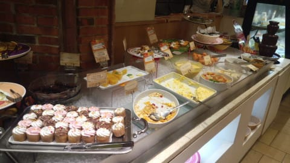
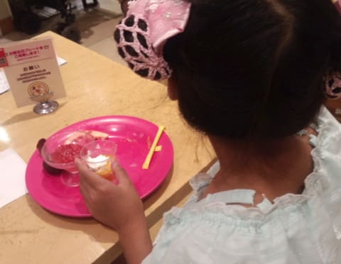
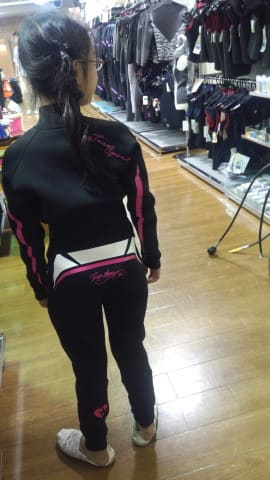
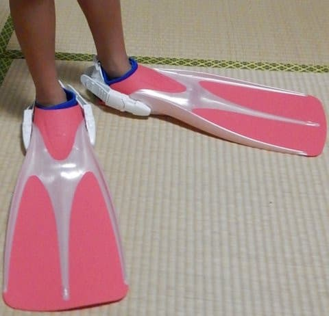
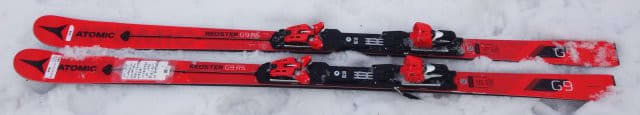
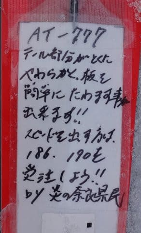
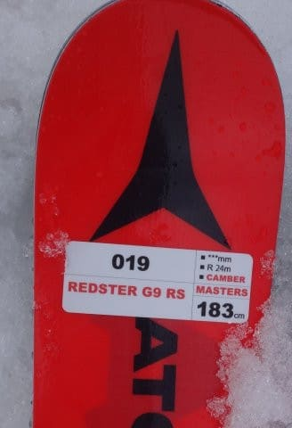
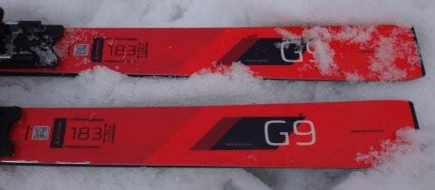
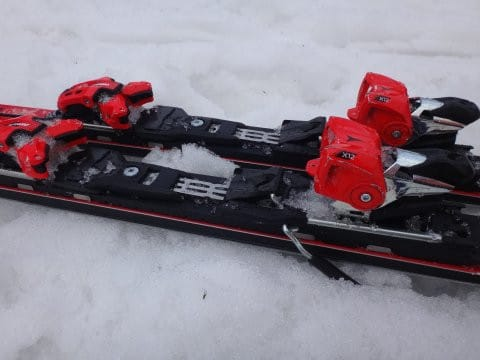

# 2018シーズンモデル，スキー試乗レポート最終回…ATOMIC編その4

📅 投稿日時: 2017-07-10 02:42:37

🏷️ カテゴリ: [スキー板試乗](c0bd8048615710cee890e403a36cc9a2b.md)

ということで．

約9か月ぶりに遠出しなかったこの週末．

メンテに出していたバイクを受け取って

走りこんで来たり．

私のオフシーズンの恒例行事（？）である，

デザートバイキングに行って…

ケーキがそれほど好きじゃなく，

パスタやらカレーやらを食べる娘を

横目に，自分がたらふくケーキを食し．

（甘いものはせいぜいゼリーみたいな

　ものしか食べない娘）

そして，これから夏に向かって．

これまで使っていた娘のウエットスーツやら

フィンやらが小さくなってしまったので，

新しいのを購入してきました…

ウエットも，これまでの半そでひざ上の

スプリングスーツではなく，フルスーツに

しましたが．

なんと．想定外なことに．

ウエットスーツもフィンも，大人用を

買うことになったという…

大人用ってことで，このプラフィンなんか．

私が使っているのより高かったんだけど…（涙）．

だんだんだんだん，

娘のいろんな道具にかかるお金が

高くなっていく…（泣）．

来シーズンは，スキー道具もブーツやら

ウェアやらを買い替えなくてはならないんだけど．

足のサイズが23cmになりつつあるわが娘．

来シーズン，スキーブーツももうジュニア用じゃ

なくなりそうな気配…

ってことで．

スキーシーズンは終わったけど，

まだ続いていた2018シーズンモデルのスキー試乗レポート，

ついに最終回です．

今回は，アトミックのGS板．

イマイチGS板の性能が発揮できるコンディション

じゃなかったので，イマイチのレポートですが…

では，どうぞ～！

---

◎ATOMIC REDSTER G9 RS X12VAR 183cm

GS（マスターズ）競技用．

GS用のG9でも，「RS」がつくFISモデルでは

ない板で，

183cmでR=24という，比較的ラディウスが小さめの，

モデルです．

メインはマスターズ向けのようで…．

一応，サーボテックが着いて．

そして，ビンディングはVARモデルになります．

ただ，試乗したコンディションがかなりの

ザブ雪で，とてもじゃないけどGS板を試せる

コンディションじゃ無かったため．

ちょいとイマイチ，性能が試せる領域まで

もっていけませんでしたが．

R=24としては，比較的まっすぐ走る感じ．

トップが細めなので，トップ部分が食いついて

回っていくような感じはありません．

たわめば曲がるんだろうけど．

雪が柔らかすぎて，圧をかけると足場が

崩れていき，残念ながら板をそれほど

たわませられず…

でも，VARビンディング付きにしては，フレックスは

意外と柔らかそう．

炎の奈良県民さんが書かれているように，

板のテールが比較的たわみやすく，

テール寄りに荷重してやれば曲がっていきます．

雪が柔らかすぎたため，ホントの板の性能が

そうなのか微妙ですが，比較的テール荷重で

コントロールする板かな…と思いました．

ザブ雪で，板が潜ってしまうような状況だったので，

板の動かしやすさとかはわかりにくかったですが．

やはり，SL板に比べるとスイングウエイトは重めか…

ただ，履いた感じは，GS板としては軽めに感じます．

柔らかい雪や春雪ではその性能を発揮できず，

やはり整地で乗る板だなぁ…

と痛感しました．

## 💬 コメント一覧

### 💬 コメント by (伽羅)
**タイトル**: Unknown
**投稿日**: 2017-07-10 05:39:29

娘さんの足のサイズ23cm…私と同じ（笑）

ウエット&フィン購入されたところで、夏モードのブログも楽しみにしてますよ！

私は某大陸に島流し中でして、せっかくなので西洋顔のサカナでも眺めてみようかなーと思ってます。

### 💬 コメント by (Skier_S)
**タイトル**: 伽羅さま
**投稿日**: 2017-07-11 02:26:42

お久しぶりです～！

あれ？某大陸には，お仕事ですか？

せっかくですから，西洋の海を楽しみましょう…！

しかし，娘の身長も140cmに近づき．

足のサイズも大きくなり．

ちょっとまだ無理があるものの，服や靴は

母親と一部供用できるようになってます…

子供の成長は早いものです…

とりあえず，残りスキーネタをやってしまったら

夏モード突入です．

今年の夏休みの予約もすべて終わったので，

夏モードに入ったらどこに行くかまたネタにします…

読者が一気に減る夏モードも，お楽しみに～！

